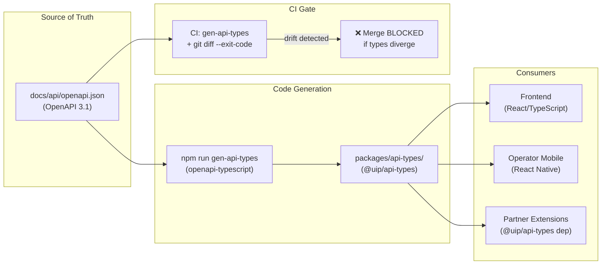

# ADR-039: OpenAPI-First API Contract Enforcement

| Field | Value |
|---|---|
| **ADR Number** | ADR-039 |
| **Title** | OpenAPI-First API Contract Enforcement |
| **Status** | Accepted |
| **Date** | 2026-06-04 |
| **Author** | Solution Architect |
| **Sprint** | MVP3-9 (S9-CONTRACT-DOC) |
| **Supersedes** | — |
| **Related ADRs** | ADR-010 (Multi-tenancy), ADR-025 (API Gateway Kong), ADR-031 (Frontend Type Safety) |

---

## Context

Sprint 9 contract audit revealed a significant drift between the OpenAPI specification (`docs/api/openapi.json`) and the actual controller implementations. The audit found:

- **61 spec endpoints**: fully implemented ✅
- **49 controller endpoints**: NOT present in spec — 9 entire modules undocumented

### P0 Critical gaps identified (fixed in Sprint 9 early start):

| Endpoint | Risk | Action Taken |
|---|---|---|
| `PUT /api/v1/alerts/{id}/resolve` | Frontend calls undocumented path; no auth schema | Added to spec |
| `POST /api/v1/admin/sensors` | Admin endpoint with no documented auth requirement | Added to spec |
| All 7 `/api/v1/workflows` CRUD+deploy+execute | Core AI workflow feature invisible to spec consumers | Added to spec |

### Entire modules missing from spec backlog:

| Module | Endpoints | Priority |
|---|---|---|
| TenantAdmin | 10 | HIGH |
| BMS (Building Mgmt System) | 7 | HIGH |
| Buildings | 6 | MEDIUM |
| Push Notifications | 5 | MEDIUM |
| Workflow CRUD (WorkflowDefinitionController) | 7 | P0 — fixed |
| Forecast | various | MEDIUM |
| Dashboard variants | various | LOW |

### Why this drift is a production risk:

1. **Security risk**: Undocumented endpoints bypass the formal security review process. Auth requirements (`Bearer JWT`, required scopes, tenant isolation) are not visible to Kong gateway configuration, security auditors, or penetration testers.

2. **Frontend type safety failure**: Without a generated types contract, frontend developers write ad-hoc `fetch()` calls with manually typed request/response shapes. Type drift causes silent runtime failures — as seen in Sprint 8 bug `C-2` (dashboard 404 after API path rename).

3. **Mobile app sharing problem**: The operator mobile app (`applications/operator-mobile/`) and partner extensions (`partner-extensions/`) cannot safely consume backend APIs without a shared types package. Each consumer independently reverse-engineers the API from source code or runtime inspection.

4. **CI enforcement gap**: No CI job prevented the 49 undocumented endpoints from accumulating. Every sprint, the drift widened as new controllers were added without corresponding spec updates.

---

## Decision

**`docs/api/openapi.json` is the SINGLE SOURCE OF TRUTH for all API contracts in the UIP platform.**

The platform adopts **schema-first development**: the OpenAPI spec defines request/response schemas, authentication requirements, and path structure. Controllers implement the spec. Controllers do NOT generate the spec.



---

## Enforcement Rules

1. **New endpoints MUST be added to `docs/api/openapi.json` BEFORE frontend integration.** A controller-only PR that touches `@RestController` without a corresponding spec update is automatically flagged by the CI contract drift check.

2. **`npm run gen-api-types` must succeed** with zero errors before any backend PR can merge. This validates that all new schemas are valid OpenAPI 3.1 and correctly referenced.

3. **CI contract drift check blocks merge.** The CI pipeline runs:
   ```bash
   npm run gen-api-types && git diff --exit-code packages/api-types/
   ```
   Any diff in generated types that is not committed alongside the spec change fails the pipeline. The generated types in `packages/api-types/` are committed to the repository and serve as a change-detection artifact.

4. **`@Hidden` annotation is only allowed on endpoints with `@Profile("test")` or `@Profile("!production")`.** Using `@Hidden` to suppress an endpoint from the spec in production builds is prohibited. If an endpoint exists in production, it must be documented. This rule is enforced by a custom ArchUnit test:
   ```java
   // HiddenAnnotationRule in src/test/java/architecture/
   noMethods()
     .that().areAnnotatedWith(Hidden.class)
     .should().beDeclaredInClassesThat()
     .areNotAnnotatedWith(Profile.class)
   ```

---

## Path Alignment Note: WorkflowDefinitionController

During the audit, two workflow-related path patterns were identified:

- `/api/v1/workflow/definitions` — **Camunda engine read-only** endpoints. These are pass-through proxies to the embedded Camunda REST API for deployment and process definition listing. They are NOT owned by UIP controllers.
- `/api/v1/workflows` — **UIP WorkflowDefinitionController** CRUD endpoints for managing UIP-native workflow definitions (create, update, delete, deploy, execute, list). This is the canonical path.

The spec now documents `/api/v1/workflows` as the UIP workflow management path. The Camunda pass-through endpoints at `/api/v1/workflow/definitions` are documented separately with `x-internal: true` and are not exposed via Kong gateway in production.

---

## Consequences

### Positive

- **Type safety end-to-end**: Frontend, mobile, and partner extensions consume `@uip/api-types` — a versioned, generated package. API shape changes are caught at compile time, not runtime.
- **CI enforcement**: The `git diff --exit-code` gate prevents spec drift from re-accumulating. The 49-endpoint gap found in Sprint 9 cannot happen again undetected.
- **Security auditability**: Every production endpoint has a documented auth requirement in the spec. Security reviews and Kong plugin configuration are based on the spec, not source code inspection.
- **Mobile + partner sharing**: `applications/operator-mobile/` and `partner-extensions/` reference `@uip/api-types` as a workspace dependency. One spec update propagates to all consumers.
- **Onboarding speed**: New developers understand the full API surface from a single file. No need to read all controllers to discover endpoints.

### Negative

- **Initial backlog**: 42 endpoints remain undocumented after P0 fixes (see remediation backlog below). These must be spec-documented before the corresponding modules can be used in production integrations. This is tracked work, not a blocker.
- **Discipline overhead**: Every new endpoint requires a spec edit alongside the controller implementation. This adds ~10 minutes per endpoint for developers not yet familiar with OpenAPI authoring. Mitigated by spec templates and IDE plugin (`42Crunch` or `Spectral` linter).
- **Codegen step in CI**: `npm run gen-api-types` adds ~15 seconds to CI runtime. Acceptable given the safety guarantee.
- **Camunda path ambiguity**: The two workflow path namespaces (`/api/v1/workflows` vs `/api/v1/workflow/definitions`) require clear documentation to avoid developer confusion. Mitigated by this ADR and inline spec comments.

---

## Remediation Backlog

The remaining **42 undocumented endpoints** (post P0 fixes) are tracked in:

**[docs/sa-fix-backlog.md](../sa-fix-backlog.md)**

That file lists each endpoint, its module, the assigned sprint, and the security classification. All 42 endpoints are blocked from production Kong routing until their spec entries are merged and the CI gate passes.

Priority order from `docs/sa-fix-backlog.md`:
1. TenantAdmin (10 ep) — Sprint 9, HIGH — admin security surface
2. BMS (7 ep) — Sprint 9, HIGH — building sensor ingestion critical path
3. Buildings (6 ep) — Sprint 10, MEDIUM
4. Push Notifications (5 ep) — Sprint 10, MEDIUM
5. Forecast + Dashboard variants — Sprint 10-11, LOW

---

## Alternatives Considered

### A. Generate spec from controllers (Springdoc auto-generation)

**Rejected.** Auto-generated specs from annotations produce correct *syntax* but incorrect *semantics* — missing security schemes, wrong error response shapes, incomplete descriptions. The spec becomes a lagging artifact of implementation rather than a design contract. Frontend developers cannot rely on auto-generated specs for integration because they change with every refactor.

### B. Separate spec per module (multi-file OpenAPI)

**Rejected for now.** The current monolith scope does not justify the tooling complexity of multi-file spec stitching (e.g., Redocly bundle). Revisit when the platform migrates to microservices (post-MVP4). At that point, each service owns its spec, and the API gateway aggregates them.

### C. GraphQL as primary contract mechanism

**Rejected.** IoT sensor ingestion, alert streaming (SSE/WebSocket), and NGSI-LD compatibility require REST semantics. A GraphQL layer would be additive complexity, not a replacement. Revisit for analytics query surface post-MVP4.

---

## References

- `docs/api/openapi.json` — authoritative OpenAPI 3.1 spec
- `packages/api-types/` — generated TypeScript types (`@uip/api-types`)
- `docs/sa-fix-backlog.md` — remaining 42 undocumented endpoint backlog
- Sprint 9 plan: `docs/mvp3/project/sprint9-plan.md` — task S9-CONTRACT-DOC
- ADR-025: Kong API Gateway configuration (JWT validation, plugin order)
- ADR-031: Frontend type safety patterns
