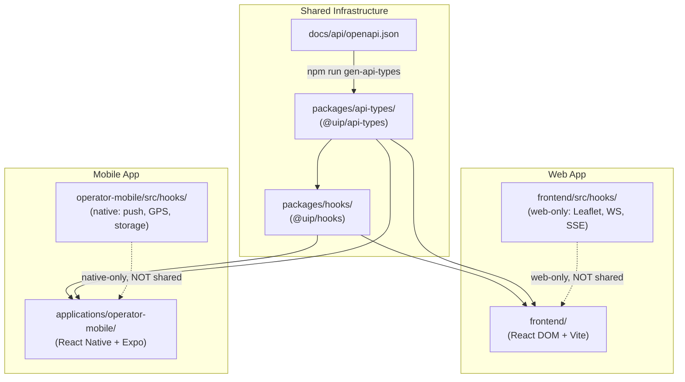

# ADR-040: packages/hooks/ Monorepo Boundary — Shared React Hooks for Web and Mobile

| Field | Value |
|---|---|
| **ADR Number** | ADR-040 |
| **Title** | packages/hooks/ Monorepo Boundary — Shared React Hooks for Web and Mobile |
| **Status** | Accepted |
| **Date** | 2026-06-04 |
| **Author** | Solution Architect |
| **Sprint** | MVP3-8 (monorepo boundary enforcement) |
| **Supersedes** | — |
| **Related ADRs** | ADR-031 (Frontend Type Safety), ADR-039 (OpenAPI-First API Contract) |

---

## Context

Sprint 8 discovered that `applications/operator-mobile/` was importing React hooks directly from `frontend/src/hooks/` using a relative path that crosses package boundaries:

```ts
// applications/operator-mobile/src/screens/AlertsScreen.tsx  (BEFORE)
import { useAlerts } from '../../frontend/src/hooks/useAlerts'
```

This is a **monorepo boundary violation**. The effects:

1. **Fragile coupling**: Any refactor of `frontend/src/hooks/` (rename, move, split) silently breaks the mobile app. The mobile app has no type-safe contract — it relies on file path stability.

2. **Shared logic duplication pressure**: Without a canonical shared location, teams face a choice between the illegal cross-import or maintaining duplicate hook implementations (one in `frontend/`, one in `operator-mobile/`). Both options accumulate technical debt.

3. **React Query cache fragmentation**: When hooks are duplicated, each app maintains a separate query client. Shared cache invalidation across packages is impossible, leading to stale-data bugs in the mobile app when the web dashboard triggers a mutation.

4. **Build tool incompatibility**: Vite (used by `frontend/`) and Metro/Expo (used by `operator-mobile/`) cannot bundle cross-package relative imports correctly. The import worked in development only because both apps happened to run from the same machine; it would fail in a standalone mobile build or CI.

The root cause is the absence of a designated shared package for React hooks that legitimately serve both React DOM (web) and React Native (mobile) — hooks that only depend on `@tanstack/react-query` and `axios`, with no browser-specific APIs.

---

## Decision

Create `packages/hooks/` as a shared npm workspace package (`@uip/hooks`) within the monorepo.

The package is registered as a workspace in the root `package.json` and consumed by downstream apps via the workspace protocol (e.g. `"@uip/hooks": "*"`).

**Package identity:**

```json
{
  "name": "@uip/hooks",
  "version": "0.1.0",
  "main": "./src/index.ts",
  "types": "./src/index.ts",
  "peerDependencies": {
    "@tanstack/react-query": "^5.0.0",
    "axios": "^1.6.0",
    "react": "^18.2.0"
  },
  "dependencies": {
    "@uip/api-types": "*"
  }
}
```

**Hooks shipped in the initial release:**

| Hook | Category | Description |
|---|---|---|
| `useDashboard` | Analytics | Dashboard KPI stats (sensor count, active alerts, ESG score) |
| `useAlerts` | Alerts | Paginated alert list with status/severity filters |
| `useAcknowledgeAlert` | Alerts | Mutation: acknowledge alert by ID |
| `useEscalateAlert` | Alerts | Mutation: escalate alert to higher severity |
| `useResolveAlert` | Alerts | Mutation: resolve alert with resolution note |
| `useCitizenNotifications` | Notifications | Paginated citizen notification history |
| `useSensors` | IoT | Paginated sensor list with status filter |
| `useSensor` | IoT | Single sensor detail by ID |

All hooks accept an optional `client` parameter (axios instance) for environment-specific configuration. The default `defaultApiClient` resolves the base URL from:
- `window.__UIP_API_BASE_URL__` (browser / React DOM)
- `process.env.API_BASE_URL` (React Native / Node.js)

This dual-resolution makes the hooks genuinely platform-agnostic without requiring build-time branching.

---

## Boundary Rules

This section is the canonical definition of what belongs in each hook location. Violations are escalated to SA review.

### `packages/hooks/` — Platform-agnostic shared hooks

A hook belongs in `packages/hooks/` if and only if ALL of the following are true:

- Uses only `@tanstack/react-query` + `axios` (no DOM, no React Native APIs)
- Works identically on React DOM and React Native
- Has no dependency on `window`, `document`, `EventSource`, `WebSocket`, or any browser global
- Represents a **business logic concern**: alerts, sensors, ESG metrics, dashboard stats, user profile, tenants

### `frontend/src/hooks/` — Web-only hooks

A hook belongs in `frontend/src/hooks/` if it depends on:

- `useMap()` or any Leaflet/MapLibre primitive
- `window.*` (e.g. `window.__UIP_TENANT_ID__`, `window.performance`)
- `EventSource` or native browser `WebSocket`
- Browser Geolocation API (`navigator.geolocation`)
- Notifications API (`Notification.requestPermission`)
- ServiceWorker API
- Any web-only UI component from MUI or `react-leaflet`

These hooks cannot run in React Native and must not be placed in the shared package.

### `applications/operator-mobile/src/hooks/` — Mobile-only hooks

A hook belongs in the mobile app if it depends on:

- `expo-notifications` (push notification registration, token management)
- `expo-secure-store` (native encrypted storage)
- `expo-location` (device GPS)
- `react-native` device APIs (accelerometer, compass, biometrics)
- `AsyncStorage` (React Native async key-value store)

These hooks have no web equivalent and must not be placed in the shared package.

### Decision table summary

| Hook characteristic | Location |
|---|---|
| `useQuery` / `useMutation` + axios only | `packages/hooks/` |
| Uses `leaflet` / `react-leaflet` | `frontend/src/hooks/` |
| Uses `EventSource` / `WebSocket` | `frontend/src/hooks/` |
| Uses `window.*` / browser globals | `frontend/src/hooks/` |
| Uses `expo-notifications` | `operator-mobile/src/hooks/` |
| Uses native device hardware | `operator-mobile/src/hooks/` |

---

## Consequences

### Positive

- **Mobile decoupled from frontend**: `applications/operator-mobile/` imports from `@uip/hooks` — a versioned package with a stable public API. Frontend internal refactors no longer break the mobile app.
- **Single source of business logic**: Alert, sensor, and dashboard query logic is written and tested once. Both platforms benefit from the same bug fixes and performance tuning.
- **Type safety propagated**: `@uip/hooks` depends on `@uip/api-types`, which is generated from `docs/api/openapi.json` (see ADR-039). Type changes propagate from the OpenAPI spec → generated types → shared hooks → both apps, caught at compile time.
- **React Query cache coherence**: Each app maintains its own `QueryClient`, but the query key structure is defined in `@uip/hooks`. Consistent cache keys allow predictable invalidation behavior across environments.
- **Testability**: Shared hooks can be tested once in isolation with `@testing-library/react` + `msw`. No need to replicate hook tests in both the web and mobile test suites.

### Negative

- **Additional package to maintain**: Every new shared hook requires a PR that touches `packages/hooks/src/`, updates `index.ts` exports, and bumps the version if the public API changes.
- **Peer dependency version discipline**: `react`, `@tanstack/react-query`, and `axios` peer dependencies must remain compatible across `frontend/` and `operator-mobile/`. A major version bump in any peer requires coordinated upgrade across both apps. Current policy: `react@^18.2.0`, `@tanstack/react-query@^5.0.0`.
- **Bundle inclusion in both apps**: `packages/hooks/` is included in both the web bundle (via Vite) and the mobile bundle (via Metro). For hooks not used by one platform, tree-shaking must be configured correctly. Each hook should be in its own file with named exports to allow per-hook tree-shaking.
- **Type-only entry point limitation**: The current `"main": "./src/index.ts"` setup works for monorepo consumption where TypeScript resolves sources directly. If `@uip/hooks` is ever published externally or consumed outside the workspace, a build step (tsc or tsup) is required to emit compiled JS.

---

## Enforcement

The following items are added to the **code review checklist** for all PRs modifying hook files:

- [ ] New business logic hook (alerts, sensors, ESG, dashboard, tenant) → goes to `packages/hooks/`, not `frontend/src/hooks/`
- [ ] Platform-specific hook (Leaflet, WebSocket, browser APIs) → stays in `frontend/src/hooks/`
- [ ] Native device hook (push, GPS, secure storage) → goes to `applications/operator-mobile/src/hooks/`
- [ ] `packages/hooks/` must not import from `frontend/` or `applications/` — verified by `tsc --noEmit` in the package
- [ ] New hooks exported from `packages/hooks/src/index.ts`
- [ ] Peer dependency additions to `packages/hooks/package.json` require SA approval
- [ ] ADR-040 governs; violations escalate to SA review before merge

---

## Architecture Diagram



**Dependency direction rule**: arrows flow from shared packages toward app packages. No arrow may flow from an app package (`frontend/`, `operator-mobile/`) into a shared package (`packages/`).

---

## Alternatives Considered

### Keep hooks in `frontend/`, use path alias in mobile

Rejected. A path alias (e.g. `"@frontend-hooks": "../../frontend/src/hooks"`) in `operator-mobile/tsconfig.json` or Metro config is equally fragile. It still couples the mobile build to the internal structure of `frontend/`. Any hook that gains a browser-API dependency would silently break the mobile build. The alias approach provides no encapsulation — it is the same violation with extra configuration.

### Duplicate hooks in both `frontend/` and `operator-mobile/`

Rejected. Dual maintenance creates divergence. Alert pagination logic fixed in `frontend/` must be manually mirrored to `operator-mobile/`. In practice this never happens consistently; the mobile app would run stale logic. The `useResolveAlert` mutation was already diverged in Sprint 8 — one copy handled the `resolution_note` field, the other dropped it.

### Turborepo or Nx for full monorepo tooling

Deferred. Turborepo and Nx provide task caching, affected-graph execution, and enforced module boundaries via lint rules. These are valuable at scale. The current monorepo has two app packages and two shared packages — the overhead of adopting a full build orchestrator is not yet justified by the team size or package count. This decision is revisited at Sprint 12 if the number of shared packages exceeds three or if CI build times for cross-package changes exceed 5 minutes.

---

## Remediation Note

The Sprint 8 violating import (`../../frontend/src/hooks/useAlerts`) was removed from `applications/operator-mobile/` as part of the `packages/hooks/` bootstrap. The mobile app now consumes `@uip/hooks` exclusively for shared business logic hooks.
