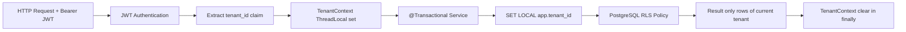

# Training Multi-Tenant cho Team Dev UIP ESG POC

## 1) Agenda buổi training 90 phút

### Mục tiêu buổi học
- Team hiểu mô hình tenant isolation đang áp dụng thực tế trong UIP ESG POC.
- Team làm được checklist triển khai module mới theo chuẩn multi-tenant.
- Team tự tin test isolation và tránh các lỗi rò rỉ tenant phổ biến.

### Agenda chi tiết (90 phút)

| Thời lượng | Nội dung | Kết quả đầu ra |
|---|---|---|
| 0–10 phút | Bối cảnh dự án + vì sao multi-tenant là bắt buộc | Thống nhất risk model (cross-tenant leak là Critical) |
| 10–25 phút | Kiến trúc chuẩn T1/T2/T3 + luồng tenant context | Team vẽ lại được flow JWT → TenantContext → DB RLS |
| 25–40 phút | Deep dive RLS + SET LOCAL + transaction boundary | Team hiểu vì sao cấm SET SESSION với HikariCP |
| 40–55 phút | JWT claims, TenantConfigContext, FE authorization theo tenant | Team map claim sang UI behavior đúng |
| 55–70 phút | Checklist module mới: backend, frontend, kafka/flink, migration | Có checklist triển khai chuẩn dùng ngay |
| 70–82 phút | Hands-on test isolation (2 tenant song song) | Chạy được test không cross-contaminate |
| 82–90 phút | Handover format DECIDED/DONE/NEXT/OPEN + Q&A | Team thống nhất template bàn giao |

### Chuẩn bị trước buổi training
- Có 2 account test thuộc 2 tenant khác nhau (ví dụ: tenant_a, tenant_b).
- Có seed data riêng cho mỗi tenant (ít nhất 1 sensor + 1 metric).
- Môi trường local chạy backend + frontend + db + kafka.

---

## 2) Kiến trúc chuẩn multi-tenant đang áp dụng

## 2.1 Mô hình theo tier

| Tier | Mục tiêu | Cơ chế isolation chính | Ghi chú thực thi |
|---|---|---|---|
| T1 | Single customer deployment | tenant_id cố định default | Vẫn giữ schema có tenant_id để tương thích nâng cấp |
| T2 | Shared infra cho nhiều tenant | PostgreSQL RLS + tenant_id + TenantContext | Bắt buộc SET LOCAL trong transaction |
| T3 | Tenant quy mô lớn/compliance cao | Schema-per-tenant | Routing theo tenant, cô lập schema sâu hơn |

## 2.2 Luồng tenant context chuẩn



## 2.3 RLS policy chuẩn

```sql
ALTER TABLE environment.sensor_readings ENABLE ROW LEVEL SECURITY;
CREATE POLICY tenant_isolation ON environment.sensor_readings
USING (tenant_id = current_setting('app.tenant_id', true));
```

Nguyên tắc:
- RLS là lớp chặn cuối cùng ở DB, không phụ thuộc repository code có quên filter hay không.
- Query phải chạy trong transaction có set local tenant context.

## 2.4 Tenant context + connection pool

Luật vàng:
- Dùng SET LOCAL app.tenant_id trong transaction.
- Không dùng SET SESSION app.tenant_id với HikariCP.

Lý do:
- SET SESSION có thể dính giá trị tenant cũ khi connection được tái sử dụng, gây leak dữ liệu chéo tenant.

## 2.5 JWT claims bắt buộc cho multi-tenant

Claims tối thiểu:
- tenant_id: tenant runtime hiện tại.
- tenant_path: phân cấp tenant/location.
- scopes: quyền nghiệp vụ.
- allowed_buildings: giới hạn scope dữ liệu UI.
- roles: phân quyền route/action.

Ví dụ payload:

```json
{
  "sub": "user-123",
  "tenant_id": "hcm",
  "tenant_path": "city.hcm",
  "scopes": ["environment:read", "esg:read", "alert:ack"],
  "allowed_buildings": ["bld-001", "bld-002"],
  "roles": ["ROLE_OPERATOR"]
}
```

---

## 3) Checklist cấu hình multi-tenant cho module mới

## 3.1 Backend checklist

- Entity có cột tenant_id và mapping đầy đủ trong JPA.
- Repository/query có tenant boundary rõ ràng (không hardcode tenant).
- Endpoint lấy tenant từ JWT/TenantContext, không nhận tenant_id tự do từ client thường.
- Service chạy trong @Transactional để đảm bảo SET LOCAL có hiệu lực.
- Filter set/clear TenantContext theo request lifecycle.
- Log không lộ dữ liệu nhạy cảm theo tenant (PII/location nhạy cảm phải mask).

Kiểm tra cụ thể:
- Tạo dữ liệu tenant_a, query bằng token tenant_b trả rỗng hoặc 403 theo thiết kế.
- Chạy test concurrent 2 tenant, xác nhận không lẫn dữ liệu.
- Grep code không có SET SESSION app.tenant_id.

## 3.2 Frontend checklist

- AuthContext parse đủ tenant_id, scopes, allowed_buildings, roles.
- TenantConfigContext mount trước Router để feature flag theo tenant hoạt động sớm.
- React Query key có tenantId để tránh cache lẫn tenant.
- Building selector/filter theo allowed_buildings.
- ProtectedRoute kiểm tra role + scope trước render action.

Kiểm tra cụ thể:
- Login 2 tenant trên 2 browser profile, đối chiếu dữ liệu khác nhau.
- Chuyển tenant (super-admin) không tái dùng cache tenant trước.

## 3.3 Kafka/Flink checklist

- Event schema bắt buộc có tenant_id.
- Producer luôn set tenant_id từ context/domain event.
- Consumer validate tenant_id (thiếu thì reject hoặc DLQ theo policy).
- Flink job propagate tenant_id end-to-end, không drop trong transform.
- Có DLQ cho event invalid/missing tenant_id.

Kiểm tra cụ thể:
- Publish event thiếu tenant_id, xác nhận đi DLQ.
- Publish 2 stream tenant khác nhau, verify sink không trộn.

## 3.4 DB migration checklist

- Migration 3 bước: add nullable -> backfill -> set default/not null.
- Enable RLS sau backfill để tránh che mất dữ liệu cũ.
- Index theo tenant_id cho bảng high-read/high-write.
- Không dùng SELECT * trong query nghiệp vụ/report.

Kiểm tra cụ thể:
- Chạy migration trên snapshot dữ liệu thật.
- Đo plan query có dùng index tenant_id.
- Smoke test rollback/rollforward migration trong local/UAT.

---

## 4) Playbook dev mới tham gia dự án

## 4.1 Setup local nhanh

B1. Clone repo và chạy stack nền tảng:
- database (PostgreSQL/TimescaleDB)
- kafka
- redis (nếu test cache path)

B2. Chạy backend + frontend với profile local.

B3. Seed tối thiểu 2 tenant:
- tenant_a: có 1 building + sensor + metrics
- tenant_b: có dữ liệu khác biệt rõ

B4. Tạo 2 token test có claim tenant_id tương ứng.

Tiêu chí pass setup:
- Đăng nhập được cả 2 tenant.
- API cùng endpoint trả dữ liệu khác nhau theo token.

## 4.2 Cách test isolation chuẩn

Bài test tối thiểu (phải chạy trước merge):
- API isolation test: token tenant_a không đọc được data tenant_b.
- Concurrent isolation test: 2 request song song khác tenant không nhiễm chéo.
- Cache isolation test: key có tenant_id, không cross-hit.
- Event isolation test: consumer/sink phân tách theo tenant_id.

Kịch bản gợi ý:
1. Ghi metric cho tenant_a.
2. Gọi dashboard bằng token tenant_b.
3. Kỳ vọng không thấy metric tenant_a.
4. Lặp lại dưới tải song song.

## 4.3 Lỗi thường gặp và cách tránh

| Lỗi | Dấu hiệu | Cách tránh |
|---|---|---|
| Quên clear TenantContext | Request sau đọc nhầm tenant trước | clear trong finally của filter/decorator |
| Dùng SET SESSION | Leak ngẫu nhiên khi tải cao | chỉ dùng SET LOCAL trong transaction |
| Quên tenant_id trong React Query key | UI đổi tenant nhưng data cũ vẫn hiện | chuẩn hóa query key có tenantId |
| Event thiếu tenant_id | Flink/Kafka sink lẫn dữ liệu | validate schema + route DLQ |
| Enable RLS trước backfill | Data cũ biến mất sau deploy | luôn backfill trước, rồi mới ENABLE/FORCE RLS |
| Hardcode tenant trong code | Không mở rộng được module | lấy tenant từ context/JWT, không hardcode |

---

## 5) Handover template DECIDED/DONE/NEXT/OPEN

Dùng template này khi thêm module mới có multi-tenant.

```markdown
## Module: <module-name>
## Date: <yyyy-mm-dd>
## Owner: <name>

### DECIDED
- Isolation level: <T1/T2/T3>
- Tenant propagation path: <HTTP/JWT, Kafka event, Async>
- RLS strategy: <tables + policy naming>
- Cache strategy theo tenant: <query key / ttl>

### DONE
- [ ] Entity/Schema có tenant_id đầy đủ
- [ ] TenantContext set/clear đúng lifecycle
- [ ] JWT claims parse và authorize đúng
- [ ] Kafka/Flink event có tenant_id + DLQ policy
- [ ] Migration add/backfill/enable RLS hoàn tất
- [ ] Isolation tests pass (API + concurrent + cache + stream)

### NEXT
- <Task 1 + owner + due date>
- <Task 2 + owner + due date>
- <Task 3 + owner + due date>

### OPEN
- <Risk hoặc quyết định còn treo>
- <Phụ thuộc module khác>
- <Deferred ADR liên quan>
```

---

## Runbook kiểm tra nhanh trước merge (practical gate)

- Gate 1: Không có query/logic nào bypass tenant boundary.
- Gate 2: 100% endpoint module mới có behavior nhất quán theo tenant claim.
- Gate 3: Test concurrent 2 tenant pass.
- Gate 4: Event path có tenant_id từ producer đến sink.
- Gate 5: Migration chạy sạch trên dữ liệu cũ và không lock nguy hiểm.

Nếu fail bất kỳ gate nào: không merge.
