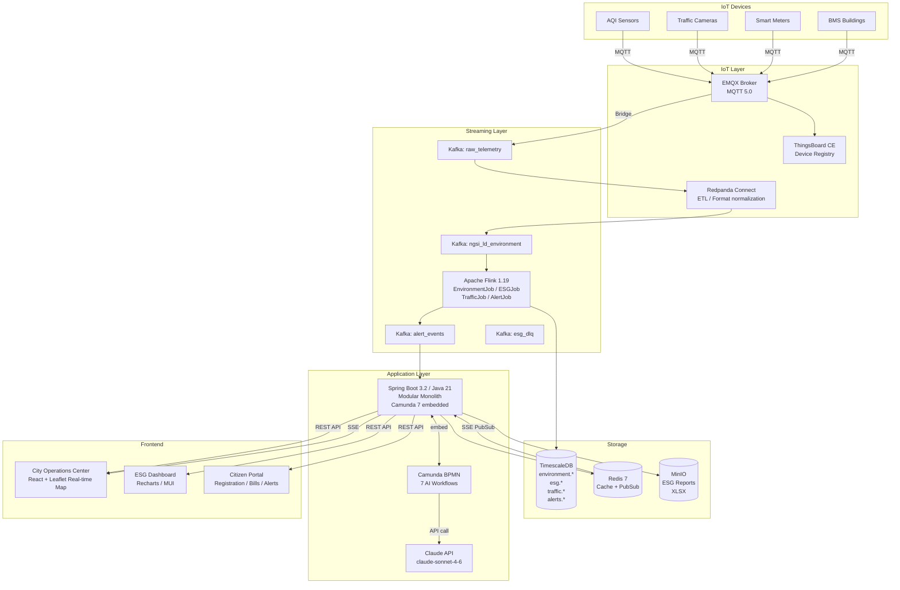

# UIP Smart City Platform — Bài Thuyết Trình Kỹ Thuật

**Dành cho**: Toàn team (Backend, Frontend, DevOps, QA)  
**Thời lượng**: ~60 phút + Q&A  
**Ngày**: 2026-04-25  
**Phiên bản**: 1.0

---

## Mục Lục

1. [Bức Tranh Tổng Thể](#1-bức-tranh-tổng-thể-10-phút) — 10 phút
2. [Kiến Trúc Hệ Thống](#2-kiến-trúc-hệ-thống-15-phút) — 15 phút
3. [Quyết Định Công Nghệ](#3-quyết-định-công-nghệ-10-phút) — 10 phút
4. [Khó Khăn & Thách Thức](#4-khó-khăn--thách-thức-10-phút) — 10 phút
5. [MVP2 & Roadmap](#5-mvp2--roadmap-10-phút) — 10 phút
6. [Q&A Chuẩn Bị Sẵn](#6-qa-chuẩn-bị-sẵn) — 5 phút

---

## 1. Bức Tranh Tổng Thể (10 phút)

### 1.1 UIP Là Gì?

**UIP — Urban Intelligence Platform** là nền tảng thành phố thông minh cho phép:

- **Thu thập dữ liệu** từ hàng nghìn cảm biến IoT (chất lượng không khí, giao thông, điện nước)
- **Phân tích real-time** và phát hiện bất thường trong vài giây
- **Ra cảnh báo tự động** cho vận hành thành phố và thông báo đến người dân
- **Tổng hợp báo cáo ESG** (môi trường, xã hội, quản trị) phục vụ cơ quan nhà nước
- **Hỗ trợ quyết định AI** qua workflow BPMN + Claude AI

### 1.2 Bài Toán Thực Tế

Trước UIP, một thành phố phải đối mặt với:

```
Vấn đề hiện tại (không có platform):
  ├── 8 hệ thống rời rạc, không giao tiếp với nhau
  ├── Báo cáo ESG hàng quý: 3 ngày tổng hợp thủ công
  ├── Cảnh báo ô nhiễm không khí: phát hiện sau 4-6 giờ
  ├── Sự cố giao thông: vận hành biết sau 30-45 phút
  └── Người dân không biết tình trạng môi trường khu vực mình

Sau UIP:
  ├── 1 platform tích hợp, 1 dashboard duy nhất
  ├── Báo cáo ESG: tự động < 1 phút
  ├── Cảnh báo ô nhiễm: < 30 giây
  ├── Sự cố giao thông: phát hiện tức thì
  └── Người dân xem AQI real-time, nhận thông báo khi ngưỡng vượt
```

### 1.3 Demo Flow End-to-End (5 phút thực tế)

```
[Cảm biến AQI tại Quận 7]
         │ MQTT publish every 30s
         │ {"sensor": "AQI-Q7-001", "pm25": 156.3, "aqi": 205}
         ▼
[EMQX Broker]
         │ Bridge → Kafka
         ▼
[Kafka Topic: raw_telemetry]
         │
         ▼
[Flink: EnvironmentFlinkJob]        ← xử lý trong ~2 giây
         │ Event-time aggregation (30s window)
         │ AQI 205 → Category: UNHEALTHY
         ├──→ TimescaleDB: environment.sensor_readings (lưu trữ)
         └──→ Kafka: alert_events (nếu vượt ngưỡng)
                         │
                         ▼
             [Spring Boot: AlertService]
                         │ @KafkaListener
                         │ Tạo alert_event trong DB
                         ├──→ Redis PUBLISH "alerts:Q7"
                         │            │
                         │            ▼ SSE push tức thì
                         │   [City Operations Center]
                         │   Dashboard operator thấy alert đỏ
                         │
                         └──→ [Camunda BPMN + Claude AI]
                                  │ AI phân tích: nguồn ô nhiễm?
                                  │ Confidence 0.82 → Operator review
                                  ▼
                         [Notification: gửi SMS/push citizen]
                                  │
                                  ▼
                    [Citizen Portal: hiển thị cảnh báo]

Tổng thời gian: sensor → citizen notification < 30 giây ✅
```

---

## 2. Kiến Trúc Hệ Thống (15 phút)

### 2.1 Architecture Diagram



### 2.2 Tại Sao Chọn Modular Monolith?

**Câu hỏi luôn được hỏi:** "Tại sao không dùng Microservices ngay từ đầu?"

| Tiêu chí | Monolith thuần | **Modular Monolith** | Microservices ngay |
|----------|:--------------:|:-------------------:|:-----------------:|
| Time to MVP | ✅ Nhanh nhất | ✅ Nhanh | ❌ Chậm (infra phức tạp) |
| Team size phù hợp | 1-3 người | **3-8 người** | 10+ người |
| Module boundary | ❌ Không có | ✅ Rõ ràng | ✅ Network boundary |
| Tách thành service sau | ❌ Rất khó | ✅ Từng bước | N/A |
| Ops complexity | ✅ Thấp | ✅ Thấp | ❌ Cao (K8s, mesh, tracing) |
| Debug | ✅ Dễ | ✅ Dễ | ❌ Distributed tracing bắt buộc |
| Fault isolation | ❌ Kém | Trung bình | ✅ Tốt |

**Quyết định:** Bắt đầu Modular Monolith → tách từng module thành service khi có trigger rõ ràng (>50K events/sec, team riêng, scaling riêng).

> **Lesson learned từ industry:** Amazon, Shopify, Stack Overflow đều bắt đầu monolith. Tách microservice khi *cần*, không phải vì *thời thượng*.

### 2.3 Event-Driven Architecture — Tại Sao Không REST Internal?

**Pattern sai (REST internal):**
```java
// ❌ KHÔNG làm thế này
@Service
public class EsgService {
    @Autowired
    private EnvironmentService environmentService; // cross-module inject!

    public EsgReport generate() {
        var aqiData = environmentService.getAqiData(); // tight coupling
        // ...
    }
}
```

**Pattern đúng (Port Interface trong monolith):**
```java
// ✅ Đúng — ESG chỉ biết interface, không biết implementation
public interface EnvironmentMetricsPort {
    AqiAggregate getAqiAggregate(String districtCode, LocalDate from, LocalDate to);
}

@Service
public class EsgReportService {
    private final EnvironmentMetricsPort environmentMetrics; // chỉ biết contract

    public EsgReport generate(String district, LocalDate from, LocalDate to) {
        var aqi = environmentMetrics.getAqiAggregate(district, from, to);
        // ESG không biết Environment dùng TimescaleDB, SQL gì, ...
    }
}
```

**Khi module tách ra (Phase 2):** Chỉ cần swap `EnvironmentMetricsAdapter` thành gRPC stub — `EsgReportService` không đổi một dòng nào.

### 2.4 Database Per Domain

```
Module              Schema              Database
──────────────────────────────────────────────────
environment-module  environment.*       TimescaleDB (time-series)
esg-module          esg.*               TimescaleDB (time-series + ACID)
traffic-module      traffic.*           TimescaleDB (time-series)
alerts-module       alerts.*            PostgreSQL (ACID, status machine)
citizens-module     citizens.*          PostgreSQL (ACID, PII)
auth-module         public.app_users    PostgreSQL (ACID)
error-mgmt          error_mgmt.*        PostgreSQL (ACID)
```

**Quy tắc cứng:** Module A **KHÔNG BAO GIỜ** query schema của Module B trực tiếp.

```sql
-- ❌ KHÔNG làm
SELECT e.aqi, t.vehicle_count
FROM environment.sensor_readings e
JOIN traffic.traffic_counts t ON e.district = t.district; -- cross-schema JOIN

-- ✅ Đúng: fetch riêng qua Port Interface, join ở application layer
```

---

## 3. Quyết Định Công Nghệ (10 phút)

### 3.1 Tại Sao Kafka (không phải RabbitMQ)?

| Tiêu chí | Apache Kafka | RabbitMQ | Quyết định |
|----------|:-----------:|:--------:|:---------:|
| Throughput IoT 100K/sec | ✅ Xuất sắc | ⚠️ Đủ | Kafka |
| Message replay | ✅ Có (retention) | ❌ Không | Kafka |
| Flink native integration | ✅ First-class | ⚠️ Plugin | Kafka |
| Ordering guarantee | ✅ Per partition | Queue-level | Kafka |
| Operational complexity | Cao hơn | Thấp hơn | Kafka (trade-off chấp nhận được) |

**Điểm quan trọng về replay:** Khi Flink job bị lỗi, có thể reprocess từ checkpoint — không mất dữ liệu. RabbitMQ không có capability này.

### 3.2 Tại Sao Flink (không phải Spark Streaming)?

| Tiêu chí | Apache Flink | Spark Streaming | Quyết định |
|----------|:-----------:|:---------------:|:---------:|
| True streaming | ✅ Native | ⚠️ Micro-batch | Flink |
| Latency | ✅ <100ms | ⚠️ ~500ms-1s | Flink |
| Event-time processing | ✅ First-class | ⚠️ Phức tạp hơn | Flink |
| State management | ✅ RocksDB native | ⚠️ External only | Flink |
| Alert <30s requirement | ✅ Đáp ứng | ⚠️ Khó với micro-batch | Flink |

**Ví dụ:** Alert detection cần xử lý 30-second sliding window với event-time. Flink làm điều này natively; Spark Streaming cần trick phức tạp.

### 3.3 Tại Sao TimescaleDB (không phải InfluxDB)?

| Tiêu chí | TimescaleDB | InfluxDB OSS | Quyết định |
|----------|:-----------:|:-----------:|:---------:|
| SQL compatible | ✅ Full SQL | ❌ Flux/InfluxQL | TimescaleDB |
| PostGIS integration | ✅ Seamless | ❌ Không có | TimescaleDB |
| Team skill (SQL) | ✅ Dùng ngay | ❌ Phải học ngôn ngữ mới | TimescaleDB |
| Ingestion rate | 200K/s | 300K/s | TimescaleDB (đủ cho 100K target) |
| Continuous Aggregates | ✅ Real-time | ⚠️ Task-based | TimescaleDB |

**Trade-off chấp nhận được:** InfluxDB ingestion nhanh hơn, nhưng TimescaleDB là standard SQL → toàn team dùng được ngay, không học ngôn ngữ query mới.

### 3.4 Tại Sao Camunda 7 (không phải Temporal/Zeebe)?

| Tiêu chí | Camunda 7 (embedded) | Temporal | Camunda 8 (Zeebe) |
|----------|:--------------------:|:--------:|:-----------------:|
| BPMN 2.0 standard | ✅ | ❌ (code-based) | ✅ |
| Visual workflow editor | ✅ Camunda Modeler | ❌ | ✅ |
| Embedded (no infra) | ✅ Spring Boot jar | ❌ Server needed | ❌ Zeebe cluster |
| bpmn-js frontend | ✅ First-class | ❌ | ✅ |
| Spring Boot integration | ✅ Starter | Trung bình | Trung bình |
| Ops burden MVP1 | ✅ Zero (embedded) | Cao | Cao |

**Quyết định:** Camunda 7 embedded — không cần deploy thêm server, Spring Boot starter là đủ cho MVP1. Khi cần scale workflow (Phase 3+), migrate lên Camunda 8 Zeebe.

### 3.5 Tại Sao EMQX (không phải Mosquitto)?

| Tiêu chí | EMQX CE | Eclipse Mosquitto | Quyết định |
|----------|:-------:|:-----------------:|:---------:|
| Throughput | 1M+ connections | ~100K | EMQX |
| MQTT 5.0 | ✅ | ✅ | EMQX |
| Kafka bridge built-in | ✅ Rule Engine | ❌ Cần plugin | EMQX |
| Cluster support | ✅ | ❌ | EMQX |
| Management UI | ✅ Dashboard | ❌ | EMQX |
| Complexity | Cao hơn | Đơn giản hơn | EMQX (trade-off OK) |

**5 ADRs Quan Trọng Nhất:**

```
ADR-001: Modular Monolith → Microservices path
  Context:  Team 5 người, 1 thành phố, 5 sprints
  Decision: Modular Monolith với package boundary rõ ràng
  Why not:  Microservices = 3x ops complexity, 2x dev time với team nhỏ

ADR-002: Anti-Corruption Layer cho partner integration
  Context:  Tương lai tích hợp đối tác có IoT platform riêng
  Decision: Mọi data từ partner bắt buộc qua ACL adapter → canonical schema
  Why not:  Direct integration = tight coupling, partner thay đổi API = UIP crash

ADR-003: Database per module (logical schema separation)
  Context:  Tất cả module dùng chung TimescaleDB
  Decision: Schema riêng mỗi module (environment.*, esg.*, traffic.*)
  Why:      Cross-schema JOIN vẫn có thể trong Phase 1; tách physical khi cần

ADR-009: Kafka KRaft (không ZooKeeper)
  Context:  Kafka 3.x cho phép chạy không cần ZooKeeper
  Decision: KRaft mode — giảm 1 service infrastructure, đơn giản hóa ops
  Why:      ZooKeeper là legacy dependency, KRaft là tương lai của Kafka

ADR-010: Multi-tenant với tenant_id + LTREE + RLS
  Context:  MVP2 — phục vụ nhiều khách hàng (building, cluster, district, city)
  Decision: Row-Level Security + LTREE location path thay vì schema-per-tenant ngay
  Why:      Schema-per-tenant = Flyway quản lý 100+ schemas, overkill cho giai đoạn này
```

---

## 4. Khó Khăn & Thách Thức (10 phút)

### 4.1 Kafka KRaft: Startup Order Hell

**Vấn đề:** Stack khởi động theo thứ tự sai → toàn bộ pipeline im lặng, không có error rõ ràng.

```
Thứ tự sai:                    Thứ tự đúng:
Spring Boot (up)          →     EMQX (up, 30s)
Kafka (đang khởi động)    →     Kafka KRaft (up, 15s)
EMQX (đang khởi động)     →     TimescaleDB (up, 10s)
Flink (chưa job nào chạy) →     Flink (up, submit jobs)
                                Spring Boot (healthcheck phụ thuộc Kafka)
                                Frontend
```

**Cách giải quyết:**
```yaml
# docker-compose.yml
spring-boot:
  depends_on:
    kafka:
      condition: service_healthy   # ← không phải service_started
    timescaledb:
      condition: service_healthy
  healthcheck:
    test: ["CMD", "kafka-topics.sh", "--bootstrap-server", "kafka:9092", "--list"]
    interval: 10s
    retries: 5
```

> **Lesson Learned:** `depends_on: service_started` ≠ `depends_on: service_healthy`. Kafka KRaft cần ~15s để bầu leader sau khi container up. Luôn dùng healthcheck.

---

### 4.2 Flink Watermark & Late Data

**Vấn đề:** Sensor gửi data trễ (network delay, batch upload) → Flink xử lý với event-time sai → AQI tính không chính xác.

```java
// ❌ Sai: dùng processing-time
stream.timeWindowAll(Time.seconds(30))

// ✅ Đúng: event-time với watermark 30 giây
stream
  .assignTimestampsAndWatermarks(
      WatermarkStrategy.<SensorReading>forBoundedOutOfOrderness(Duration.ofSeconds(30))
          .withTimestampAssigner((event, ts) -> event.getEventTs().toEpochMilli())
  )
  .keyBy(SensorReading::getSiteId)
  .window(TumblingEventTimeWindows.of(Time.seconds(30)))
  .aggregate(new AqiAggregator())
```

**Trade-off của watermark 30s:** Late events sau 30 giây sẽ bị drop. Acceptable vì sensor gửi mỗi 30 giây — late > 30s là sensor có vấn đề nghiêm trọng.

> **Lesson Learned:** Bao giờ cũng hỏi "đây là event-time hay processing-time?" trước khi viết Flink job. Sai cái này → alert sai timing → vận hành ra quyết định sai.

---

### 4.3 TimescaleDB Hypertable: Partition Sai

**Vấn đề Sprint 1:** Quên tạo hypertable → bảng `sensor_readings` là plain PostgreSQL table → query 7 ngày mất 8 giây thay vì 200ms.

```sql
-- ❌ Tạo table xong quên convert
CREATE TABLE environment.sensor_readings (...);

-- ✅ Phải gọi ngay sau CREATE TABLE
SELECT create_hypertable('environment.sensor_readings', 'event_ts',
    chunk_time_interval => INTERVAL '1 day');

-- Index composite bắt buộc cho query pattern
CREATE INDEX ON environment.sensor_readings (site_id, event_ts DESC);
```

**Phát hiện:** Khi chạy performance test Sprint 4, query dashboard chậm bất thường. `EXPLAIN ANALYZE` cho thấy Seq Scan toàn bảng thay vì Index Scan trên chunk.

> **Lesson Learned:** Chạy `EXPLAIN ANALYZE` ngay sau khi tạo schema mới, không đợi đến performance test sprint sau.

---

### 4.4 Testcontainers trên macOS: Docker API Compatibility

**Vấn đề:** Integration test chạy local macOS fail với `java.io.IOException: Cannot run program "docker"`.

**Root cause:** macOS dùng Docker Desktop với socket ở non-standard path, Testcontainers dùng default `/var/run/docker.sock`.

```java
// ❌ Fail trên macOS Docker Desktop
@Testcontainers
class SensorRepositoryTest {
    @Container
    static PostgreSQLContainer<?> postgres = new PostgreSQLContainer<>("timescale/timescaledb:latest-pg16");
}

// ✅ Fix: override docker socket path
@TestConfiguration
public class TestcontainersConfig {
    static {
        // macOS Docker Desktop socket path
        System.setProperty("DOCKER_HOST", "unix:///Users/" + System.getProperty("user.name")
            + "/.docker/run/docker.sock");
    }
}
```

Hoặc dùng `~/.testcontainers.properties`:
```properties
docker.host=unix:///Users/anhgv/.docker/run/docker.sock
```

> **Lesson Learned:** Tài liệu hóa environment setup requirement trong README. Developer mới mất 2 giờ debug nếu không có hướng dẫn này.

---

### 4.5 Camunda Embedded: Transaction Boundary

**Vấn đề:** `@Transactional` trong `JavaDelegate` gây deadlock với Camunda's own transaction.

```java
// ❌ Sai: delegate tự quản lý transaction
@Component
public class NotificationDelegate implements JavaDelegate {
    @Transactional // ← Camunda đã có transaction, tạo nested transaction
    public void execute(DelegateExecution execution) {
        notificationService.send(...); // deadlock!
    }
}

// ✅ Đúng: delegate KHÔNG có @Transactional, delegate sang service
@Component
public class NotificationDelegate implements JavaDelegate {
    public void execute(DelegateExecution execution) {
        notificationService.send(...); // service có @Transactional của riêng nó
    }
}
```

> **Lesson Learned:** Camunda `JavaDelegate.execute()` chạy trong Camunda transaction context. Không thêm `@Transactional` vào delegate — để business service tự manage transaction của nó.

---

### 4.6 API Contract Drift

**Vấn đề:** Backend thay đổi DTO field name (camelCase → snake_case), Frontend không được thông báo → dashboard trắng, không có error log rõ ràng.

**Giải pháp đã implement:**
```bash
# scripts/update-openapi-spec.sh — chạy sau mỗi khi thêm/sửa API
./gradlew generateOpenApiDocs
cp build/docs/openapi.json docs/api/openapi.json

# Frontend auto-generate TypeScript types từ OpenAPI
npm run generate:types  # openapi-typescript ../docs/api/openapi.json
```

**MVP2: CI gate** — PR merge bị block nếu OpenAPI spec không được update khi thay đổi API:
```yaml
# .github/workflows/ci.yml
- name: Check OpenAPI sync
  run: bash scripts/check-openapi-sync.sh
```

> **Lesson Learned:** "Contract-first" không phải chỉ là triết lý — phải có automated check. Con người quên, CI không quên.

---

### 4.7 @WebMvcTest + Security Filter

**Vấn đề:** `@WebMvcTest` test fail với 403 Forbidden vì Spring Security filter vẫn chạy.

```java
// ❌ Fail: Security filter chặn request
@WebMvcTest(AlertController.class)
class AlertControllerTest {
    @Test
    void testGetAlerts() {
        mockMvc.perform(get("/api/v1/alerts"))
            .andExpect(status().isOk()); // → 403!
    }
}

// ✅ Fix: disable security hoặc mock authentication
@WebMvcTest(AlertController.class)
@Import(TestSecurityConfig.class)  // config permit all cho test
class AlertControllerTest {
    @Test
    @WithMockUser(roles = "OPERATOR")
    void testGetAlerts() {
        mockMvc.perform(get("/api/v1/alerts"))
            .andExpect(status().isOk()); // → 200 ✅
    }
}
```

> **Lesson Learned:** `@WebMvcTest` load Spring Security theo mặc định. Luôn dùng `@WithMockUser` hoặc `TestSecurityConfig` với `permitAll()` cho controller tests.

---

### 4.8 EMQX Bridge Config: Quiet Failure

**Vấn đề:** EMQX bridge connect thành công nhưng không có message nào đến Kafka. Không có error log. Dashboard EMQX hiển thị "connected".

**Root cause:** Rule Engine filter `WHERE payload.sensor_type = 'AQI'` — sensor gửi `sensorType` (camelCase) thay vì `sensor_type` (snake_case) → filter không match → drop silently.

```json
// ❌ Rule filter sai
{"rule": "SELECT * FROM 'sensors/#' WHERE payload.sensor_type = 'AQI'"}

// Sensor thực tế gửi:
{"sensorType": "AQI", "value": 156.3}   // ← camelCase!

// ✅ Fix: kiểm tra actual payload format
{"rule": "SELECT * FROM 'sensors/#'"}   // bỏ filter, để Flink xử lý
```

**Cách debug:** Dùng EMQX WebSocket client để inspect actual payload format trước khi viết rule.

> **Lesson Learned:** Kiểm tra "silent drop" trước khi debug business logic. Trong pipeline dài, message có thể bị nuốt ở bất kỳ điểm nào mà không có error.

---

## 5. MVP2 & Roadmap (10 phút)

### 5.1 MVP2 — Production Hardening + Multi-Tenancy

**Mục tiêu:** UIP sẵn sàng bán cho khách hàng Tier 1 (Single Building) với SLA-bearing deployment.

**Sprint MVP2-1 (đang chạy):**
- HashiCorp Vault — quản lý secrets production
- Fill 12 test gaps từ MVP1 (GAP-01 đến GAP-12)
- V14 migration: `tenant_id` + `location_path LTREE` cho tất cả domain tables
- OpenAPI CI gate

**Sprint MVP2-2:**
- Kubernetes Helm charts
- Prometheus + Grafana + alerting rules
- Row-Level Security cho tenant isolation
- `TenantContext` ThreadLocal filter mọi repository query

### 5.2 Multi-Tenancy Strategy (ADR-010)

```
location_path: LTREE — cây địa lý phân cấp

city.district_7.cluster_riverpark.tower_a.floor_3.zone_east

LTREE operators:
  @>  contains
  <@  is contained by
  ~   regex match

Ví dụ query:
  -- Tất cả alerts trong District 7
  SELECT * FROM alerts.alert_events
  WHERE tenant_id = 'hcmc_tenant'
    AND location_path ~ 'hcmc.d7.*';

  -- Tất cả sensors trong cluster riverpark
  SELECT * FROM environment.sensor_readings
  WHERE tenant_id = 'hcmc_tenant'
    AND location_path <@ 'hcmc.d7.riverpark';
```

**Migration path T1 → T4:**

```
T1: Single Building
  ├── Docker Compose (dedicated instance)
  ├── tenant_id = 'default' (1 tenant)
  └── Không cần RLS

T2: Building Cluster (5-20 toà nhà)
  ├── Kubernetes (small)
  ├── Row-Level Security: SET app.tenant_id = ?
  └── TenantContext ThreadLocal trong Spring

T3: Urban District (50-200 toà nhà)
  ├── K8s prod + ClickHouse
  ├── Schema-per-tenant (khi >10M rows/tháng)
  └── Kong API Gateway per-tenant rate limiting

T4: Smart Metropolis (500+ toà nhà)
  ├── Multi-region
  ├── DB-per-major-tenant
  └── Event Mesh (Kafka federation)
```

### 5.3 Roadmap 2026

```
Q1 2026 (hoàn thành): MVP1
  ✅ 8 modules, 7 AI workflows
  ✅ Alert <30s, API p95 <200ms
  ✅ ESG report <1 phút

Q2 2026 (in progress): MVP2
  🔄 Multi-tenancy foundation (V14 migration, RLS)
  🔄 Kubernetes + Helm
  🔄 Prometheus + Grafana
  🔄 HashiCorp Vault
  📋 ClickHouse adoption (nếu ESG report > 5 phút)

Q3 2026: v3.0 — Scale & Marketplace
  📋 Module enable/disable per tenant
  📋 Anti-Corruption Layer framework cho partner integration
  📋 Multi-city deployment (city thứ 2)
  📋 Self-service tenant provisioning

Q4 2026 + 2027: v4.0 — AI Innovation
  📋 Predictive analytics (flood, AQI forecast)
  📋 Autonomous traffic signal optimization
  📋 Digital Twin integration
  📋 Mobile app cho citizen
```

### 5.4 Trigger Để Tách Microservice

Chỉ tách module thành service riêng khi có **ít nhất 1** trigger:

| Trigger | Module tiên phong |
|---------|------------------|
| IoT throughput > 50K events/sec sustained | iot-module |
| Team riêng cần deploy độc lập | notification-module |
| ESG report query > 5 phút | esg-module + ClickHouse |
| City thứ 2 với requirements khác | environment-module |

---

## 6. Q&A Chuẩn Bị Sẵn

### Q1: "Tại sao không dùng Microservices ngay từ đầu?"

**A:** Microservices giải quyết vấn đề scaling và team autonomy — nhưng tạo ra vấn đề mới: distributed tracing, service mesh, network latency, distributed transactions. Với team 5 người và 1 thành phố, overhead của microservices lớn hơn lợi ích. Modular monolith cho phép di chuyển từng bước khi thực sự cần, không phải vì muốn.

### Q2: "Tại sao không dùng MongoDB cho IoT data?"

**A:** MongoDB tốt cho document storage, nhưng IoT time-series có pattern truy vấn đặc thù: range query theo time, aggregation theo time bucket, retention policy. TimescaleDB (PostgreSQL extension) làm tất cả điều này với SQL chuẩn, thêm hypertable partitioning tự động và PostGIS cho spatial queries — MongoDB cần multiple aggregation pipeline phức tạp để đạt cùng kết quả.

### Q3: "Khi nào thì tách thành Microservices?"

**A:** Có 4 trigger rõ ràng: (1) throughput IoT vượt 50K events/sec sustained, (2) team riêng cần deploy độc lập, (3) ESG query > 5 phút SLA breach, (4) city thứ 2 với deployment requirements khác. Khi trigger xuất hiện, module đầu tiên tách ra sẽ là `notification-module` vì stateless nhất và ít dependencies nhất.

### Q4: "Tại sao Camunda 7 chứ không phải Camunda 8?"

**A:** Camunda 8 (Zeebe) cần cluster riêng (Zeebe broker, Operate, Tasklist) — quá nhiều infra overhead cho MVP1. Camunda 7 embedded trong Spring Boot là single JAR, zero ops. Khi cần scale workflow (hàng nghìn instances đồng thời), migrate lên Camunda 8 — nhưng đó là vấn đề của Phase 3, không phải bây giờ.

### Q5: "Circuit Breaker ở đâu trong hệ thống?"

**A:** MVP1 đã implement Resilience4j Circuit Breaker cho: (1) Claude API calls từ Camunda delegates — fallback về rule-based decision khi Claude không phản hồi trong 10s, (2) Traffic external HTTP adapter — fallback khi external traffic system down. Alert pipeline (Flink → Kafka → Redis → SSE) không có circuit breaker vì đây là at-least-once pipeline với Kafka DLQ làm safety net.

### Q6: "Làm sao đảm bảo không miss alert?"

**A:** Alert pipeline dùng at-least-once delivery với idempotency: Flink publish alert vào Kafka topic `alert_events` → `AlertService` consume với `@KafkaListener` → lưu vào DB với `ON CONFLICT DO NOTHING` (idempotent upsert) → publish vào Redis pub/sub → SSE push. Nếu service restart giữa chừng, Kafka consumer offset chưa commit → alert được xử lý lại → idempotent upsert không tạo duplicate. DLQ (`esg_dlq`) catch messages fail sau 3 retry.

### Q7: "Redis pub/sub có đảm bảo delivery không?"

**A:** Redis pub/sub là fire-and-forget — nếu SSE client disconnect, message bị mất. Đây là chấp nhận được vì: (1) Alert đã được lưu trong DB, client reconnect sẽ fetch lại latest alerts, (2) SSE connection thường stable trong LAN/datacenter, (3) P0 alerts cũng được gửi qua notification channel (email/SMS) — không chỉ SSE.

### Q8: "LTREE có impact performance không?"

**A:** GIST index trên `location_path` cho subtree query O(log n). Overhead write nhỏ hơn B-tree (GIST phức tạp hơn nhưng không đáng kể cho write pattern của chúng ta). Benchmark PostgreSQL: query `WHERE location_path <@ 'hcmc.d7'` trên 10M rows với GIST index: ~5ms. Không có GIST: full seq scan ~8 giây. Trade-off rõ ràng.

### Q9: "Tenant isolation đã đủ chặt chẽ chưa?"

**A:** Hiện tại (MVP2-1): `tenant_id` column đã có ở tất cả tables, nhưng RLS policy chưa apply. Application-level filter (TenantContext) là biện pháp đầu tiên. MVP2-2 sẽ thêm PostgreSQL RLS (`CREATE POLICY tenant_isolation ON table USING (tenant_id = current_setting('app.tenant_id'))`) — enforce ở DB layer, không thể bypass kể cả khi có bug ở application. Đây là defense-in-depth: application filter + DB RLS.

### Q10: "Frontend TypeScript types được generate như thế nào?"

**A:** Backend có `springdoc-openapi` tự động generate `openapi.json` từ code. Script `scripts/update-openapi-spec.sh` fetch spec từ backend đang chạy và lưu vào `docs/api/openapi.json`. Frontend dùng `openapi-typescript` convert sang TypeScript interfaces (`npm run generate:types`). MVP2 sẽ thêm CI gate để fail PR nếu OpenAPI spec không sync sau khi thay đổi API.

---

## Tóm Tắt Slide Deck

| Slide | Nội dung | Thời gian |
|-------|---------|----------|
| 1 | Title + mục lục | 1 phút |
| 2 | UIP là gì — bài toán thành phố | 3 phút |
| 3 | Demo flow: sensor → citizen notification | 5 phút |
| 4 | Architecture diagram (Mermaid) | 3 phút |
| 5 | Modular Monolith vs Microservices — quyết định | 4 phút |
| 6 | Event-driven: Port Interface pattern | 3 phút |
| 7 | Database per domain | 3 phút |
| 8 | Technology choices: Kafka, Flink, TimescaleDB | 5 phút |
| 9 | ADRs 001-010 highlight | 3 phút |
| 10 | Camunda + Claude AI workflow | 2 phút |
| 11 | Challenge 1: Startup order + Flink watermark | 4 phút |
| 12 | Challenge 2: Testcontainers + Security test | 3 phút |
| 13 | Challenge 3: EMQX silent drop + Contract drift | 3 phút |
| 14 | MVP2: Multi-tenancy, ADR-010, LTREE | 4 phút |
| 15 | Roadmap 2026 + Microservice triggers | 4 phút |
| 16 | Q&A | 10 phút |
| **Total** | | **60 phút** |

---

*Sau buổi thuyết trình: PO sẽ bổ sung thêm các yêu cầu bài toán → SA sẽ đánh giá impact lên architecture và cập nhật ADRs tương ứng.*
