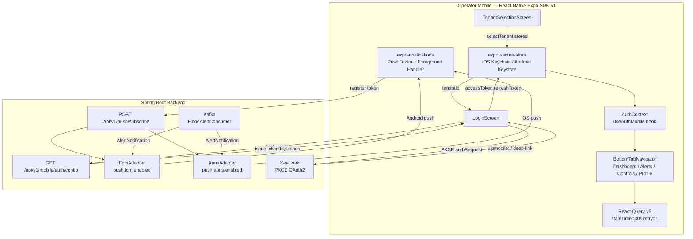

# ADR-031: Mobile Stack — React Native Expo SDK 51 for Operator Mobile App

**Status:** Accepted
**Date:** 2026-05-30
**Sprint:** MVP3-6 (Tier 2 — Mobile Foundation)
**Author:** Solution Architect
**Deciders:** SA, Backend Lead, PO
**Resolves:** Tech Debt SA-2 — Document mobile architecture decision

---

## Context

Sprint 6 Tier 2 introduces the **Operator Mobile App** — a native mobile application for city operations staff to monitor real-time sensor alerts, manage building controls, and receive push notifications for P0/P1 emergency events (e.g., flood alerts from `FloodAlertConsumer`).

### Problem Statement

The existing web-based City Operations Center (React 18 + browser) does not serve operators in the field. Three operational gaps require a native mobile solution:

1. **Real-time push for P0/P1 alerts** — Operators need reliable foreground and background push notifications when a flood or critical threshold is exceeded. The `<30 second sensor-to-notification` SLA defined in platform NFRs cannot be met by polling-based PWA on mobile.
2. **Multi-city deployment** — The platform serves HCMC, Hanoi, and Danang. The mobile app must support tenant selection at login time with no hardcoded fallback city.
3. **Secure token storage** — Bearer tokens on mobile devices must be stored in platform-backed secure storage (iOS Keychain / Android Keystore), not browser `localStorage`.

### Constraints

- Target users: **internal operators only** (not citizen app)
- Team expertise: React/TypeScript only — no Flutter/Dart or Swift/Kotlin capacity
- Auth is already standardized on Keycloak PKCE (ADR-027)
- Backend API contracts exist: `GET /api/v1/mobile/auth/config`, `POST /api/v1/push/subscribe`
- Push delivery backend already implements `FcmAdapter` and `ApnsAdapter` (both `@ConditionalOnProperty`, guarded by `push.fcm.enabled` / `push.apns.enabled`)
- iOS APNs requirement: APNs token-based push is **not supported** on iOS Safari via PWA — rules out web-only approach

---

## Decision

Adopt **React Native 0.74 with Expo SDK 51 (managed workflow)** as the mobile application framework, with the full stack as described below.

### D1: Framework — Expo SDK 51 Managed Workflow

React Native 0.74.0 bundled via Expo SDK 51 in managed workflow mode. Rationale:

- Team has React expertise; no new language investment required
- Expo managed workflow provides OTA (over-the-air) update capability via EAS Update — critical for post-deploy hotfixes without App Store review cycles
- `expo-auth-session` provides PKCE-compliant OAuth2 out of the box — integrates directly with the Keycloak `RoutingJwtDecoder` established in ADR-027
- Expo EAS Build produces standalone `.ipa` / `.apk` artifacts suitable for App Store / Play Store submission

**Application entrypoint:** `applications/operator-mobile/`
**Bundle identifiers:** `com.uip.operatormobile` (iOS + Android)

### D2: Authentication — Keycloak PKCE via expo-auth-session

```
User selects tenant (stored in SecureStore)
    → App fetches GET /api/v1/mobile/auth/config?tenantId={id}
        → returns { issuer, clientId, scopes }
    → AuthSession.fetchDiscoveryAsync(issuer + /.well-known/openid-configuration)
    → AuthRequest(clientId, scopes, redirectUri=uipmobile://)
        → authRequest.promptAsync(discovery)
    → System browser opens Keycloak login page
    → User authenticates → Keycloak redirects to uipmobile:// deep link
    → AuthSession.maybeCompleteAuthSession() resolves the PKCE code exchange
    → accessToken + refreshToken stored in expo-secure-store
```

Key parameters:
- Deep-link scheme: `uipmobile://` (declared in `app.json` → `expo.scheme`)
- Auth library: `expo-auth-session` ~5.0.0 (`expo-web-browser` ~13.0.0 as companion)
- No hardcoded Keycloak issuer URI — always fetched dynamically per tenant from backend config endpoint
- Tenant must be selected before login can proceed; no fallback to a default tenant

### D3: Push Notification Architecture

```
Mobile device (Expo)
    → expo-notifications.getExpoPushTokenAsync()
    → POST /api/v1/push/subscribe { token, platform, tenantId }
    → Backend PushSubscriptionRepository (PostgreSQL)

Alert event (Kafka → FloodAlertConsumer)
    → NotificationChannel.send(AlertNotification)
    → FcmAdapter  (Android, @ConditionalOnProperty push.fcm.enabled=true)
    → ApnsAdapter (iOS,     @ConditionalOnProperty push.apns.enabled=true)
    → FCM → Android device
    → APNs → iOS device
```

- Push token registration hook: `usePushToken(token, tenantId)` in `App.tsx`
- Foreground notification handler: `Notifications.setNotificationHandler` — `shouldShowAlert: true`, `shouldPlaySound: true`
- Background delivery handled natively by FCM/APNs transport
- Token auto-cleanup on delivery failure: `FcmAdapter.handleInvalidToken` (NotRegistered), `ApnsAdapter.handleInvalidToken` (BadDeviceToken / Unregistered)

### D4: State Management

| Concern | Technology | Configuration |
|---------|-----------|---------------|
| Auth state | React Context (`AuthContext` + `useAuthMobile` hook) | Singleton provider at app root |
| Server data | React Query v5 (`@tanstack/react-query ^5.0.0`) | `retry: 1`, `staleTime: 30_000 ms` |
| Mutations | React Query `useMutation` | `retry: 0` (explicit, no silent retry on mutations) |

React Context is intentionally used only for auth state (low-frequency, session-scoped). All data fetching uses React Query to benefit from caching, background refresh, and error state management.

### D5: Secure Storage

`expo-secure-store` ~13.0.0 — backed by iOS Keychain and Android Keystore.

| Key | Value | Cleared on logout |
|-----|-------|-------------------|
| `auth_token` | Keycloak access token (JWT) | Yes |
| `auth_refresh_token` | Keycloak refresh token | Yes |
| `selected_tenant` | tenantId string | Yes |

Tokens are never stored in AsyncStorage or JavaScript memory beyond the current session state.

### D6: Navigation

React Navigation v6 with two navigator types:

```
Root (NavigationContainer)
 └── TenantSelectionScreen   ← shown when selectedTenant is null
 └── LoginScreen             ← shown when !isAuthenticated
 └── BottomTabNavigator
       ├── DashboardScreen
       ├── AlertsScreen
       ├── ControlsScreen
       └── ProfileScreen
```

Libraries: `@react-navigation/native ^6.1.0`, `@react-navigation/bottom-tabs ^6.5.0`, `react-native-screens ~3.31.0`, `react-native-safe-area-context 4.10.0`.

Navigation guard is enforced by `AppNavigator` component rendering order — tenant selection gates login, login gates the tab navigator. No `useEffect`-based navigation that risks flicker.

### D7: Multi-Tenant Enforcement

Tenant is selected **before** the login screen is shown. The flow enforces:

1. `selectedTenant === null` → render `TenantSelectionScreen` unconditionally
2. `selectedTenant` present → enable login
3. `tenantId` injected into every auth request and push subscribe call from SecureStore

There is no hardcoded default tenant, no environment variable fallback tenant. A missing tenant ID fails fast with a user-visible error: `"Please select a city before logging in"`.

### D8: Architecture Diagram



---

## Consequences

### Positive

- **Zero new language investment** — full React/TypeScript stack matches existing frontend team skills; no Dart or Swift/Kotlin ramp-up required
- **OTA hotfix capability** — EAS Update allows JS bundle patches without App Store review (critical for P0 operational fixes in field-deployed devices)
- **PKCE compliance** — `expo-auth-session` fully implements RFC 7636; integrates with ADR-027 Keycloak dual-issuer without custom OAuth code
- **Secure storage** — `expo-secure-store` uses OS-backed Keychain/Keystore; tokens never in browser storage or JS memory after hydration
- **Reliable push delivery** — native FCM + APNs transport satisfies `<30s sensor-to-notification` SLA; not achievable with PWA on iOS
- **Guard-based navigation** — tenant-first rendering order prevents inadvertent unauthenticated screen access without a runtime auth guard hook

### Negative

- **Expo managed workflow lock-in** — adding native modules not in Expo SDK requires ejecting to bare workflow or using EAS `config-plugins`; this is a future constraint if BACnet or Modbus direct-device communication is needed from mobile
- **Two build pipelines** — EAS Build produces separate iOS (`.ipa`) and Android (`.apk`/`.aab`) artifacts; DevOps must maintain two signing credential sets
- **FCM/APNs credentials not yet wired** — `FcmAdapter.sendFcmMessage` and `ApnsAdapter.sendApnsMessage` are currently log-only stubs pending Firebase service account key and APNs `.p8` certificate provisioning (see Implementation Notes)
- **Push token auto-cleanup is best-effort** — if backend cannot reach FCM/APNs for validation, stale tokens remain in `PushSubscription` table until next delivery attempt

### Risks

| ID | Risk | Probability | Impact | Mitigation |
|----|------|-------------|--------|-----------|
| R1 | FCM/APNs credentials not provisioned for Sprint 6 demo | Medium | Medium | Demo uses log-only stub; flag as pre-production gate |
| R2 | Expo SDK 51 → 52 breaking change mid-sprint | Low | Low | Patch version only per sprint; major upgrade deferred |
| R3 | iOS APNs token expiry causing silent push failure | Low | High | `ApnsAdapter.handleInvalidToken` deactivates stale subscriptions; monitor `PushSubscription.active=false` count |
| R4 | Keycloak deep-link callback blocked by device browser | Low | Medium | `WebBrowser.maybeCompleteAuthSession()` already called at module init |
| R5 | Multi-tenant SecureStore key collision (shared device) | Low | Medium | Per-user logout clears all keys; shared device is unsupported use case for operator app |

---

## Alternatives Considered

### Alternative 1: React Native CLI (bare workflow)

**Rejected.** Bare workflow requires manual Xcode/Android Studio configuration, native module linking, and manual OTA update infrastructure (CodePush). Setup cost estimated at 4–5 SP vs 1 SP for Expo managed. Team has no prior React Native bare experience.

### Alternative 2: Flutter

**Rejected.** Team has no Dart expertise. Flutter would require a full new language hire or 8–12 week ramp-up. Not feasible within Sprint 6 timeline. Flutter provides no capability advantage over React Native for this use case (CRUD screens + push notifications).

### Alternative 3: Progressive Web App (PWA)

**Rejected.** iOS Safari does **not** support Web Push (APNs) for PWA installed from the browser. Operators on iPhones would receive no push notifications — a hard blocker for P0 flood alert delivery. Push was explicitly identified as P0 requirement. PWA rejected on functional grounds, not preference.

### Alternative 4: Expo Go (development client only)

**Rejected.** Expo Go is a development-time sandbox. It cannot be distributed to operators, cannot be submitted to App Store / Play Store, and does not support custom deep-link schemes (`uipmobile://`). Production deployment requires standalone EAS Build.

---

## Implementation Notes

### Production Readiness Gates (pre-Sprint 7 deploy)

1. **FCM credential**: Provision Firebase project for `com.uip.operatormobile`, download `google-services.json` (Android) and `GoogleService-Info.plist` (iOS), configure `push.fcm.enabled=true` in production environment, wire `FirebaseMessaging.getInstance().send()` in `FcmAdapter.sendFcmMessage()`
2. **APNs credential**: Generate APNs `.p8` key from Apple Developer account, configure `push.apns.enabled=true`, wire `Pushy ApnsClient` in `ApnsAdapter.sendApnsMessage()`
3. **EAS Build**: Configure `eas.json` for production profile with signing credentials per platform
4. **API base URL**: Change `extra.apiBaseUrl` in `app.json` from `http://localhost:8080` to production gateway URL before EAS Build

### Backend Config Endpoint Contract

`GET /api/v1/mobile/auth/config?tenantId={tenantId}` must return:

```json
{
  "issuer": "https://keycloak.uip.local/realms/uip",
  "clientId": "uip-operator-mobile",
  "scopes": "openid profile"
}
```

### Environment Variables (additions to `docs/deployment/environment-variables.xlsx`)

| Variable | Module | Required Prod | Secret |
|----------|--------|---------------|--------|
| `push.fcm.enabled` | notification | Yes | No |
| `push.apns.enabled` | notification | Yes | No |
| `FIREBASE_SERVICE_ACCOUNT_KEY` | notification | Yes | Yes |
| `APNS_P8_KEY_PATH` | notification | Yes | Yes |
| `APNS_TEAM_ID` | notification | Yes | No |
| `APNS_KEY_ID` | notification | Yes | No |

---

## References

- ADR-027: Keycloak Hybrid Auth — PKCE OAuth2 Keycloak setup (`docs/mvp3/architecture/ADR-027-keycloak-hybrid-auth.md`)
- Sprint 6 Decisions: `docs/mvp3/project/sprint6-decisions.md`
- Push channel implementation: `com.uip.backend.notification.channel.FcmAdapter`, `ApnsAdapter`
- Auth hook: `applications/operator-mobile/src/hooks/useAuthMobile.ts`
- App entrypoint: `applications/operator-mobile/App.tsx`
- Push subscribe endpoint: `POST /api/v1/push/subscribe` (backend notification module)
