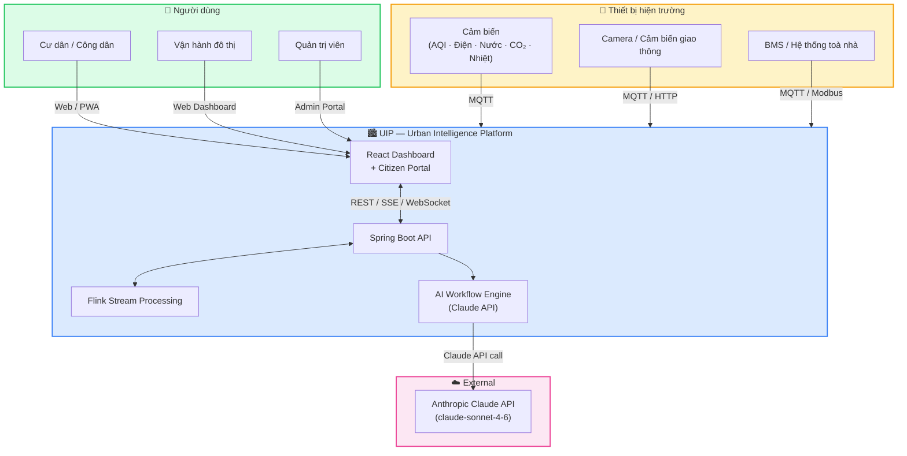
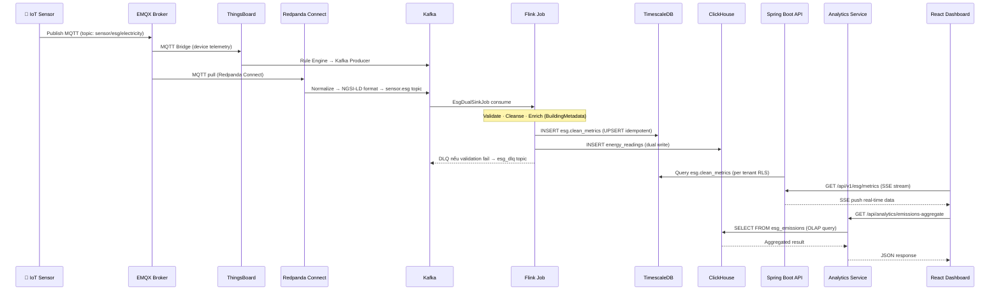
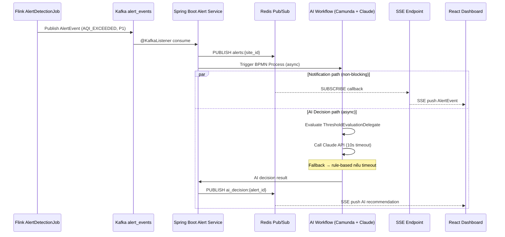
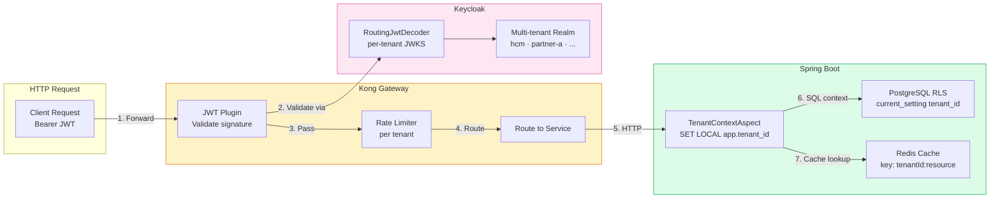
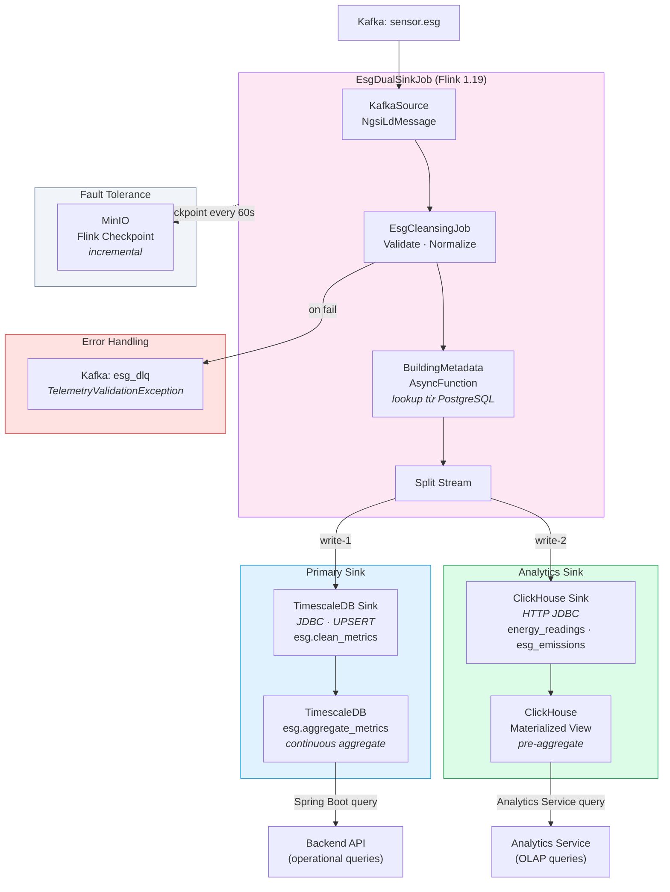
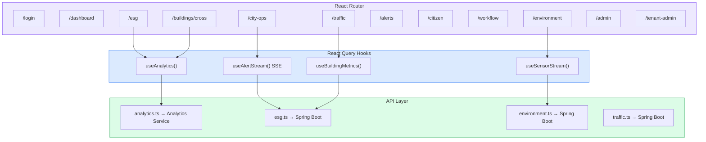

# UIP — Kiến trúc Hệ thống (MVP3)

> **Phiên bản:** 3.0  
> **Ngày cập nhật:** 2026-05-15  
> **Trạng thái:** Live — MVP3 Sprint 2  
> **Tác giả:** Solution Architect

---

## 1. Tổng quan (C4 Level 1 — System Context)

---

## 2. Kiến trúc thành phần (C4 Level 2 — Container Diagram)

```mermaid
graph TD
    subgraph IoTLayer["📡 Tầng IoT Ingest"]
        EMQX["EMQX CE 5.x<br/>MQTT Broker<br/><i>port 1883/8883</i>"]
        TB["ThingsBoard CE 3.x<br/>Device Registry<br/>+ Rule Engine"]
        RPANDA["Redpanda Connect<br/>ETL Bridge<br/><i>MQTT→Kafka transform</i>"]
    end

    subgraph MsgBus["📨 Message Bus"]
        KAFKA["Apache Kafka 3.7 KRaft<br/><b>Topics:</b><br/>sensor.esg · sensor.environment<br/>sensor.traffic · alert_events · esg_dlq"]
    end

    subgraph StreamLayer["⚡ Stream Processing — Apache Flink 1.19"]
        FLINK_ESG["EsgDualSinkJob<br/><i>Cleanse → TS + ClickHouse</i>"]
        FLINK_ENV["EnvironmentFlinkJob<br/><i>AQI compute</i>"]
        FLINK_TRF["TrafficFlinkJob<br/><i>Density aggregate</i>"]
        FLINK_ALT["AlertDetectionJob<br/><i>Threshold check</i>"]
        META_FN["BuildingMetadata<br/>AsyncFunction<br/><i>Enrich from PG</i>"]
        MINIO["MinIO<br/>Flink Checkpoint<br/>Storage"]
    end

    subgraph StorageLayer["🗄️ Tầng Lưu trữ"]
        TS["TimescaleDB PG 16<br/><b>Schemas:</b> esg · environment<br/>traffic · alerts · citizens<br/>+ Multi-tenant RLS"]
        PGB["PgBouncer<br/>Connection Pool"]
        CH["ClickHouse<br/><b>Tables:</b> energy_readings<br/>esg_emissions · aqi_readings<br/>traffic_density"]
        REDIS["Redis 7.x<br/>Cache + Pub/Sub"]
        PG_META["PostgreSQL<br/>Keycloak DB<br/>+ Metadata"]
    end

    subgraph BackendLayer["🔧 Backend Services"]
        SPRING["Spring Boot 3.2 Java 21<br/><b>Modules:</b><br/>auth · building · esg · environment<br/>traffic · alert · citizen · workflow<br/>notification · partner · tenant · scheduler"]
        ANALYTICS["Analytics Service<br/><i>Reads ClickHouse only</i><br/>GET /api/analytics/aqi-trend<br/>GET /api/analytics/emissions-aggregate"]
    end

    subgraph AuthGW["🔐 Auth & Gateway"]
        KONG["Kong API Gateway<br/>DB-less mode<br/>JWT · Rate Limit · Routing"]
        KC["Keycloak<br/>JWT / OIDC<br/>Multi-tenant Realm<br/>RoutingJwtDecoder"]
    end

    subgraph FrontendLayer["🖥️ Frontend — React 18 + TypeScript"]
        UI_CITY["City Operations Center<br/><i>MapLibre · Real-time</i>"]
        UI_ESG["ESG Analytics Dashboard<br/><i>ClickHouse powered</i>"]
        UI_ENV["Environment Monitor<br/><i>AQI · CO₂ · Nhiệt</i>"]
        UI_TRF["Traffic Management<br/><i>Mật độ · Sự cố</i>"]
        UI_ALT["Alert Rule Builder<br/><i>No-code rules</i>"]
        UI_CIT["Citizen Portal<br/><i>Hộ khẩu · Hóa đơn</i>"]
        UI_AI["AI Workflow Dashboard<br/><i>BPMN Designer</i>"]
        UI_XBLD["Cross-Building Dashboard<br/><i>Analytics API</i>"]
    end

    subgraph ObsLayer["📊 Observability"]
        PROM["Prometheus"]
        GRAF["Grafana"]
        ALERTMGR["Alertmanager"]
    end

    EMQX -->|"MQTT Bridge"| TB
    TB -->|"Kafka Publisher"| KAFKA
    EMQX -->|"MQTT"| RPANDA
    RPANDA -->|"Normalize → NGSI-LD"| KAFKA

    KAFKA -->|"consume"| FLINK_ESG
    KAFKA -->|"consume"| FLINK_ENV
    KAFKA -->|"consume"| FLINK_TRF
    KAFKA -->|"consume"| FLINK_ALT

    META_FN -.->|"async enrich"| FLINK_ESG
    FLINK_ESG -->|"checkpoint"| MINIO

    FLINK_ESG -->|"dual write"| PGB
    FLINK_ESG -->|"dual write"| CH
    FLINK_ENV --> PGB
    FLINK_TRF --> PGB
    FLINK_ALT -->|"alert_events topic"| KAFKA

    PGB --> TS

    SPRING <-->|"JDBC"| PGB
    SPRING <-->|"Redis Cache"| REDIS
    SPRING <-->|"@KafkaListener"| KAFKA

    ANALYTICS -->|"JDBC / HTTP"| CH

    KONG -->|"route"| SPRING
    KONG -->|"route"| ANALYTICS
    KC -->|"validate JWT"| KONG

    SPRING <-->|"SSE push"| UI_CITY
    SPRING -->|"REST API"| UI_ESG
    ANALYTICS -->|"REST API"| UI_XBLD
    ANALYTICS -->|"REST API"| UI_ESG

    PROM -->|"scrape"| SPRING
    PROM -->|"scrape"| KAFKA
    PROM -->|"scrape"| KONG
    PROM --> GRAF
    PROM --> ALERTMGR

    style IoTLayer fill:#fef9c3,stroke:#eab308
    style MsgBus fill:#ffe4e6,stroke:#f43f5e
    style StreamLayer fill:#fce7f3,stroke:#a855f7
    style StorageLayer fill:#e0f2fe,stroke:#0ea5e9
    style BackendLayer fill:#dcfce7,stroke:#16a34a
    style AuthGW fill:#fef3c7,stroke:#d97706
    style FrontendLayer fill:#ede9fe,stroke:#8b5cf6
    style ObsLayer fill:#f1f5f9,stroke:#64748b
```

---

## 3. Data Flow — IoT đến Dashboard

---

## 4. Alert Flow — Phát hiện và thông báo

---

## 5. Multi-Tenancy & Security

---

## 6. Dual-Write Architecture (MVP3 — Flink)

> **ADR-026 / ADR-035:** ClickHouse được thêm vào MVP3 như OLAP layer, Flink ghi đồng thời vào cả 2 store.

---

## 7. Frontend Module Map

---

## 8. Deployment Topology (UAT → Production)

```mermaid
graph TB
    subgraph UAT["UAT Environment — Docker Compose"]
        direction LR
        U_EMQX["EMQX"]
        U_TB["ThingsBoard"]
        U_KAFKA["Kafka 1-node<br/>KRaft"]
        U_FLINK["Flink<br/>JobManager + 1 TM"]
        U_TS["TimescaleDB<br/>single node"]
        U_CH["ClickHouse<br/>single node"]
        U_REDIS["Redis"]
        U_SPRING["Spring Boot"]
        U_AN["Analytics Service"]
        U_KONG["Kong"]
        U_KC["Keycloak"]
        U_MINIO["MinIO"]
        U_FE["React (Nginx)"]
    end

    subgraph PROD["Production — Kubernetes + Helm"]
        direction LR
        P_EMQX["EMQX Cluster<br/>3 nodes"]
        P_KAFKA["Kafka 3-node<br/>RF=3"]
        P_FLINK["Flink HA<br/>K8s leader election"]
        P_TS["TimescaleDB<br/>Patroni HA<br/>1 primary + 2 replicas"]
        P_CH["ClickHouse<br/>2-node cluster"]
        P_REDIS["Redis Cluster<br/>3 shards"]
        P_SPRING["Spring Boot<br/>3 replicas · HPA"]
        P_AN["Analytics Service<br/>2 replicas"]
        P_KONG["Kong<br/>2 replicas"]
        P_KC["Keycloak<br/>HA cluster"]
        P_VAULT["HashiCorp Vault<br/>Secret Management"]
        P_ISTIO["Istio<br/>mTLS + Traffic Mgmt"]
    end

    UAT -.->|"promote"| PROD

    style UAT fill:#fef9c3,stroke:#eab308
    style PROD fill:#dcfce7,stroke:#16a34a
```

---

## 9. Tech Stack

| Tầng | Công nghệ | Phiên bản | Ghi chú |
|---|---|---|---|
| **IoT Broker** | EMQX CE | 5.x | MQTT 3.1.1 / 5.0 |
| **IoT Platform** | ThingsBoard CE | 3.x | Device registry + Rule Engine |
| **ETL** | Redpanda Connect | latest | Benthos-based, MQTT→Kafka bridge |
| **Message Bus** | Apache Kafka KRaft | 3.7 | Không ZooKeeper |
| **Stream Processing** | Apache Flink | 1.19 | Java, dual-sink, checkpoint MinIO |
| **OLTP Database** | TimescaleDB | PG 16 | Hypertable, RLS, continuous aggregate |
| **Connection Pool** | PgBouncer | 1.22 | UAT bypass; Prod mandatory |
| **OLAP Database** | ClickHouse | 24.x | Analytics queries |
| **Cache** | Redis | 7.x | Cache + Pub/Sub |
| **Object Storage** | MinIO | latest | Flink checkpoint S3 |
| **Backend** | Spring Boot | 3.2 / Java 21 | Modular monolith |
| **Stream Processing** | Flink Jobs | 1.19 | Java, multi-job |
| **Frontend** | React + TypeScript | 18 / 5.x | MUI v5, Leaflet, recharts |
| **Workflow Engine** | Camunda 7 | 7.21 | Embedded, BPMN 2.0 |
| **AI** | Claude API | sonnet-4-6 | Anthropic, tool-use pattern |
| **API Gateway** | Kong | 3.x | DB-less, JWT plugin |
| **Auth** | Keycloak | 23.x | Multi-tenant, RoutingJwtDecoder |
| **Secret** | HashiCorp Vault | 1.15 | Prod only |
| **Container** | Docker Compose | — | UAT |
| **Orchestration** | Kubernetes + Helm | 1.28 | Prod |
| **Service Mesh** | Istio | 1.20 | Prod, mTLS |
| **Monitoring** | Prometheus + Grafana | — | Alertmanager, Kong alerts |

---

## 10. Thay đổi kiến trúc theo MVP

| Thành phần | MVP1 | MVP2 | MVP3 (hiện tại) |
|---|---|---|---|
| **Database** | TimescaleDB only | TimescaleDB + Redis | + ClickHouse (OLAP) |
| **Flink** | EsgFlinkJob (single sink) | Multi-job | EsgDualSinkJob (dual write) |
| **Analytics** | Embedded Spring Boot | Tách module | Analytics Service (microservice) |
| **Auth** | JWT basic | Multi-tenant Keycloak | RoutingJwtDecoder per-tenant |
| **Building** | N/A | N/A | Cross-building aggregation |
| **Metadata Enrich** | N/A | N/A | BuildingMetadataAsyncFunction |
| **Gateway** | N/A | Kong added | Kong + rate limit + alerts |
| **Deployment** | Docker Compose | Docker Compose + Helm draft | Helm GA + MinIO checkpoint |

---

> **Tài liệu liên quan:**
> - [ADR-026: ClickHouse Pre-emptive Adoption](ADR-026-clickhouse-pre-emptive.md)
> - [ADR-027: Keycloak Hybrid Auth](ADR-027-keycloak-hybrid-auth.md)
> - [ADR-028: Kong Gateway Scope](ADR-028-kong-gateway-scope.md)
> - [ADR-033: Tenant Hierarchy](ADR-033-tenant-hierarchy.md)
> - [ADR-035: Flink Enrichment Metadata Join](ADR-035-flink-enrichment-metadata-join.md)
> - [Flink Dual-Sink Risk Assessment](flink-dual-sink-risk-assessment.md)
> - [Sprint 1 Closeout Report](../reports/sprint1-closeout-po-report.md)
