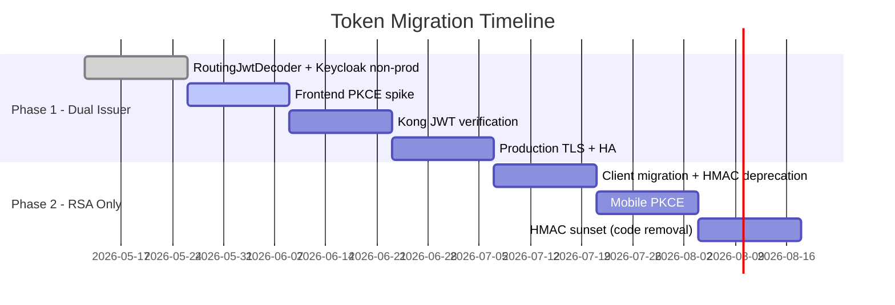

# Token Migration Guide — HMAC to Keycloak RSA

**Task:** S3-08 (Backend Lead)
**Date:** 2026-05-20
**Status:** Active
**Related ADRs:** ADR-027 (Keycloak Hybrid Auth)
**Audience:** Backend engineers, DevOps, City Authority IT security team

---

## 1. Overview

### Purpose

This guide documents the migration of JWT authentication from the legacy HMAC-symmetric issuer (`uip-legacy`) to Keycloak RS256-asymmetric tokens (`http://localhost:8085/realms/uip`). It covers the dual-issuer transition period, the final RSA-only state, rollback procedures, and per-client migration steps.

### Scope

| Component | Affected |
|-----------|----------|
| Backend monolith (`uip-backend`) | Token validation, `RoutingJwtDecoder`, `JwtAuthenticationFilter` |
| Keycloak | Realm `uip`, clients `uip-api` / `uip-frontend`, protocol mappers |
| Frontend SPA | Login flow, token storage, Authorization header |
| Kong API Gateway | Analytics route JWT verification |
| Mobile app (Sprint 5+) | PKCE OAuth2 flow via `uip-frontend` client |
| Flink jobs | No change (no auth; internal Kafka consumer) |

### Key Concepts

| Term | Definition |
|------|------------|
| **HMAC token** | JWT signed with `HS256` using a shared symmetric secret (`JWT_SECRET`). Issuer = `uip-legacy`. Generated by `JwtTokenProvider`. |
| **RSA token** | JWT signed with `RS256` using Keycloak's private key. Issuer = Keycloak realm URL. Verified via JWK set endpoint. |
| **Dual-issuer period** | Both HMAC and RSA tokens are accepted simultaneously. `RoutingJwtDecoder` routes based on the `iss` claim. |

---

## 2. Phase 1: Dual-Issuer (Current -- Sprint 3)

### 2.1 Architecture

Both HMAC and RSA tokens are accepted. The `RoutingJwtDecoder` inspects the JWT `iss` claim (without signature verification) and delegates to the appropriate decoder:

```
Client Request
    |
    v
Authorization: Bearer <jwt>
    |
    v
JwtAuthenticationFilter          (extracts token from header/cookie)
    |
    v
RoutingJwtDecoder.decode(token)  (routes by iss claim)
    |
    +--> iss == "uip-legacy"            --> HMAC decoder (NimbusJwtDecoder.withSecretKey)
    |
    +--> iss == "http://localhost:8085/realms/uip"  --> RSA decoder (NimbusJwtDecoder.withJwkSetUri)
    |
    +--> iss == anything else           --> JwtException("Unknown JWT issuer")
```

### 2.2 Configuration

All routing is driven by environment variables with sensible defaults in `application.yml`:

```yaml
security:
  jwt:
    secret: ${JWT_SECRET:changeme_jwt_secret_must_be_at_least_256_bits_long_for_hmac_sha256}
    expiration-ms: ${JWT_EXPIRATION_MS:900000}          # 15 min
    refresh-expiration-ms: ${JWT_REFRESH_EXPIRATION_MS:604800000}  # 7 days
    hmac-issuer: ${JWT_HMAC_ISSUER:uip-legacy}
    keycloak-issuer: ${JWT_KEYCLOAK_ISSUER:http://localhost:8085/realms/uip}
    keycloak-jwk-set-uri: ${JWT_KEYCLOAK_JWK_SET_URI:http://localhost:8085/realms/uip/protocol/openid-connect/certs}
```

**Production overrides (docker-compose profile):**

```yaml
JWT_KEYCLOAK_ISSUER: http://keycloak:8085/realms/uip
JWT_KEYCLOAK_JWK_SET_URI: http://keycloak:8085/realms/uip/protocol/openid-connect/certs
```

Note: Inside Docker network, the hostname is `keycloak` (container name), not `localhost`.

### 2.3 Token Issuance During Phase 1

| Endpoint | Token Type | Issuer | Notes |
|----------|-----------|--------|-------|
| `POST /api/v1/auth/login` | HMAC | `uip-legacy` | Legacy flow via `AuthService` + `JwtTokenProvider` |
| `POST /api/v1/auth/refresh` | HMAC | `uip-legacy` | Legacy refresh flow |
| Keycloak `/protocol/openid-connect/token` | RSA | `http://.../realms/uip` | Direct grant via `uip-api` client |

During Phase 1, the backend still issues HMAC tokens through its own `/auth/login` endpoint. Clients that have been migrated to Keycloak obtain RSA tokens directly from Keycloak's token endpoint.

### 2.4 Claim Mapping

Both token types must carry equivalent claims for the authorization layer to work uniformly:

| Claim | HMAC Token Source | RSA Token Source |
|-------|-------------------|------------------|
| `sub` | `userDetails.getUsername()` | Keycloak username |
| `iss` | `uip-legacy` (set by JJWT builder, no explicit `.issuer()` -- defaults to null in JJWT) | Keycloak realm URL |
| `roles` | `claims.put("roles", roles)` | Keycloak realm roles (`OPERATOR`, `ADMIN`, `VIEWER`) |
| `tenant_id` | `claims.put("tenant_id", tenantId)` | Keycloak `tenant-id-mapper` protocol mapper |
| `scopes` | `claims.put("scopes", scopes)` | Keycloak `scope` claim from client scope |
| `allowed_buildings` | `claims.put("allowed_buildings", ...)` | Keycloak `building-ids-mapper` |
| `tenant_path` | `claims.put("tenant_path", "city." + tenantId)` | Derived in `UipJwtConverter` from `tenant_id` |
| `parent_tenant_id` | Not present | Keycloak `parent-tenant-id-mapper` |

**Important:** The `JwtAuthenticationFilter` currently extracts claims using `JwtTokenProvider` (HMAC path only). When the `iss` is the Keycloak URL, the filter must handle claim extraction differently. This is handled by the filter catching `JwtException` from `JwtTokenProvider.extractUsername()` and falling through -- the Spring Security `JwtDecoder` bean validates the RSA token independently.

### 2.5 Security Considerations During Phase 1

1. **alg=none attack surface**: Both decoders reject unsigned tokens. The RSA decoder uses an explicit algorithm allowlist via `NimbusJwtDecoder.withJwkSetUri()`, which defaults to RS256.

2. **Key confusion**: An HMAC token with `iss` set to the Keycloak URL is routed to the RSA decoder, which rejects HS256 signatures. An RSA token with `iss` set to `uip-legacy` is routed to the HMAC decoder, which rejects RS256 signatures. Cross-issuer confusion is not possible.

3. **JWK cache TTL**: NimbusJwtDecoder caches the JWK set internally with a default TTL. Key rotation propagates within the cache TTL window.

4. **Token blacklist**: The `TokenBlacklistService` checks a Redis set. This applies to HMAC tokens only during Phase 1. RSA token revocation is handled by Keycloak's own session management.

---

## 3. Phase 2: RSA-Only (Sprint 5+)

### 3.1 When to Switch

Switch to RSA-only after ALL of the following are true:

- [ ] All frontend users log in via Keycloak (`/protocol/openid-connect/token`)
- [ ] All backend service accounts use Keycloak client credentials
- [ ] No HMAC tokens remain in active rotation (check Redis blacklist for recent entries)
- [ ] Mobile app (if deployed) uses PKCE flow via `uip-frontend` client
- [ ] City Authority IT has validated the Keycloak LDAP federation (if applicable)

### 3.2 How to Switch to RSA-Only

**Step 1: Disable HMAC login endpoint**

Remove or gate the `/api/v1/auth/login` and `/api/v1/auth/refresh` endpoints. At minimum, add a feature flag:

```yaml
# application.yml
uip:
  auth:
    legacy-login-enabled: false   # Set to false to disable HMAC login
```

**Step 2: Keep RoutingJwtDecoder in place**

Do NOT remove the HMAC decoder path immediately. Existing tokens have a 15-minute TTL (`expiration-ms: 900000`). After disabling HMAC login, existing HMAC tokens expire naturally within 15 minutes.

**Step 3: Remove HMAC decoder after token drain**

After `JWT_EXPIRATION_MS` (15 min) has elapsed since disabling HMAC login, verify no HMAC tokens are hitting the decoder by checking logs:

```bash
grep "HMAC JwtDecoder initialized" backend.log
grep "uip-legacy" /var/log/uip-backend/auth.log
```

If no HMAC tokens have been seen for 30 minutes (2x TTL), the HMAC decoder code path can be safely removed in the next release.

**Step 4: Environment variable cleanup (Sprint 7+)**

Remove these environment variables from docker-compose and deployment configs:

```yaml
# REMOVE these after HMAC is fully sunset
JWT_SECRET: ...              # No longer needed
JWT_HMAC_ISSUER: ...         # No longer needed
```

Keep these:
```yaml
JWT_KEYCLOAK_ISSUER: http://keycloak:8085/realms/uip
JWT_KEYCLOAK_JWK_SET_URI: http://keycloak:8085/realms/uip/protocol/openid-connect/certs
```

### 3.3 Code Changes for RSA-Only

In `SecurityConfig`, the `JwtAuthenticationFilter` must be updated to extract claims from the Spring Security `Jwt` principal (set by `JwtDecoder` bean) instead of using `JwtTokenProvider` for claim extraction. This is a separate refactor task.

The `RoutingJwtDecoder` can be simplified to a single-decoder `JwtDecoder` bean:

```java
@Bean
public JwtDecoder jwtDecoder(JwtProperties props) {
    return NimbusJwtDecoder.withJwkSetUri(props.getKeycloakJwkSetUri()).build();
}
```

### 3.4 Keycloak Token Refresh Flow

RSA-only clients use Keycloak's refresh token flow:

```
POST http://keycloak:8085/realms/uip/protocol/openid-connect/token
Content-Type: application/x-www-form-urlencoded

grant_type=refresh_token
client_id=uip-frontend        (public client, no secret)
refresh_token=<token>
```

The backend no longer issues or refreshes tokens. All token lifecycle is managed by Keycloak.

---

## 4. Rollback Procedure

If the Keycloak RSA path fails in production (Keycloak down, JWK endpoint unreachable, claim mapping mismatch), follow these steps to revert to HMAC-only.

### 4.1 Immediate Rollback (Zero Downtime)

All steps use environment variables only -- no code deployment needed.

**Step 1: Set environment variables to disable RSA routing**

```bash
# On the backend container, update these env vars:
export JWT_KEYCLOAK_ISSUER="DISABLED"
export JWT_KEYCLOAK_JWK_SET_URI="http://localhost:1"   # unreachable, fails fast
```

Or in docker-compose:

```yaml
environment:
  JWT_KEYCLOAK_ISSUER: "DISABLED"
  JWT_KEYCLOAK_JWK_SET_URI: "http://localhost:1"
```

**Step 2: Restart the backend container**

```bash
docker compose restart backend
```

After restart, all tokens with `iss = http://.../realms/uip` will be rejected with `JwtException("Unknown JWT issuer")`. Only HMAC tokens (`iss = uip-legacy`) will be accepted.

**Step 3: Verify HMAC-only mode**

```bash
# HMAC token should return 200:
curl -H "Authorization: Bearer <hmac-token>" http://localhost:8080/api/v1/health

# RSA token should return 401:
curl -H "Authorization: Bearer <rsa-token>" http://localhost:8080/api/v1/health
```

**Step 4: Switch frontend login back to HMAC**

If the frontend was pointing to Keycloak's token endpoint, switch it back to:

```
POST /api/v1/auth/login
Content-Type: application/json

{"username": "...", "password": "..."}
```

### 4.2 Partial Rollback (Keep Dual-Issuer, Fix RSA Path)

If Keycloak is healthy but the RSA token claim mapping is wrong (e.g., missing `tenant_id`):

1. Fix the protocol mapper in Keycloak Admin Console (`/admin/master/console`) -- no backend restart needed.
2. Verify the JWK set is accessible: `curl http://keycloak:8085/realms/uip/protocol/openid-connect/certs`.
3. Re-issue RSA tokens for affected users (ask them to log out and log back in).

### 4.3 Environment Variable Reference for Rollback

| Variable | HMAC-Only Value | Dual-Issuer Value | RSA-Only Value |
|----------|----------------|-------------------|----------------|
| `JWT_SECRET` | (keep existing) | (keep existing) | (remove) |
| `JWT_HMAC_ISSUER` | `uip-legacy` | `uip-legacy` | (remove) |
| `JWT_KEYCLOAK_ISSUER` | `DISABLED` | `http://keycloak:8085/realms/uip` | `http://keycloak:8085/realms/uip` |
| `JWT_KEYCLOAK_JWK_SET_URI` | `http://localhost:1` | `http://keycloak:8085/realms/uip/protocol/openid-connect/certs` | `http://keycloak:8085/realms/uip/protocol/openid-connect/certs` |

### 4.4 Rollback Decision Matrix

| Symptom | Root Cause | Action |
|---------|-----------|--------|
| All requests return 401 | Keycloak container down | Partial rollback: restart Keycloak, no env change needed |
| RSA tokens return 401 but Keycloak is up | JWK endpoint misconfigured | Check `JWT_KEYCLOAK_JWK_SET_URI` value, fix URL |
| RSA tokens decode but missing `tenant_id` claim | Protocol mapper misconfigured | Fix in Keycloak Admin Console, no restart |
| RSA tokens decode but `roles` claim is empty | Realm role mapping missing | Assign roles in Keycloak, re-login |
| Intermittent 401 spikes during key rotation | JWK cache thrash | Increase NimbusJwtDecoder cache TTL (code change) |
| Full auth failure, cannot diagnose quickly | Unknown | Full rollback to HMAC-only (Section 4.1) |

---

## 5. Client Migration Checklist

### 5.1 Backend API Client (`uip-api` -- Confidential)

**Keycloak client config:** `client_id = uip-api`, `publicClient = false`, `directAccessGrantsEnabled = true`

| Step | Action | Verification |
|------|--------|-------------|
| 1 | Obtain token from Keycloak: `POST /realms/uip/protocol/openid-connect/token` with `grant_type=password`, `client_id=uip-api`, `client_secret=<secret>` | Response contains `access_token` with `iss = http://.../realms/uip` |
| 2 | Decode the token at jwt.io -- verify claims: `sub`, `tenant_id`, `roles`, `building_ids` | All claims present and correct |
| 3 | Call protected endpoint: `GET /api/v1/environment/sensors` with `Authorization: Bearer <rsa-token>` | Returns 200 with data |
| 4 | Verify tenant isolation: use a token for tenant-a, confirm no access to tenant-b data | Returns 403 or empty results for cross-tenant |
| 5 | Test token refresh via Keycloak: `grant_type=refresh_token` | New access token issued |
| 6 | Remove hardcoded `JWT_SECRET` from CI/test scripts | Tests pass with Keycloak tokens |

**curl example:**

```bash
# Obtain RSA token from Keycloak
RSA_TOKEN=$(curl -s -X POST http://localhost:8085/realms/uip/protocol/openid-connect/token \
  -d "grant_type=password" \
  -d "client_id=uip-api" \
  -d "client_secret=uip-api-secret-dev" \
  -d "username=operator-hcm" \
  -d "password=password" | jq -r .access_token)

# Use token against backend
curl -H "Authorization: Bearer $RSA_TOKEN" http://localhost:8080/api/v1/environment/sensors
```

### 5.2 Frontend SPA (`uip-frontend` -- Public, PKCE-Ready)

**Keycloak client config:** `client_id = uip-frontend`, `publicClient = true`, `standardFlowEnabled = true`, `pkce.code.challenge.method = S256`

| Step | Action | Verification |
|------|--------|-------------|
| 1 | Switch login from `POST /api/v1/auth/login` to Keycloak Authorization Code flow with PKCE | Redirect to Keycloak login page works |
| 2 | Handle callback at redirect URI, exchange authorization code for tokens | `access_token` and `id_token` received |
| 3 | Store `access_token` in memory (not localStorage for XSS protection) | Token available for API calls |
| 4 | Use `access_token` in `Authorization: Bearer` header for all API calls | All endpoints return expected data |
| 5 | Implement silent refresh via `iframe` or `refresh_token` grant | Session persists beyond token TTL |
| 6 | Test logout: call Keycloak end-session endpoint, clear local token state | User fully logged out |
| 7 | Verify SSE endpoint (`/api/v1/notifications/stream`) works with RSA token in cookie or header | SSE stream connects and receives events |

**Keycloak endpoints for frontend:**

```
Authorization:  http://localhost:8085/realms/uip/protocol/openid-connect/auth
Token:          http://localhost:8085/realms/uip/protocol/openid-connect/token
Logout:         http://localhost:8085/realms/uip/protocol/openid-connect/logout
Userinfo:       http://localhost:8085/realms/uip/protocol/openid-connect/userinfo
```

### 5.3 Mobile App (Sprint 5+ -- React Native with PKCE)

**Keycloak client config:** Same `uip-frontend` client, PKCE via `expo-auth-session`.

| Step | Action | Verification |
|------|--------|-------------|
| 1 | Configure `expo-auth-session` with Keycloak discovery URL | Authorization prompt appears |
| 2 | Use PKCE (`S256` code challenge method) | Token exchange succeeds |
| 3 | Securely store tokens in device keychain (`expo-secure-store`) | Tokens persist across app restarts |
| 4 | Implement token refresh before expiry | No 401 errors during normal use |
| 5 | Test offline behavior with expired token | Graceful re-auth prompt |

### 5.4 Kong API Gateway

| Step | Action | Verification |
|------|--------|-------------|
| 1 | Configure Kong JWT plugin to verify tokens against Keycloak JWK set | Requests without valid JWT return 401 |
| 2 | Strip client-supplied `X-Tenant-ID` header, inject from JWT `tenant_id` claim | Tenant isolation enforced at gateway |
| 3 | Test analytics endpoint through Kong with RSA token | Returns correct tenant-scoped data |
| 4 | Verify HMAC tokens are rejected by Kong (Kong does not know the HMAC secret) | HMAC token returns 401 via Kong (expected -- analytics route is RSA-only per ADR-028) |

### 5.5 Service Accounts / Machine-to-Machine

For backend services that call other backend APIs (e.g., Flink jobs that need to call analytics endpoints):

| Step | Action | Verification |
|------|--------|-------------|
| 1 | Create a Keycloak service account client (if not already `uip-api`) | Client configured with `serviceAccountsEnabled = true` |
| 2 | Use `client_credentials` grant: `grant_type=client_credentials&client_id=uip-api&client_secret=<secret>` | Token returned with service account subject |
| 3 | Assign appropriate roles to the service account via Keycloak | Token contains correct `roles` and `tenant_id` claims |

---

## 6. Testing Verification

### 6.1 Unit Tests

Existing tests in `RoutingJwtDecoderTest` cover:

| Test | Scenario | Expected |
|------|----------|----------|
| `hmacToken_correctIssuer_decodes` | HMAC token with `iss = uip-legacy` | Decode succeeds, claims extracted |
| `hmacToken_rolesAndTenant_extracted` | HMAC with `roles` and `tenant_id` claims | Claims match input |
| `expiredHmacToken_rejected` | Expired HMAC token | `JwtException` thrown |
| `unknownIssuer_rejected` | Token with `iss = unknown-issuer` | `JwtException("Unknown JWT issuer")` |
| `missingIssuer_rejected` | Token without `iss` claim | `JwtException("missing issuer")` |
| `tamperedHmacToken_rejected` | HMAC signature tampered | `JwtException` thrown |

### 6.2 Integration Tests

Existing tests in `RoutingJwtDecoderIT` (9 scenarios) cover:

| Test ID | Scenario | Expected |
|---------|----------|----------|
| KC-IT-01 | RSA JWT decode -- iss matches Keycloak URL | Decode succeeds |
| KC-IT-02 | RSA JWT -> protected API -> 200 | Full request pipeline works |
| KC-IT-03 | HMAC JWT -> protected API -> 200 (fallback) | Dual-issuer working |
| KC-IT-04 | Expired RSA JWT -> protected API -> 401 | Expired token rejected |
| KC-IT-05 | RSA JWT signed with unknown key -> 401 | Untrusted key rejected |
| KC-IT-06 | alg=none JWT -> rejected | Unsigned token rejected |
| KC-IT-07 | Issuer-based routing (3 sub-tests) | Routing logic correct |
| KC-IT-08 | HS256 token with RSA issuer -> rejected | Cross-algorithm confusion blocked |
| KC-IT-09 | JWK key rotation -- new kid, old tokens still valid | Key rotation handled |

### 6.3 Manual Verification Checklist

**Phase 1 (Dual-Issuer) -- verify before merging any auth change:**

```bash
# 1. HMAC login still works
HMAC_TOKEN=$(curl -s -X POST http://localhost:8080/api/v1/auth/login \
  -H "Content-Type: application/json" \
  -d '{"username":"admin","password":"admin_Dev#2026!"}' | jq -r .accessToken)
echo "HMAC token issuer: $(echo $HMAC_TOKEN | cut -d. -f2 | base64 -d 2>/dev/null | jq .iss)"

# 2. HMAC token accesses protected endpoint
curl -s -o /dev/null -w "%{http_code}" \
  -H "Authorization: Bearer $HMAC_TOKEN" \
  http://localhost:8080/api/v1/environment/sensors
# Expected: 200

# 3. Keycloak is healthy
curl -s http://localhost:8085/health/ready | jq .
# Expected: UP

# 4. JWK set is accessible
curl -s http://localhost:8085/realms/uip/protocol/openid-connect/certs | jq .keys
# Expected: non-empty array with RS256 key

# 5. RSA token from Keycloak works
RSA_TOKEN=$(curl -s -X POST http://localhost:8085/realms/uip/protocol/openid-connect/token \
  -d "grant_type=password" \
  -d "client_id=uip-api" \
  -d "client_secret=uip-api-secret-dev" \
  -d "username=operator-hcm" \
  -d "password=password" | jq -r .access_token)

curl -s -o /dev/null -w "%{http_code}" \
  -H "Authorization: Bearer $RSA_TOKEN" \
  http://localhost:8080/api/v1/environment/sensors
# Expected: 200

# 6. Verify RSA token issuer claim
echo $RSA_TOKEN | cut -d. -f2 | base64 -d 2>/dev/null | jq .iss
# Expected: "http://localhost:8085/realms/uip"

# 7. Verify tenant_id in RSA token
echo $RSA_TOKEN | cut -d. -f2 | base64 -d 2>/dev/null | jq .tenant_id
# Expected: tenant identifier string
```

**Phase 2 (RSA-Only) -- verify before sunsetting HMAC:**

```bash
# 1. All active users use Keycloak tokens
grep "iss" /var/log/uip-backend/auth.log | grep "uip-legacy" | tail -1
# Expected: no entries in last 30 minutes

# 2. HMAC login endpoint returns 403 or 404 (if disabled)
curl -s -o /dev/null -w "%{http_code}" \
  -X POST http://localhost:8080/api/v1/auth/login \
  -H "Content-Type: application/json" \
  -d '{"username":"admin","password":"admin_Dev#2026!"}'
# Expected: 403 or 404

# 3. RSA token refresh works
REFRESH=$(curl -s -X POST http://localhost:8085/realms/uip/protocol/openid-connect/token \
  -d "grant_type=refresh_token" \
  -d "client_id=uip-api" \
  -d "client_secret=uip-api-secret-dev" \
  -d "refresh_token=<refresh-token>")
echo $REFRESH | jq .access_token
# Expected: new access token

# 4. Rollback drill: switch to HMAC-only and verify
# (Follow Section 4.1 steps, then re-enable dual-issuer)
```

### 6.4 Automated Test Gate

Add to CI pipeline for every PR touching `auth/` package:

```yaml
# .github/workflows or equivalent
- name: Auth Integration Tests
  run: |
    ./gradlew test --tests "com.uip.backend.auth.config.RoutingJwtDecoderTest"
    ./gradlew test --tests "com.uip.backend.auth.config.RoutingJwtDecoderIT"
```

Gate: all 6 unit tests + 9 integration tests must pass. Zero tolerance for auth regressions.

---

## 7. Timeline

| Sprint | Phase | Milestone | Action Items |
|--------|-------|-----------|-------------|
| **MVP3-1** (current) | Phase 1 | Dual-issuer live | `RoutingJwtDecoder` deployed, Keycloak non-prod running, 9 IT tests passing |
| **MVP3-2** | Phase 1 | Frontend PKCE spike | Prototype Keycloak auth code + PKCE flow in frontend dev build |
| **MVP3-3** | Phase 1 | Kong JWT verification | Analytics route through Kong with RSA token validation |
| **MVP3-4** | Phase 1 | Production TLS | Keycloak production HA, Kong TLS termination, rate limiting |
| **MVP3-5** | Phase 1 -> Phase 2 | Client migration | Tier 2 customers migrated to Keycloak tokens, HMAC login deprecated |
| **MVP3-6** | Phase 2 | Mobile PKCE | React Native app using `uip-frontend` PKCE flow |
| **MVP3-7** | Phase 2 | HMAC sunset | Remove HMAC decoder code path, remove `JWT_SECRET` env var, cleanup `JwtTokenProvider` |

### Dependencies



### Risk Register

| Risk | Probability | Impact | Mitigation |
|------|-------------|--------|------------|
| Keycloak downtime blocks all auth during Phase 2 | Medium | Critical | Keep HMAC fallback until Sprint 7; healthcheck-driven circuit breaker |
| JWK cache thrash during key rotation | Low | Medium | 60s cache TTL, both old and new keys served during rotation |
| Claim mapping mismatch between HMAC and RSA tokens | Medium | High | Integration tests verify claim equivalence; manual checklist in Section 6.3 |
| Frontend cookie-based SSE breaks with RSA tokens | Low | Medium | Verify SSE endpoint accepts `Authorization: Bearer` header fallback |
| City Authority LDAP federation delays | Medium | Low | LDAP is additive; Phase 2 does not block on it |

---

## Appendix A: Keycloak Realm Configuration Reference

Realm: `uip` (file: `infra/keycloak/realm-uip-export.json`)

| Client | Type | Grant Types | Notes |
|--------|------|-------------|-------|
| `uip-api` | Confidential | `password`, `client_credentials` | Backend service accounts, direct grant |
| `uip-frontend` | Public | `authorization_code` (PKCE) | SPA and mobile, no secret, `redirectUris: ["http://localhost:3000/*", "http://localhost:8080/*"]` |

**Protocol Mappers on `uip-api`:**
- `tenant-id-mapper` -- maps `tenant_id` user attribute to access token claim
- `is-aggregator-mapper` -- maps `is_aggregator` boolean attribute
- `building-ids-mapper` -- maps `building_ids` multivalued attribute
- `parent-tenant-id-mapper` -- maps `parent_tenant_id` attribute

**Protocol Mappers on `uip-frontend`:**
- `tenant-id-mapper` -- maps `tenant_id` user attribute to access token claim

**Test Users:**
- `operator-hcm` -- role `OPERATOR`, tenant `hcm`
- (Additional users defined in `realm-uip-export.json`)

## Appendix B: Quick Reference -- Environment Variables

| Variable | Required | Default | Phase |
|----------|----------|---------|-------|
| `JWT_SECRET` | Phase 1 only | `changeme_jwt_secret_...` | 1 |
| `JWT_HMAC_ISSUER` | Phase 1 only | `uip-legacy` | 1 |
| `JWT_EXPIRATION_MS` | Both phases | `900000` (15 min) | 1-2 |
| `JWT_REFRESH_EXPIRATION_MS` | Phase 1 only | `604800000` (7 days) | 1 |
| `JWT_KEYCLOAK_ISSUER` | Both phases | `http://localhost:8085/realms/uip` | 1-2 |
| `JWT_KEYCLOAK_JWK_SET_URI` | Both phases | `http://localhost:8085/realms/uip/protocol/openid-connect/certs` | 1-2 |
| `KEYCLOAK_ADMIN` | DevOps | `admin` | Infra |
| `KEYCLOAK_ADMIN_PASSWORD` | DevOps | (secret) | Infra |
