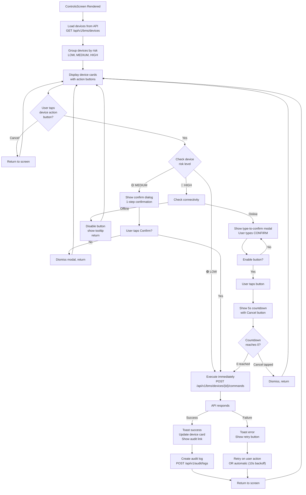

# S10-TD-05: Mobile Control Panel Safety Specification

**Sprint:** MVP3.1  
**Component:** `applications/operator-mobile` / `ControlsScreen`  
**Owner:** Frontend Engineer + UX Designer  
**Date:** 2026-06-05

---

## 1. Context & Safety Requirements

### Why Mobile Actuator Control Needs Special UX

HVAC, lighting, door, and emergency systems in HCMC buildings are safety-critical. The mobile app must prevent accidental or malicious activation of high-risk commands while enabling legitimate operators to respond quickly to incidents.

**Current State:**
- `ControlsScreen` displays building list only (no control actions)
- v3.1 roadmap adds BMS (Building Management System) device control

**Safety Requirements:**
1. **Prevent Accidental Activation** — No single-tap for destructive actions
2. **Audit Trail** — Every command logged with operator ID, timestamp, reason
3. **Offline Safety** — HIGH risk commands blocked when no connectivity (cannot reach audit service)
4. **Role-Based Access** — Operator role can adjust HVAC; only Site Manager can emergency-stop HVAC
5. **Undo Window** — HIGH risk commands give 5-second undo window before execution
6. **Visual Safety** — Color-blind safe indicators (not just red; use icon + text + shape)

---

## 2. Command Risk Classification

### 🟢 LOW Risk
**Safe, easily reversible, no emergency impact**
- Lighting: toggle on/off, brightness adjust
- Schedule: enable/disable recurring schedule
- Occupancy mode: switch between occupied/unoccupied
- Data: fetch sensor readings, view logs

**User Impact:** None  
**Undo Window:** None (immediate execution)  
**Offline Allowed:** Yes (can queue to sync when online)

---

### 🟡 MEDIUM Risk
**Affects comfort/availability, reversible within minutes**
- HVAC temperature adjust (±3°C from setpoint)
- Door unlock (corridor, stairwell, non-emergency)
- Lighting schedule edit (affects multiple zones)
- Emergency lights test (low impact)

**User Impact:** Zone becomes uncomfortable (10–30 min recovery)  
**Undo Window:** 5 seconds (confirm dialog only)  
**Offline Allowed:** No (must sync immediately to prevent duplicate changes)

---

### 🔴 HIGH Risk
**Emergency or catastrophic impact, difficult/impossible to undo quickly**
- HVAC shutdown (system off, no cooling/heating)
- Elevator emergency stop (strands occupants)
- Door emergency unlock (security breach)
- Fire suppression activation (false alarm = expensive cleanup)
- Electrical circuit breaker trip

**User Impact:** Building occupant safety risk, financial loss (>VND 10M)  
**Undo Window:** 5-second countdown with visible "Cancel" button  
**Offline Allowed:** **NO** — must be online and authenticated (enforce in backend with 401 Unauthorized)

---

## 3. Confirmation Flow by Risk Level

```
┌─────────────────────────────────────────────────────────────────┐
│                     USER TAPS COMMAND BUTTON                    │
└─────────────────────────────────────────────────────────────────┘
                              ↓
                    ┌─────────────────────┐
                    │  Risk Level Check   │
                    └─────────────────────┘
                      ↙          ↓           ↘
          🟢 LOW      🟡 MEDIUM   🔴 HIGH
            ↓           ↓           ↓
        Execute   Confirm Dialog  2-Step + Countdown
        Immediate   (1-tap)       (Type-to-confirm)
        
        ✓ Done      ✓ Continue?   Type "CONFIRM"
                        ↓              ↓
                    Show 5s        Show 5s
                    Countdown      Countdown
                        ↓              ↓
                    Execute      Execute
```

### LOW Risk Flow (Immediate)

**User taps:** "Toggle Lighting — Corridor 3"

```
Button tap → API POST /api/v1/bms/devices/{id}/commands
  ↓
POST response: { status: "success", device_state: "ON" }
  ↓
Toast: "Lighting enabled ✓" (2s dismiss)
  ↓
Card updates: LED icon green, "Last command: 10s ago"
```

### MEDIUM Risk Flow (Confirm Dialog)

**User taps:** "Adjust Temperature +2°C — Zone B1"

```
Button tap
  ↓
[Modal appears]
┌──────────────────────────────────────┐
│ ⚠️  Confirm Temperature Adjustment   │
├──────────────────────────────────────┤
│ Building: ABC Office Tower           │
│ Device: HVAC Unit B1                 │
│ Current: 22°C → Set to: 24°C         │
│                                      │
│ This affects 3 office zones          │
│ Comfort impact: +15 min recovery     │
│                                      │
│         [Cancel]  [Confirm]          │
└──────────────────────────────────────┘
  ↓
User taps [Confirm]
  ↓
API POST immediately
  ↓
Toast: "Temperature set to 24°C ✓"
```

### HIGH Risk Flow (Type-to-Confirm + Countdown)

**User taps:** "🛑 HVAC Shutdown — Emergency"

```
Button tap (RED button with ⚠️ icon, large 56dp)
  ↓
[Full-screen modal]
┌──────────────────────────────────────────────────────┐
│                 🛑 EMERGENCY ACTION 🛑               │
├──────────────────────────────────────────────────────┤
│                                                      │
│ HVAC COMPLETE SHUTDOWN                              │
│ Zone: Building Floor 1-5                            │
│ Device: Central HVAC Unit                           │
│                                                      │
│ ⚠️  WARNING: This will stop all heating and cooling │
│    occupant comfort impact: IMMEDIATE                │
│    recovery time: 30+ minutes                        │
│    cost of activation: estimated VND 5M             │
│                                                      │
│ This action CANNOT be undone immediately.           │
│ An audit entry will be created.                     │
│                                                      │
│ Type "CONFIRM" to enable the button:                │
│ ┌─────────────────────────────────────────┐         │
│ │                                         │         │
│ │ _                                       │         │
│ └─────────────────────────────────────────┘         │
│                                                      │
│ Typed: "CONFIR" (text appears as user types)        │
│                                                      │
│              [Cancel]  [CONFIRM (disabled)]         │
│                                                      │
│ Next: 5-second countdown will begin                 │
│                                                      │
│       Operator ID: op-2849                          │
│       Timestamp: 2026-06-05 14:32:10 UTC            │
│                                                      │
└──────────────────────────────────────────────────────┘
  ↓
User types "CONFIRM" → button enables
  ↓
User taps [CONFIRM] button
  ↓
[5-second countdown screen]
┌──────────────────────────────────────────────────────┐
│                                                      │
│            ⏳ EXECUTION IN: 5 SECONDS ⏳             │
│                                                      │
│            🛑 HVAC Shutdown — Building 1-5          │
│                                                      │
│           ⏱️ 5  →  4  →  3  →  2  →  1              │
│                                                      │
│                   [CANCEL COMMAND]                  │
│                  (Tap to undo execution)            │
│                                                      │
└──────────────────────────────────────────────────────┘
  ↓
[Countdown reaches 0 OR user taps Cancel]
  ↓
If Cancel → Modal closes, return to ControlsScreen, toast: "Command cancelled"
If 0 → API POST /api/v1/bms/devices/{id}/commands with { action: "shutdown", reason: "Emergency operator request" }
  ↓
API Response
  ├─ success: Toast "HVAC shutdown initiated. Building evacuated?" + audit trail link
  └─ failure: Toast "Command failed [Error: 500]. Contact operations center immediately."
  ↓
Audit log entry created:
  {
    operator_id: "op-2849",
    command: "HVAC_SHUTDOWN",
    device_id: "hvac-unit-1",
    timestamp: "2026-06-05T14:32:15Z",
    reason: "Emergency operator request",
    status: "executed",
    ip_address: "192.168.1.100",
    user_agent: "ExpoClient/..."
  }
```

---

## 4. HIGH Risk Command UX Pattern — Detailed Flow

### Step 1: Command Button Design

**Visual:**
- Background: Bright red (`#D32F2F`)
- Icon: ⚠️ + large text label
- Size: 56dp minimum (WCAG touch target)
- Shape: Rounded (12dp radius)
- State:
  - Normal: Full color, slightly elevated shadow
  - Hover: Slightly darker red
  - Pressed: Deeper shadow (active state feedback)

**Label Examples:**
```
🛑 HVAC Shutdown
🚨 Emergency Stop (Elevator)
🔓 Emergency Door Unlock
💧 Fire Suppression Test
⚡ Electrical Isolation
```

### Step 2: Full-Screen Confirmation Modal

**Modal Properties:**
- Overlay: Semi-transparent dark background (cannot dismiss by tapping outside)
- Size: Full screen (prevents accidental closure)
- Content:
  - Title: "🛑 EMERGENCY ACTION 🛑" (red, large)
  - Command name
  - Building / device name
  - Current state
  - Consequence / warning (2–3 lines max)
  - Audit metadata (operator ID, timestamp)

**Cannot dismiss by:**
- Tapping outside modal
- Back button on Android

**Can dismiss by:**
- Tap [Cancel] button explicitly
- Tap [CONFIRM] → countdown screen (not dismissible there)

### Step 3: Type-to-Confirm Input

**Requirement:** User must type "CONFIRM" (case-sensitive) to enable the button

**UI:**
```
┌─────────────────────────────────────────┐
│ Type "CONFIRM" to enable the button:    │
│ ┌─────────────────────────────────────┐ │
│ │ CON                                 │ │
│ └─────────────────────────────────────┘ │
│ Progress: 3/7 characters                │
│                                         │
│ [Cancel]  [CONFIRM (disabled)]          │
└─────────────────────────────────────────┘
```

**Behavior:**
- Text input cleared on modal open
- Input is plain text (no special formatting)
- Backspace removes characters
- Once "CONFIRM" typed fully, button enables (changes from gray to red)
- Button remains enabled until user taps it or dismisses modal

### Step 4: 5-Second Countdown with Undo

**Screen:**
```
⏳ EXECUTION IN: 5 SECONDS ⏳

🛑 HVAC Shutdown — Building 1-5

⏱️ 5  →  4  →  3  →  2  →  1

[CANCEL COMMAND]
(Tap to undo execution)
```

**Behavior:**
- Countdown displays large, bold numbers
- Updates every 1 second (no flicker)
- User can tap [CANCEL COMMAND] any time before 0
- If cancelled: Modal closes, toast "Command cancelled", return to ControlsScreen
- If countdown reaches 0: Immediately execute API call (do NOT wait for user)

**Audio/Haptics (Optional, v3.2):**
- Vibration on every countdown tick
- Beep at 3s, 1s remaining

### Step 5: Execute & Audit Log

**API Call:**
```http
POST /api/v1/bms/devices/{device_id}/commands

{
  "action": "HVAC_SHUTDOWN",
  "reason": "Emergency operator request",
  "operator_id": "op-2849",
  "timestamp": "2026-06-05T14:32:15Z",
  "client_ip": "192.168.1.100",
  "app_version": "3.1.0"
}
```

**Backend Response (Success):**
```json
{
  "status": "success",
  "command_id": "cmd-98765",
  "device_state": "offline",
  "executed_at": "2026-06-05T14:32:15Z",
  "audit_entry_id": "audit-54321"
}
```

**Backend Response (Failure — e.g., 500):**
```json
{
  "status": "error",
  "error": "Device unreachable",
  "code": "DEVICE_OFFLINE",
  "retry_after_seconds": 30
}
```

**UI Feedback:**
- **Success:** Toast "HVAC shutdown initiated ✓" + link to audit log
- **Failure:** Toast "Command failed: Device unreachable. Contact ops immediately." + error badge on card

---

## 5. Accessibility & Safety

### No Accidental Touch Prevention

**Design Rules:**
- 56dp minimum touch target for destructive actions (WCAG 2.5.5 AAA)
- 8dp padding around button to prevent accidental adjacent taps
- No auto-dismiss of confirmation modals
- Confirmation modals: cannot dismiss by tapping overlay

**Device Orientation:**
- Portrait: Large button, centered
- Landscape: Same button size (do NOT shrink in landscape)

### Color-Blind Safe Indicators

**Current Anti-Pattern:**
```
RED button = danger ✗ (not sufficient; color-blind users see gray)
```

**Correct Pattern:**
```
RED button + ⚠️ ICON + "🛑 HVAC Shutdown" TEXT

Elements:
  ✓ Color: Red
  ✓ Icon: Universal warning symbol (⚠️)
  ✓ Text: Descriptive label (not just color)
  ✓ Shape: Distinct from other buttons (larger, rounded more)
```

**Color Palette (Color-Blind Safe):**
| Risk | Color | Icon | Text | Notes |
|------|-------|------|------|-------|
| 🟢 LOW | Green #4CAF50 | ✓ | "Enable" | Protanopia: cyan-friendly |
| 🟡 MEDIUM | Amber #FF9800 | ⚠️ | "Confirm?" | Deuteranopia: yellow-friendly |
| 🔴 HIGH | Red #D32F2F | 🛑 | "🛑 SHUTDOWN" | Tritanopia: red-friendly |

### Offline Safety: Block HIGH Risk

**Current Implementation:**
- When offline, disable all HIGH risk buttons (gray out, show tooltip "Offline — feature unavailable")
- MEDIUM risk: Allow queue to sync when online
- LOW risk: Can execute offline

**Backend Enforcement:**
```
If offline && HIGH_RISK_COMMAND:
  Response: 401 Unauthorized { error: "offline_not_allowed" }
  Backend rationale: Command audit service unreachable; prevent unlogged actions
```

**Frontend UI:**
```
[Gray button with tooltip]
🛑 HVAC Shutdown (disabled)
Tooltip: "Offline — cannot execute high-risk commands"
```

---

## 6. Implementation Estimate for v3.1

| Feature | Story Points | Dependency | Priority | Notes |
|---------|-------------|-----------|----------|-------|
| Command risk classification + card UI | 3 | BMS API design | P0 | Foundational |
| LOW risk: Single-tap execution | 2 | API integration | P0 | Lighting, occupancy mode |
| MEDIUM risk: Confirm dialog | 2 | Command queuing | P1 | HVAC adjust, door unlock |
| HIGH risk: Type-to-confirm + countdown | 4 | Auth + audit API | P0 | HVAC shutdown, emergency stop |
| Offline state enforcement | 2 | NetInfo integration | P1 | Disable HIGH risk when offline |
| Audit log view + filter (read-only) | 3 | Audit API | P2 | Show command history per device |
| Error handling + retry UI | 2 | API error responses | P1 | User feedback for failed commands |
| Accessibility audit (WCAG 2.1 AA) | 2 | All UI | P2 | Touch targets, color contrast |
| E2E tests (Detox) | 3 | All features | P1 | Critical safety workflows |
| **Total** | **23 SP** | — | — | ~2 sprints |

---

## 7. UX Flow Diagram



---

## 8. Acceptance Criteria

### AC-01: LOW Risk Command Execution
- User taps LOW risk button (e.g., "Toggle Lighting")
- Command executes immediately without confirmation dialog
- API POST succeeds → card updates within 1 second
- Toast shows "Lighting enabled ✓"

### AC-02: MEDIUM Risk Confirm Dialog
- User taps MEDIUM risk button (e.g., "Adjust +2°C")
- Full confirmation dialog appears with device details and consequence warning
- User can cancel (modal closes, no API call)
- User can confirm → API POST executes immediately, card updates

### AC-03: HIGH Risk Type-to-Confirm + Countdown
- User taps HIGH risk button (e.g., "🛑 HVAC Shutdown")
- Full-screen modal appears with ⚠️ header, command name, building, warning text
- User must type "CONFIRM" (case-sensitive) to enable button
- User taps [CONFIRM] → 5-second countdown modal displays
- During countdown: user can tap [CANCEL COMMAND] to abort
- Countdown reaches 0 → API POST executes, audit log created

### AC-04: Offline Safety — HIGH Risk Disabled
- When device offline (NetInfo.isConnected === false):
  - HIGH risk buttons appear disabled (gray, unresponsive)
  - Tooltip shows "Offline — cannot execute high-risk commands"
  - LOW/MEDIUM buttons queue or execute normally (per design)

### AC-05: Audit Trail Created
- After each command execution (regardless of risk level):
  - Audit entry created with: operator_id, command_type, device_id, timestamp, status
  - Backend enforces audit log write before responding to client
  - User can view audit trail from device card (link in success toast)

### AC-06: Error Handling & Retry
- API returns 500 error for command execution
- Toast shows "Command failed: [error message]. Contact ops immediately."
- Error badge appears on device card
- User can manually retry (tap button again)

### AC-07: Color-Blind Safe Design
- All risk levels use: Color + Icon + Text (not color alone)
- WCAG 2.1 AA color contrast verified (4.5:1 minimum)
- No red/green only; use red/amber/green with distinct icons (🛑/⚠️/✓)

### AC-08: Touch Target Size (WCAG AAA)
- All command buttons: minimum 56dp square touch area
- Confirm/Cancel buttons in modals: minimum 56dp
- Text input field: 48dp height
- No accidental touches on adjacent buttons (8dp padding minimum)

---

## 9. Technical Implementation Notes

### Component Structure

```typescript
// ControlsScreen.tsx
<ControlsScreen>
  <RiskDeviceCard risk="LOW" device={lighting} />
    <LowRiskButton onPress={executeLowRisk} />
  <RiskDeviceCard risk="MEDIUM" device={hvac} />
    <MediumRiskButton onPress={showMediumConfirm} />
  <RiskDeviceCard risk="HIGH" device={emergencyStop} />
    <HighRiskButton onPress={showHighConfirm} disabled={offline} />
</ControlsScreen>

// Modals (overlay)
<MediumConfirmModal visible={medium.visible} />
<HighConfirmModal visible={high.visible} />  // 2-step: type-to-confirm + countdown
<CountdownModal visible={high.countdown} />
```

### Redux/Zustand State

```typescript
{
  devices: Device[],
  selectedCommand: {
    deviceId: string,
    action: string,
    riskLevel: "LOW" | "MEDIUM" | "HIGH"
  },
  modals: {
    mediumConfirmOpen: boolean,
    highTypeConfirmOpen: boolean,
    highCountdownOpen: boolean,
    countdownSeconds: number  // 5..0
  },
  auditLog: AuditEntry[]
}
```

### API Contract

**Execute Command:**
```http
POST /api/v1/bms/devices/{device_id}/commands
Authorization: Bearer {token}

{
  "action": "HVAC_SHUTDOWN" | "DOOR_UNLOCK" | ... ,
  "reason": "Emergency operator request",
  "timestamp": "2026-06-05T14:32:15Z"
}

Response 200:
{
  "status": "success",
  "command_id": "cmd-98765",
  "device_state": "offline",
  "executed_at": "2026-06-05T14:32:15Z"
}

Response 401:
{ "error": "offline_not_allowed" }

Response 500:
{ "error": "Device unreachable" }
```

**Audit Log:**
```http
GET /api/v1/audit/logs?device_id={id}&limit=50
Response:
{
  entries: [
    {
      audit_id: "audit-54321",
      operator_id: "op-2849",
      command: "HVAC_SHUTDOWN",
      device_id: "hvac-1",
      timestamp: "2026-06-05T14:32:15Z",
      status: "executed",
      ip_address: "192.168.1.100"
    }
  ]
}
```

### Testing Strategy

**Unit Tests:**
- Risk level classification logic
- Type-to-confirm validation (only "CONFIRM" enables button)
- Countdown timer logic

**Integration Tests (Detox):**
- Tap LOW risk button → immediate execution without dialog
- Tap MEDIUM button → modal appears → cancel → no API call
- Tap MEDIUM button → modal → confirm → API POST with correct payload
- Tap HIGH button offline → button disabled, no dialog
- Tap HIGH button online → type-to-confirm modal → type "CONFIRM" → countdown → execute
- Tap HIGH button → cancel during countdown → no execution
- Command failure (500) → error toast → manual retry succeeds

**Accessibility Audit:**
- Axe DevTools on all screens
- Manual check: 56dp touch targets, color contrast 4.5:1

---

## 10. Rollout Plan

**Phase 1 (v3.1 Alpha):**
- Deploy to internal testers with LOW + MEDIUM risk commands
- Gathering feedback on dialog UX, modal dismissal behavior
- Verify audit API working

**Phase 2 (v3.1 Beta):**
- Enable HIGH risk commands for Site Manager role only
- Train 5 operators on type-to-confirm flow
- Monitor audit logs for unexpected patterns

**Phase 3 (v3.1 Release):**
- Full rollout to all operators
- Support escalation: "why is my button disabled?" → offline detection
- Quarterly audit log review (compliance)

---

**Revision:** v1.0  
**Next Review:** Post-implementation, Sprint 11  
**Owner:** Frontend Engineer  
**Reviewed By:** UX Designer, QA Engineer, Solution Architect
