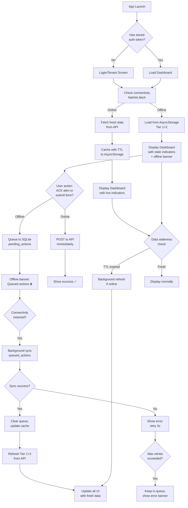

# S10-TD-01: Mobile Offline UX Specification

**Sprint:** MVP3.1  
**Component:** `applications/operator-mobile`  
**Owner:** Frontend Engineer  
**Date:** 2026-06-05

---

## 1. Context & Problem

### Urban Operator Connectivity Challenges in HCMC

The Urban Intelligence Platform operator mobile app serves city workers in field environments where persistent connectivity is not guaranteed:

- **Elevator shafts & basements** — No cellular signal during building inspections
- **Tunnel systems** — Tran Tram, utility tunnels (subway infrastructure monitoring)
- **Rural zone surveys** — ESG baseline collection outside metro area (suburban stations)
- **Underground parking structures** — Facility managers checking HVAC systems
- **Disaster response** — Field officers coordinating during flood events

**Current Pain Points:**
- Operators see blank screens when offline → cannot make time-sensitive decisions
- Push alerts are lost if device is offline → city incident response delayed
- Mission-critical data unavailable (active P0/P1 flood alerts, building status)
- No visibility into what data is stale when connectivity returns

**Solution:** Implement a tiered offline-first cache strategy with clear staleness indicators and background sync, enabling operators to work effectively in low-connectivity zones.

---

## 2. User Stories

### US-01: Offline Sensor Readings for Field Decisions

**As a** facility manager checking HVAC system in basement parking during signal loss

**I want to** see the last-known sensor readings (temperature, humidity, CO2) for 15 minutes after going offline

**So that** I can decide whether to adjust settings or escalate to operations center

**Acceptance Criteria:**
- Dashboard displays last-cached temperature, humidity, CO2 with timestamp
- Offline banner shows "Offline — last synced 3 min ago"
- Sensor cards show visual staleness indicator (gray tint + ⏱️ icon)
- When connectivity returns, cards update within 5 seconds with live data

---

### US-02: Queued Alert Acknowledgment

**As a** field operator in a dead-zone tunnel survey

**I want to** acknowledge (ACK) an incoming P0 flood alert even when offline

**So that** the alert is marked as acknowledged when I reconnect, and operations center knows I received it

**Acceptance Criteria:**
- Alert ACK action triggers local queue entry (SQLite + timestamp)
- Offline banner appears when no connectivity
- Upon reconnect, queued ACK syncs via POST `/api/v1/alerts/{id}/acknowledge`
- UI shows "Syncing..." state during background sync
- If sync fails after 3 retries, alert reverts to unacknowledged with error toast

---

### US-03: ESG KPI Cards with Cached Data

**As a** city supervisor in an area with unreliable connectivity

**I want to** see the ESG KPI dashboard (air quality index, building energy efficiency %) even when offline

**So that** I can review city metrics without waiting for connectivity or making a trip to the operations center

**Acceptance Criteria:**
- Dashboard KPI cards (AQI, energy %, building count) display with 4-hour TTL
- Card shows "Updated 2h ago" label when viewing stale data
- When online, background job refreshes KPIs every 5 minutes
- Visual distinction between live vs. cached data (opacity or color shift)

---

## 3. Data Priority Tiers

### Tier 1: Always Cache (Highest Priority)
- **Active P0/P1 alerts** — 24-hour TTL (life-safety critical)
- **Building list** (ID, name, address) — 7-day TTL (static reference)
- **Dashboard KPI summary** (air quality, energy, thermal comfort) — 4-hour TTL
- **User profile** (name, role, tenant_id) — 24-hour TTL
- **Auth token & refresh token** — Expires per backend (encrypted in secure store)

### Tier 2: Cache 15 Minutes (Medium Priority)
- **Sensor readings** (temperature, humidity, CO2, PM2.5) — 15-min TTL
- **Alert history** (last 20 alerts with full details) — 30-min TTL
- **Building status** (occupied, emergency mode, occupancy %) — 15-min TTL
- **Maintenance schedule** — 6-hour TTL

### Tier 3: Defer (Low Priority)
- **ESG deep reports** (PDF, Excel exports) — Not cached; user sees "requires connectivity"
- **Analytics/trends** (monthly reports, trend charts) — Not cached; cloud-only
- **Settings** — Cache immutable system config, defer user preferences

---

## 4. Cache Strategy

### Storage Implementation

```
AsyncStorage (/offline/:user_id/)
├── tier1/
│   ├── alerts.json           (P0/P1 alerts, 24h TTL)
│   ├── buildings.json        (building reference, 7d TTL)
│   ├── dashboard_kpi.json    (KPI summary, 4h TTL)
│   └── user_profile.json     (profile, 24h TTL)
├── tier2/
│   ├── sensor_readings.json  (readings, 15m TTL)
│   ├── alert_history.json    (history, 30m TTL)
│   └── building_status.json  (status, 15m TTL)
└── sync_queue/
    └── pending_actions.json  (ACKs, form submissions)

SecureStore (tokens)
├── access_token             (encrypted, backend-controlled TTL)
├── refresh_token            (encrypted)
└── tenant_selection         (encrypted)
```

### Cache Eviction Policy

| Data Type | TTL | Check Interval | Action |
|-----------|-----|----------------|--------|
| P0/P1 alerts | 24h | Sync check | Expire if offline > 24h |
| Building list | 7d | App launch | Refresh if TTL expired + online |
| Sensor readings | 15m | Real-time display | Show stale badge after 15m |
| Alert history | 30m | Alert list open | Refresh if online + expired |
| Dashboard KPI | 4h | Dashboard focus | Background refresh if online |

### Background Sync Behavior

**On Connectivity Restore** (using `expo-network` `NetInfo.addEventListener`):
1. Check pending_actions queue
2. Attempt to sync each queued action in FIFO order
3. For each successful POST/PATCH:
   - Remove from queue
   - Update local cache with server response
   - Emit success toast ("Alert acknowledged")
4. For each failed request (500, 401, timeout):
   - Retry after 10s exponential backoff (max 3 retries)
   - If all retries fail, show error banner ("Failed to sync. Will retry.")
5. Refresh Tier 1 & 2 cache from API
6. Update all UI components with fresh data

**On Offline Detection:**
1. Set global `isOffline` flag in Redux/Zustand
2. Stop polling for real-time updates
3. Show offline banner with "last synced" timestamp
4. Disable commands that require connectivity (HIGH risk BMS actions)

---

## 5. UI/UX Patterns

### Offline Banner

**Visual Design:**
```
┌─────────────────────────────────────────────┐
│ 🌐⚠️ Offline — Showing cached data          │
│ Last synced: 3 min ago — Tap to retry       │
└─────────────────────────────────────────────┘
```

- **Placement:** Top of screen, persistent
- **Height:** 48dp (tappable)
- **Colors:** Yellow (#FFC107) background, dark text
- **Animation:** Fade in/out on connectivity change (200ms)
- **Action:** Tap to manually trigger sync

### Stale Data Indicator

**KPI Cards (Dashboard):**
- **Live data:** Full opacity, green accent border
- **Cached data (0–15 min):** 90% opacity, no border
- **Stale data (15+ min):** 70% opacity, gray tint, ⏱️ icon + "Updated 2h ago" label

**Sensor Readings (Building detail):**
- **Live:** Green dot + "now" label
- **Cached:** Yellow dot + "3 min ago" label
- **Stale (>15m):** Gray dot + "8 min ago — may be outdated" label

### Queued Actions UI

**Alert ACK Flow:**
```
User taps ACK button
    ↓
[Online] → POST immediately, show "Acknowledged ✓"
[Offline] → Show "Queued locally ⧗" badge
    ↓ (on reconnect)
Background sync attempts → "Syncing..." → "Acknowledged ✓"
```

**Visual State:**
- **Queued:** Badge with ⧗ icon, disabled appearance
- **Syncing:** Animated spinner, brief "Syncing..." toast
- **Synced:** Checkmark badge, success toast "Alert acknowledged"
- **Failed:** Red badge with ⚠️, error toast + retry button

---

## 6. Conflict Resolution

### Server-Wins Strategy (Sensor Data)

**Scenario:** Operator cached temperature reading (23°C, 2 hours old). On reconnect, server has new reading (21°C).

**Resolution:**
- Client discards local cached value
- Fetch fresh data from API
- Update UI with server value
- No user interaction needed

**Implementation:**
```javascript
// On sync: always replace cache with server response
const cachedReadings = await AsyncStorage.getItem('sensor_readings');
const serverReadings = await fetchSensorReadings();
// Discard cache, use server
await AsyncStorage.setItem('sensor_readings', JSON.stringify(serverReadings));
```

### User-Chooses Strategy (Form Data)

**Scenario:** Operator filed a facility complaint offline (status=PENDING), description="HVAC leak". Server shows older complaint from 6 hours ago (status=RESOLVED).

**Resolution:**
- Display conflict modal to user:
  - "Your draft complaint" (pending, 5 min ago)
  - "Server complaint" (resolved, 6 hours ago)
- User selects: "Keep my draft" (POST new) or "Discard, use server" (fetch)
- If "Keep draft" → POST with operator confirmation

**Implementation:**
```javascript
if (localDraft.timestamp > serverData.timestamp) {
  // Show conflict dialog
  showConflictModal({
    local: localDraft,
    server: serverData,
    onKeepLocal: () => submitDraft(),
    onUseServer: () => fetchAndReplace()
  });
}
```

---

## 7. UX Flow Diagram



---

## 8. Implementation Estimate for v3.1

| Feature | Story Points | Dependency | Priority | Notes |
|---------|-------------|-----------|----------|-------|
| AsyncStorage setup + Tier 1/2 cache | 3 | None | P0 | Foundation for all offline features |
| NetInfo connectivity detection | 2 | None | P0 | Real-time online/offline state |
| Offline banner component | 2 | AsyncStorage | P0 | Persistent UI feedback |
| Dashboard staleness indicators | 2 | AsyncStorage | P0 | Visual cache status |
| Alert ACK queuing + sync | 3 | AsyncStorage + API | P1 | High-value user story |
| Form submission queuing | 2 | AsyncStorage + API | P1 | Enable field work offline |
| Background sync on reconnect | 3 | NetInfo + AsyncStorage | P1 | Core offline-first mechanism |
| Conflict resolution modal | 3 | Form queuing | P2 | Edge case handling |
| SecureStore token encryption | 2 | Auth flow | P0 | Security hardening |
| Integration tests (Detox) | 2 | All features | P2 | QA sign-off |
| **Total** | **24 SP** | — | — | ~2 sprints (12 SP/sprint + contingency) |

---

## 9. Acceptance Criteria

### AC-01: Offline Dashboard Display
- When offline, dashboard displays cached KPI cards (AQI, energy %, building count) without errors
- Stale data is visually indicated (gray tint + ⏱️ icon + timestamp)
- Offline banner appears at top: "Offline — last synced 3 min ago"

### AC-02: Queued Alert Acknowledgment
- User can acknowledge an alert while offline
- ACK is stored locally in `pending_actions` queue
- On reconnect, ACK is automatically synced to API endpoint `/api/v1/alerts/{id}/acknowledge`
- UI shows "Synced ✓" once server confirms

### AC-03: Background Sync Retry Logic
- On connectivity restore, queued actions are retried
- Failed syncs retry up to 3 times with 10s exponential backoff
- After 3 failed retries, user sees error toast with manual retry button
- Successful syncs remove action from queue and update local cache

### AC-04: Sensor Reading TTL Management
- Sensor readings (temperature, humidity, CO2) cached with 15-minute TTL
- After 15 minutes offline, stale indicator appears
- On reconnect, fresh readings fetched from API within 5 seconds
- Old readings replaced in cache immediately (server-wins strategy)

### AC-05: SecureStore Token Protection
- Auth tokens stored in `expo-secure-store` (encrypted at rest on device)
- Tokens never written to unencrypted AsyncStorage
- Refresh token automatically rotates on successful refresh
- Logout clears all secure storage

### AC-06: Conflict Resolution for Forms
- When user reconnects after offline form submission + server has conflicting data:
  - Modal appears showing local draft vs. server version
  - User chooses: "Keep draft" (POST new) or "Use server" (fetch)
  - Choice is respected and UI updates accordingly

### AC-07: Manual Sync Trigger
- User can tap offline banner to manually trigger sync
- Sync performs full refresh of Tier 1+2 cache from API
- UI shows "Syncing..." spinner during refresh
- On completion: clear offline banner if online, update all data displays

---

## 10. Technical Notes

### Package Dependencies
- `expo-network` — Real-time connectivity detection
- `@react-native-community/netinfo` — Legacy fallback
- `expo-secure-store` — Encrypted token storage
- `realm` or SQLite driver — Pending action queue (FIFO)

### Storage Limits
- AsyncStorage: ~5-10 MB per app (ensure tier2 cache doesn't exceed 2 MB)
- SecureStore: Unlimited (keys only)
- Sync queue: Keep to <100 pending actions before warning user

### Testing Strategy
- Unit: AsyncStorage mock + Redux state
- Integration: Detox with network throttling (simulate offline)
- E2E: Deploy to real device, kill WiFi + cellular, verify cache displays

---

**Revision:** v1.0  
**Next Review:** Post-implementation, Sprint 11
