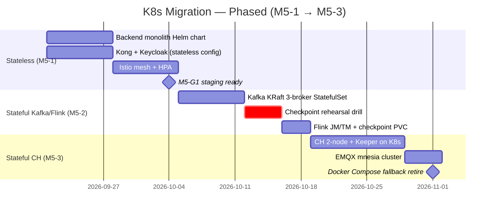

# SA MVP5 — Conflict Resolution (3 P0 + Lattice SP Budget)

| Field | Value |
|---|---|
| **Author** | Solution Architect |
| **Date** | 2026-06-20 |
| **Audience** | PO, PM, BA, DevOps Lead, Backend Lead |
| **Status** | SA RESOLUTION (updated 2026-06-20 per PO decisions: K8s defer MVP6, build-50/test-2-3, GAP-1 P0→P1, DR out MVP6, Series A out MVP5) — supersedes gaps left open in `sa-mvp5-review.md` (2026-06-18) |
| **Inputs** | `sa-mvp5-review.md` (6 GAP, 9 ADR, 5 spike), `pm-mvp5-master-plan.md` (258 SP / 6 sprint), `ba-mvp5-gap.md` (+43 SP vertical VN), `mvp5-po-synthesis.md` (build-50/test-2-3), `pm-mvp5-conflict-resolution.md` (Scenario C) |
| **PO decision deadline** | 2026-09-14 (M5-1 week) — driver cho mọi ADR lock |
| **PO decisions đã chốt (2026-06-19/20)** | (1) DR (ADR-053) OUT → MVP6+. (2) K8s DEFER MVP6 — Compose HA làm môi trường test, không cutover. (3) BUILD như 50 buildings nhưng TEST chỉ 2-3 buildings — modular architecture đầy đủ, GAP-1 tenant isolation P0→P1. (4) Series A OUT khỏi MVP5 → MVP6+. MVP5 = architecture validation + product fit. |
| **Verdict** (updated) | 4 conflict resolved. SA final budget (post-pivot) = **~169 SP committed + ~95 SP buffer (37%)** trong 258-SP envelope. **Chỉ còn 1 P0 hard gate: GAP-2 (NL→BPMN residency, ADR-049)**. GAP-1 P0→P1 (vẫn build đúng kiến trúc modular). DR (ADR-053) OUT, K8s defer, microservices split (ADR-048) defer MVP6. |

---

## TL;DR

> *(updated 2026-06-20 per PO decisions: K8s defer MVP6, build-50/test-2-3, GAP-1 P0→P1, DR out MVP6, Series A out MVP5)*

1. **GAP-1 (CH/Flink tenant isolation)** — **P0→P1** (2-3 tenant tin cậy, không breach-critical) nhưng **vẫn build đúng kiến trúc modular**: CH **RowPolicy** (primary) + view-per-tenant (fallback chỉ khi spike S1 fail) + Flink `TenantKeyedProcessFunction` + ArchUnit rule ngày 1. ADR-047 giữ. Fuzz test **giảm scope**: cover 2-3 tenant + synthetic 50-tenant test (không 10K). Ship **M5-1/M5-2**.
2. **GAP-2 (NL→BPMN residency)** — **P0 DUY NHẤT còn lại**. SA recommend **Option C (hybrid PII-redaction)** làm default, **Option A (on-prem PhoGPT/Qwen)** cho `gdpr_mode=true` tenant, **Option B (Bedrock SG)** làm fallback khi on-prem quality < 80% Claude baseline. ADR-049 hybrid routing giữ, phải chốt **trước M5-2 (2026-10-05)**, không sau.
3. **K8s zero-experience (R1)** — **RÚT GỌN**. K8s DEFER MVP6 (PO decision 2026-06-19): Compose HA làm môi trường test, không cutover. Chỉ giữ K8s **readiness spike** (Helm skeleton + ADR-050 draft, không cutover). Risk R1 HIGH→MED. Mọi phased migration plan dưới đây (§3.2) giữ làm **reference cho MVP6**, không còn critical path MVP5.
4. **Lattice SP** — Post-pivot: **~169 SP committed + ~95 SP buffer (37%)**. Theme A 57→**~20 SP** (K8s out, bỏ perf-at-scale). Hard gate giờ chỉ còn **GAP-2 (P0)**. GAP-1 P1. **DR (ADR-053) OUT, microservices split (ADR-048) DEFER MVP6**. Thêm synthetic multi-tenant test (mitigate R16).

---

## Conflict #1 — CH/Flink Tenant Isolation (GAP-1) — **P0→P1 (updated 2026-06-20)**

> **PO decision (2026-06-19/20)**: BUILD như 50 buildings nhưng TEST chỉ 2-3 buildings. Tenant isolation **không còn breach-critical** (2-3 tenant tin cậy), nhưng PO yêu cầu **source code giống modular** — vẫn build đúng kiến trúc. Do đó:
> - **Priority P0→P1** nhưng **design không đổi**: CH RowPolicy + Flink `TenantKeyedProcessFunction` + ArchUnit rule + ADR-047 vẫn giữ.
> - **Fuzz test giảm scope**: cover 2-3 tenant (đủ prove correctness) + **synthetic 50-tenant test** (simulate 50 tenant via test data, không cần 10K queries/nightly full run).
> - **Ship**: M5-1/M5-2 (không thay đổi).
> - **R11 (BA vertical ship trước GAP-1)**: severity HIGH→MED (tenant tin cậy).

### 1.1 Vấn đề

PostgreSQL có RLS (V16/V18/V30). ClickHouse + Flink **không có tenant enforcement ở storage/compute layer** — chỉ filter ở application-layer (`ClickHouseRestAnalyticsAdapter`, `ClickHouseGrpcAnalyticsAdapter`, `TimescaleDbAnalyticsAdapter`, `EsgService`). Một bug duy nhất ở một adapter = cross-tenant sensor data leak. Ở 50+ buildings paying customers = breach + fail ISO 27001 / SOC 2.

### 1.2 Design quyết định — CH RowPolicy (primary) vs View-per-Tenant (fallback)

| Tiêu chí | **CH RowPolicy** (primary) | **View-per-Tenant** (fallback) |
|---|---|---|
| Cơ chế | `CREATE ROW POLICY tenant_iso ON sensor_readings FOR SELECT USING tenant_id = currentTenant()` + per-session context qua `SET session tenant_id` | `CREATE VIEW v_tenant_42 AS SELECT * FROM sensor_readings WHERE tenant_id=42` + revoke base table |
| Độ phức tạp migration | Thấp — 1 DDL + 1 session interceptor | Cao — N views + grant management + adapter phải biết view name pattern |
| Blast radius nếu bug | 1 policy sai = leak cho mọi tenant (nhưng fuzz test bắt) | 1 view sai = leak 1 tenant (cô lập hơn) |
| ~~Tương thích gRPC adapter~~ | ~~N/A — ĐÃ VERIFY: gRPC adapter là RPC passthrough, không query CH trực tiếp~~ | ~~N/A~~ |
| Tương thích JDBC pool (Spike S1 REDEFINED) | **Cần spike S1 verify** — HikariCP + clickhouse-jdbc propagate `SET tenant_id` session setting khi borrow connection + reset khi return pool (xem ADR-047 §3) | OK — chỉ đổi table name trong query |
| Thêm tenant mới | Zero-touch (policy generic) | Phải CREATE VIEW + grant (runbook ops) |
| Performance | Không overhead (filter pushdown) | View materialization có thể hit memory nếu 50+ views |
| **Verdict SA** | **PRIMARY** — ship M5-1 | **FALLBACK** — chỉ nếu S1 fail hoặc gRPC session context không reliable |

**Quyết định SA (cập nhật 2026-06-23 per ADR-047)**: Implement RowPolicy làm mặc định trong M5-1 (8 SP). Enforcement point = **analytics-service JDBC layer** (không phải backend gRPC adapter — gRPC adapter là RPC passthrough, không chạm ClickHouse). Spike S1 (M5-1 tuần 1) REDEFINED: verify HikariCP + clickhouse-jdbc propagate `SET tenant_id` session setting đúng khi borrow/return connection pool — KHÔNG phải gRPC metadata test. Nếu S1 fail → switch sang view-per-tenant +2 SP (tổng 10 SP) trong cùng sprint. Xem ADR-047 §3 cho acceptance criteria.

### 1.3 Flink Tenant Isolation Pattern

```java
// Base class bắt buộc — mọi keyed operator phải extend
public abstract class TenantKeyedProcessFunction<K, IN, OUT>
    extends KeyedProcessFunction<K, IN, OUT> {

  @Override
  public final void processElement(IN value, Context ctx, Collector<OUT> out) {
    String tenantId = extractTenantId(value); // fail-fast null check
    if (tenantId == null) {
      throw new TenantLeakException("Event without tenant_id: " + value);
    }
    if (!tenantId.equals(ctx.getCurrentKey().getTenantId())) {
      throw new TenantLeakException("Key tenant mismatch");
    }
    processTenantElement(value, ctx, out);
  }

  protected abstract void processTenantElement(IN value, Context ctx, Collector<OUT> out);
}
```

**ArchUnit rule** (bắt buộc trong `ArchUnitTest`, ship M5-1):

```java
@ArchTest
static final ArchRule no_raw_keyed_process_function =
    noClasses().that().resideInAPackage("..flink..")
        .should().beAssignableTo(KeyedProcessFunction.class)
        .andShould().notBeAssignableTo(TenantKeyedProcessFunction.class);
```

### 1.4 Tenant-Leak Fuzz Test (M5-G2) — **scope giảm (updated 2026-06-20)**

- **Scope (pivot 2-3 bldg)**: **cover 2-3 tenant** thực tế (đủ prove correctness, không cần load) + **synthetic 50-tenant test** (simulate 50 tenant via test data — bắt buộc mitigate R16 "build-for-50 chưa exercise ở scale"). Bỏ scope 10,000 random queries nightly full run.
- **Assert**: 0 rows returned cho cross-tenant read, 0 cache hit, exception thrown cho key mismatch. Synthetic test assert thêm: 50 tenant concurrent không có partition hotspot, RowPolicy apply consistent.
- **Chạy ở**: CI mỗi PR (2-3 tenant scope) + nightly synthetic 50-tenant run.
- **CÓ block M5-G2 không?** — **KHÔNG**. M5-G2 đổi criteria: "fuzz test cover 2-3 tenant + synthetic 50-tenant PASS" (không còn 10K). M5-G2 vẫn pass ở M5-2 với PG RLS + CH RowPolicy trên 2-3 tenant. Synthetic 50-tenant test chạy song song.

### 1.5 Sprint placement — **giữ (updated 2026-06-20: P1, design không đổi)**

| Item | Sprint | SP |
|---|---|---|
| CH RowPolicy + session interceptor | M5-1 | 5 |
| Flink TenantKeyedProcessFunction + ArchUnit | M5-1 | 2 |
| Fuzz test (2-3 tenant + synthetic 50-tenant) | M5-1 (mid) → M5-G2 verify | 1 (overlap QA) |
| **Total GAP-1 (P1, build correctness)** | M5-1 | **8 SP** (giảm ~4 SP vs fuzz 10K gốc) |

---

## Conflict #2 — NL→BPMN Data Residency (GAP-2) — **P0 DUY NHẤT còn lại (updated 2026-06-20)**

> **PO decision (2026-06-19/20)**: GAP-1 P0→P1, DR out, K8s defer → **GAP-2 là P0 duy nhất còn lại** trong MVP5. ADR-049 hybrid routing giữ nguyên. Conflict #2 design không thay đổi — đây là hard gate compliance bắt buộc cho mọi tenant (2-3 bldg hay 50 bldg đều phải solve).

### 2.1 Vấn đề

Decree 13/2023/ND-CP (PDPD VN) + HCMC contract clause: operator-entered Vietnamese text (chứa tên, địa chỉ building, incident detail) **không được rời jurisdiction VN** mà không có cross-border transfer approval. Claude API = data transits AWS US/EU. PM draft defer ADR-049 tới "Sprint 3" — **quá muộn**, NL parser kickoff M5-2.

### 2.2 Decision Matrix — 3 options

| Tiêu chí | **A — On-prem PhoGPT-4B / Qwen2.5-7B-VI** | **B — Bedrock ap-southeast-1 (Singapore)** | **C — Hybrid PII-redaction + Claude** |
|---|---|---|---|
| **Compliance Decree 13** | Sạch 100% — data không rời VN | Cross-border ASEAN, cần DPA + sub-processor agreement, regulator friction trung bình | Sạch nếu redaction tight; **rủi ro leakage** qua NER miss |
| **Latency p95** | +60% (~8s vs Claude 4s) — GPU inference cold start | Ngang Claude (~4s) — AWS backbone | Ngang Claude (~4-5s) + redaction overhead ~200ms |
| **Cost (50 buildings, 30% adoption)** | Capex GPU node ~$8-12K one-time + $500/mo power | Per-token (~$0.003/1K) ≈ $2-4K/mo | Per-token + redaction infra ~$2.5-4.5K/mo |
| **Quality (BLEU/BERTScore vs Claude)** | **Cần spike S2** — expect 70-85% of Claude | 100% Claude | 95% Claude (redaction có thể warp context) |
| **Ops burden** | Cao — GPU node management, model update, HA | Thấp — fully managed | Trung bình — NER model maintain |
| **Fail-open risk** | None | Regulator challenge possible | **Cao nhất** — redaction miss = PII leak |
| **Vendor lock-in** | None (open weights) | AWS | Anthropic + NER vendor |
| **Time-to-ship** | M5-2 nếu GPU proc by Sep | M5-2 ready | M5-2 + 2 tuần NER tuning |

### 2.3 SA Recommendation — **Hybrid C là default routing, A là gated route**

**SA position khác với PM**: PM recommend Option C thuần (hybrid routing). SA cảnh báo **Option C thuần có fail-open risk** (redaction miss). SA đề xuất **layered routing**:

```
NL request vào
  ├─ tenant.gdpr_mode = true?  → Route A (on-prem PhoGPT/Qwen) — mandatory
  ├─ tenant.gdpr_mode = false AND PII-detected (Vietnamese NER)? → Route C (redact + Claude)
  └─ tenant.gdpr_mode = false AND no PII? → Route B (Bedrock SG) hoặc Claude direct
```

**Fallback chain**: Nếu S2 spike cho thấy on-prem quality < 80% Claude baseline → Route A tự động degrade về Route C cho `gdpr_mode=true` tenant (với redaction bắt buộc + audit log redaction decision). Nếu Route C redaction confidence < 90% → reject request, yêu cầu operator rephrase.

### 2.4 ADR-049 deadline

| Milestone | Date | Owner | Output |
|---|---|---|---|
| Spike S2 kickoff (PhoGPT/Qwen benchmark trên 50 prompt) | M5-1 tuần 2 (2026-09-28) | SA + Backend | Benchmark report |
| **ADR-049 decision deadline** | **2026-10-02 (trước M5-2)** | PO + SA | ADR-049 locked |
| NL parser dev kickoff | M5-2 (2026-10-05) | Backend | Implementation |

**Hard rule**: NL parser sprint (M5-2) **không start** nếu ADR-049 chưa sign-off. Nếu PO miss deadline → default = Option A on-prem (conservative, compliance-safe).

### 2.5 Anti-pattern flags (Conflict #2)

- PII/location data trong logs/errors → **WARN** — redaction filter bắt buộc trước mọi LLM call log (ghi vào ADR-049).
- Missing DLQ cho Kafka/MQTT → `nl.bpmn.requests.dlq` bắt buộc cho NL topic.

---

## Conflict #3 — K8s Zero-Experience (R1) — **RÚT GỌN: K8s DEFER MVP6 (updated 2026-06-20)**

> **PO decision (2026-06-19)**: **K8s DEFER MVP6** — Compose HA (`docker-compose.ha.yml`) làm môi trường test chính thức cho MVP5, không cutover K8s production. Conflict này **không còn critical path**. Risk R1 **HIGH→MED**.
>
> **Giữ lại trong MVP5**: Chỉ K8s **readiness spike** (S3 thu gọn — Helm skeleton + ADR-050 draft, không cutover, không contractor full-time). Phased migration plan (§3.2) và fallback trigger (§3.3) dưới đây **giữ làm reference cho MVP6**, không còn áp dụng trong MVP5.
>
> **Hệ quả**:
> - Theme A giảm 57→**~20 SP** (bỏ K8s cutover + stateful migration + Istio mesh work).
> - M5-G1 đổi criteria: "K8s staging-ready" → **"Compose HA sẵn sàng test 2-3 bldg + modular architecture proven"**.
> - R15 (3.000 RPS Compose HA) **GIẢI QUYẾT** — test 2-3 bldg chỉ cần ~100-200 RPS.

### 3.1 Vấn đề

Team zero prior K8s. Stateful workload (Flink JM/TM, Kafka KRaft 3-broker, CH Keeper 2-node, EMQX mnesia, Keycloak, Vault Raft) = không "lift-and-shift". PM đã reserve K8s contractor Day-1 + fallback Docker Compose — SA endorse + cụ thể hóa.

### 3.2 Phased Migration — **REFERENCE CHO MVP6 (updated 2026-06-20: không áp dụng MVP5)**



| Phase | Sprint | Workload | Gate | Rehearsal bắt buộc |
|---|---|---|---|---|
| **1 — Stateless** | M5-1 | Backend monolith, Kong, Keycloak (DB-less / external DB) | M5-G1 | Load test 1000 RPS trên K8s staging |
| **2 — Kafka/Flink** | M5-2 | Kafka KRaft 3-broker StatefulSet, Flink JM/TM | (none, M5-G2 là tenant isolation) | **Checkpoint rehearsal drill**: stop one Kafka broker, verify no data loss; Flink savepoint migrate từ MinIO-local → PVC |
| **3 — ClickHouse** | M5-3 | CH 2-node ReplicatedMergeTree + Keeper, EMQX mnesia | M5-G3 (NL UAT — không phụ thuộc CH topology) | CH Keeper failover drill: stop Keeper leader, verify quorum reconverge < 30s |

### 3.3 Fallback Trigger — **REFERENCE CHO MVP6 (updated 2026-06-20: Compose HA đã là primary MVP5)**

**Docker Compose HA (`docker-compose.ha.yml`) giữ active làm parallel prod** cho tới hết M5-3 (2026-11-01). Bất kỳ trigger nào dưới đây = cutover back:

| # | Trigger | Detection | Action |
|---|---|---|---|
| T1 | K8s staging không pass M5-G1 (HPA scale event fail, Istio mesh unstable) | M5-G1 review (2026-10-04) | Giữ prod trên Docker Compose, M5-2 chỉ dev/staging K8s |
| T2 | Checkpoint rehearsal drill (M5-2) **fail 2 lần** — data loss hoặc savepoint corrupt | Drill report | Rollback Kafka/Flink về Docker Compose, CH chưa migrate |
| T3 | Uptime prod < 99% trong 7 ngày liên tiếp sau phase cutover | Prometheus SLO dashboard | Rollback phase đó, re-plan với +1 sprint buffer |

**Fallback exit criteria**: K8s prod stable 99.5% uptime × 14 ngày liên tiếp ở phase cuối (CH) → decommission Docker Compose HA. Nếu không đạt tới hết M5-5 → escalate PO: either gia hạn K8s contractor hoặc defer K8s prod tới MVP6, ship MVP5 trên Docker Compose HA + horizontal scale bằng nhiều VM.

### 3.4 Istio caveat (GAP-1 interaction)

Istio auto-mTLS sẽ double-encrypt Kafka inter-broker traffic → conflict với Kafka KRaft TLS. **SA rule**: disable Istio auto-mTLS cho Kafka mesh namespace (`kafka-mtls-disable` PeerAuthentication), Kafka tự handle TLS. Ghi vào ADR-050.

---

## Conflict #4 — Lattice SP Budget — **POST-PIVOT: ~169 committed + ~95 buffer (updated 2026-06-20)**

> **PO decision (2026-06-19/20)**: K8s defer (Theme A 57→~20), DR out, GAP-1 P0→P1, Series A out, perf-at-scale (3.000 RPS) bỏ. Hard gate giờ **chỉ còn GAP-2 (P0 duy nhất)**. Microservices split (ADR-048) defer MVP6. Thêm synthetic multi-tenant test (mitigate R16).

### 4.1 Phân tích 3 con số — **post-pivot**

| Source | SP | Claim |
|---|---|---|
| SA realistic (post-pivot) | **~149** | Theme A **~20** (K8s out) + B 44 + C 28 + GAP-1 P1 8 + carry-over 22 + mobile 11 + spike/ADR ~16 |
| PM master plan (post-pivot) | **258** | 6 sprint × 43 SP envelope — nhưng **buffer ~95 SP (37%)** rất dư |
| BA gap (revised) | **~31** | LOTUS 6 + ROI 5 + EV 10 + Waste 6 + audit-lite overlap |

**Key insight (post-pivot)**: SA realistic **~149 SP** + BA vertical **31 SP** + spike/ADR **~7 SP** + carry-over/mobile pool = **~169 SP committed**. PM envelope 258 SP → **buffer ~95 SP (37%)**. PM đề xuất rút ngắn MVP5 xuống 4-5 sprint (PO D8).

### 4.2 Hard Gate vs Defer-able — **post-pivot**

| Item | Loại | Lý do | SP |
|---|---|---|---|
| **GAP-2** NL→BPMN residency (ADR-049) | **HARD GATE — P0 DUY NHẤT** | Decree 13 violation, regulator block — áp dụng mọi tenant | 6 |
| **GAP-1** CH/Flink tenant isolation (ADR-047) | **P1 — build correctness** (updated) | 2-3 tenant tin cậy, không breach-critical; vẫn build đúng kiến trúc modular (PO yêu cầu source code giống 50-bldg) | 8 |
| **GAP-4** Schema governance (Schema Registry + CH migrations) | HARD GATE | Silent data loss risk | 5 |
| **GAP-5** Observability (OTel + SLI) | HARD GATE (SLO gate bỏ) | Signal-only, không 99.9% SLO 90-day bắt buộc | 6 |
| Compose HA + Vault (K8s OUT) | **HARD GATE (Theme A giảm)** | Compose HA làm môi trường test 2-3 bldg, không cutover K8s | ~20 |
| NL→BPMN core (parser + BPMN synthesis + review UI) | HARD GATE | O2 product fit, operator leverage | 38 |
| Billing metering + invoice | HARD GATE | O3 pilot-to-paid signal (không $100K MRR) | 18 |
| Audit log + ISO 37120/GRI | HARD GATE | KR4.4 compliance audit | 7 |
| Mobile v3.1 polish | HARD (MVP4 descope) | G6 app store, offline | 11 |
| MVP4 carry-over (GAP-010, 039/040/046, Pact) | HARD GATE | Doc-vs-code debt | 22 |
| **Synthetic multi-tenant test** (mitigate R16) | **HARD GATE (MỚI)** | Build-for-50 chưa exercise ở scale → simulate 50 tenant via test data | 2 |
| **SUBTOTAL HARD GATE + P1** | | | **~143 SP** |
| **DR multi-region (ADR-053)** | **OUT — MVP6+** | PO decision 2026-06-19: DR out khỏi MVP5 | (0 — OUT) |
| **Microservices split (ADR-048)** | **DEFER → MVP6** | Modular Monolith đúng shape qua MVP5 | (0 — spike defer) |
| ADR-048 split-trigger spike (S4) | **DEFER → MVP6** | (updated) — không cần runtime data MVP5 | (0) |
| Perf-at-scale (3.000 RPS) | **OUT — bỏ KR1.2** | R15 giải quyết, test 2-3 bldg chỉ ~100-200 RPS | (0) |
| **SUBTOTAL DEFER/OUT** | | | **0 SP trong MVP5** |

### 4.3 BA Vertical — absorbed 31 SP, defer phần còn lại (updated 2026-06-20)

> Đồng bộ với `mvp5-po-synthesis.md` §3 và `pm-mvp5-conflict-resolution.md` §2 Scenario C.

| BA đề xuất | SA verdict | SP | Lý do |
|---|---|---|---|
| LOTUS VN evidence pack | **ABSORB** (M5-4) | 6 | Killer feature VN market, không ai có, cost thấp |
| Building Owner ROI dashboard | **ABSORB** (M5-3) | 5 | Persona trả tiền P0, hook renewal năm 2 |
| EV Charging + Parking (OCPP) | **ABSORB** (M5-5) | 10 | New customer segment, OCPP mature, dependency trên G4 billing |
| Smart Waste (district hook) | **DEFER → MVP6** (updated) | (6) | Synthesis §3 defer — buffer ưu tiên cho GAP-2/R16 |
| Council transparency portal | **DEFER → MVP6** (updated) | (4) | Synthesis §3 defer |
| Compliance audit trail (immutable) | **ABSORB** (overlap HARD GATE audit log) | 0 | Đã count trong HARD GATE audit log 7 SP |
| **Demand Response / P2P** | **DEFER → MVP6** | (8) | EVN regulatory chưa clear Q1 2027 |

**BA absorbed total: 31 SP** (6+5+10, overlap compliance đã count). BA defer: 6+4+8 = 18 SP → MVP6.

### 4.4 SA Final SP Allocation — **post-pivot (updated 2026-06-20)**

| Bucket | SP | % | Note |
|---|---|---|---|
| **Hardening / Must (SA core post-pivot)** | **~92** | 36% | Theme A **~20** (K8s out) + B 44 + C 28 |
| **GAP-1 tenant isolation (P1, build correctness)** | 8 | 3% | CH RowPolicy + Flink tenant fn + ArchUnit |
| **GAP-2 NL residency (P0 duy nhất)** | (trong Theme B) | — | ADR-049 hybrid routing |
| **Synthetic multi-tenant test (R16 mitigate)** | 2 | 1% | simulate 50 tenant via test data |
| **MVP4 carry-over** | 22 | 9% | GAP-010/039/040/046/Pact |
| **BA vertical absorbed** | 31 | 12% | LOTUS + ROI + EV (Council/Waste defer MVP6) |
| **ADR-049/050/051/052 authoring + S1/S2/S3 spike** | 7 | 3% | SA spike time (S4/S5 defer/out) |
| **Mobile v3.1 polish** | 11 | 4% | Offline + app store fix |
| **Committed subtotal** | **~169** | **66%** | |
| **Risk buffer (unallocated)** | **~95** | **37%** | Phòng GAP-2 phức tạp + NL hallucination tuning + R16 surprise |
| **TOTAL envelope** | **258** | 100% | 6 sprint × 43 SP (PM đề xuất rút ngắn 4-5 sprint — D8) |

**So sánh với PM allocation (post-pivot)**: PM buffer ~95 SP (37%) — rất dư cho 2-3 bldg test. SA endorse rút ngắn MVP5 xuống 4-5 sprint (D8) vì Series A out + R15 giải quyết. Buffer ưu tiên cho GAP-2 residency phức tạp + R16 synthetic test.

### 4.5 Sprint-by-sprint SA plan — **post-pivot (updated 2026-06-20)**

Đồng bộ với `pm-mvp5-conflict-resolution.md` §3 Scenario C. Theme A giảm từ 57→~20 (K8s out). Bỏ perf-at-scale (3.000 RPS). Thêm synthetic multi-tenant test (R16 mitigate).

| Sprint | Hardening | Carry-over | BA vertical | Spike/ADR | Buffer | Total |
|---|---|---|---|---|---|---|
| M5-1 | 14 (Compose HA + Vault + GAP-1 P1 CH RowPolicy) | 2 | 0 | 4 (S1 CH PoC, S3 K8s readiness) | 23 | 43 |
| M5-2 | 24 (NL parser POC + GAP-2 residency + billing metering + GAP-1 Flink tenant fn) | 1 | 0 | 2 (S2 LLM bench, ADR-049) | 16 | 43 |
| M5-3 | 18 (BPMN synth + validator + GAP-4 schema + GAP-5 obs) | 2 | 5 (ROI dashboard) | 1 (ADR-051) | 17 | 43 |
| M5-4 | 18 (billing GA + audit log + ISO 37120 + GAP-2 on-prem route) | 5 | 8 (LOTUS 6 + audit-lite 2) | 0 | 12 | 43 |
| M5-5 | 8 (billing accuracy + Compose HA replica tuning + mobile offline) | 10 | 10 (EV Charging OCPP) | 0 | 15 | 43 |
| M5-6 | 4 (bug burn + OWASP + regression) | 0 | 0 | 0 | 39 | 43 |
| **Total** | **86** | **20** | **23** (+8 BA UAT spread = 31) | **7** | **122** | **258** |

> **Buffer lớn (122 SP = 47%)** phản ánh DR out + K8s defer + perf-at-scale bỏ. PM đề xuất rút ngắn MVP5 xuống 4-5 sprint (D8) — SA endorse. Buffer ưu tiên cho GAP-2 residency phức tạp + NL hallucination tuning + R16 synthetic test surprise.

---

## Spike Ranking (S1–S5) — **post-pivot (updated 2026-06-20)**

> **Cập nhật**: S3 thu gọn readiness-only (K8s defer), S4 defer MVP6, **S5 OUT (DR out MVP6)**. S1/S2 giữ nguyên.

PO decision deadline 2026-09-14. Spike phải có output trước deadline này để PO decide.

| Spike | Output | Phải xong trước | Rank | If delayed → impact |
|---|---|---|---|---|
| **S1** CH RowPolicy PoC | ADR-047 draft + working branch | **M5-1 tuần 1 (2026-09-25)** | **MUST — blocks GAP-1 (P1) build correctness** | Nếu fail → fallback view-per-tenant +2 SP, vẫn kịp M5-1 |
| **S2** On-prem VN LLM benchmark | ADR-049 decision matrix | **M5-1 tuần 2 (2026-10-02)** | **MUST — blocks NL parser M5-2 kickoff (GAP-2 P0 duy nhất)** | Nếu fail → default Option A on-prem (conservative) |
| **S3** K8s readiness spike (THU GỌN) | ADR-050 draft + Helm skeleton (KHÔNG cutover) | M5-1 tuần 1 (2026-09-25) | **DOWNGRADE — K8s defer MVP6**, chỉ readiness reference | Nếu fail → K8s MVP6 start chậm hơn 1 sprint, không impact MVP5 |
| ~~S4~~ Modular Monolith split triggers | ~~ADR-048 + coupling report~~ | ~~M5-3~~ | **DEFER → MVP6** (updated) — ADR-048 output cho MVP6 planning | Authored MVP6 Sprint 1 dựa codegraph coupling scan |
| ~~S5~~ ~~Multi-region DR feasibility~~ | ~~ADR-053 draft~~ | — | **OUT (updated 2026-06-20)** — DR out khỏi MVP5, ADR-053 OUT khỏi ADR candidates | ADR-053 authored MVP6+ |

**SA recommendation (post-pivot)**: Fund **S1 (~2 SP)** + **S2 (~3 SP)** trong M5-1. **S3 (~2 SP) readiness-only** (không contractor full-time, down-tier DevOps generalist). S4 defer MVP6. **S5 OUT — tiết kiệm 3 SP cho buffer.**

**Total spike budget MVP5 (post-pivot)**: **~7 SP** (vs 9 SP gốc). Tiết kiệm 2 SP thêm cho risk buffer.

---

## Risk Register Update — **post-pivot (updated 2026-06-20)**

| # | Risk | Trạng thái | Mitigation |
|---|---|---|---|
| **R16** ⭐ (TOP post-pivot) | **Build-for-50 nhưng test-2-3 → code path scale chưa exercise** (race condition, CH partition hotspot, billing quota, NL routing) có thể break ở 10-50 bldg | **HIGH** | (1) Synthetic multi-tenant test (simulate 50 tenant via test data); (2) ADR-047 CH RowPolicy có synthetic test; (3) **MVP6 bắt buộc re-verify trước mở 10+ bldg** (gate K2) |
| ~~R15~~ | ~~3.000 RPS Compose HA~~ | **GIẢI QUYẾT** | Test 2-3 bldg chỉ cần ~100-200 RPS, Compose HA dư sức. KR1.2/S6 bỏ |
| **R1** | ~~K8s migration delays — team zero K8s~~ | **HIGH→MED** (giảm) | K8s defer MVP6 → không còn critical path. Chỉ readiness spike S3 |
| **R11** | ~~BA vertical ship trước GAP-1~~ | **HIGH→MED** (giảm) | 2-3 tenant tin cậy, GAP-1 P1 vẫn implement. EV dependency trên G4 giữ |
| ~~R14~~ | ~~Investor đòi enterprise infra~~ | **MED→LOW** (giảm) | MVP5 không còn mục tiêu Series A → pitch là architecture validation |

## ADR Candidates Update — **post-pivot (updated 2026-06-20)**

| ADR | Trạng thái | Lý do |
|---|---|---|
| **ADR-047** CH RowPolicy tenant isolation | **KEEP (P1)** | Build correctness — PO yêu cầu source code giống 50-bldg modular |
| **ADR-049** NL→BPMN hybrid routing (residency) | **KEEP — P0 duy nhất** | Hard gate compliance, áp dụng mọi tenant |
| **ADR-050** K8s topology (reference) | **KEEP (readiness-only)** | Draft + Helm skeleton cho MVP6, không cutover MVP5 |
| **ADR-051** Schema governance | **KEEP** | HARD GATE silent data loss |
| **ADR-052** Observability OTel | **KEEP (SLO gate bỏ)** | Signal-only, không 99.9% 90-day |
| ~~ADR-053~~ ~~Multi-region DR~~ | **OUT khỏi MVP5 (updated)** | PO decision 2026-06-19: DR out → MVP6+. **OUT khỏi ADR candidates MVP5** |
| ~~ADR-048~~ ~~Microservices split~~ | **DEFER MVP6 (updated)** | Modular Monolith đúng shape qua MVP5; ADR-048 authored MVP6 Sprint 1 |

## Anti-Pattern Checklist (run silently on resolution) — **giữ, vẫn relevant cho build correctness (updated 2026-06-20)**

> Checklist giữ nguyên — build correctness quan trọng bất kể test scope 2-3 bldg hay 50 bldg. PO yêu cầu "source code giống modular" → mọi rule vẫn apply.

| Check | Resolution status |
|---|---|
| Cross-module direct dependency? | OK — microservices split defer MVP6, monolith giữ modular shape |
| Business logic in Flink? | **WARN** — billing aggregation: Flink chỉ windowed rollup (`tenant_usage_daily`), invoice logic ở monolith (ADR-054) |
| SELECT * on CH/TimescaleDB? | **FLAG vào ADR-047** — CH query phải project explicit columns, ArchTest rule cho query annotation |
| Missing DLQ cho Kafka/MQTT? | **FLAG vào ADR-049** — `nl.bpmn.requests.dlq` + `billing.events.dlq` bắt buộc |
| PII/location data trong logs? | **FLAG vào ADR-049** — Vietnamese NER redaction filter trước mọi LLM call log |
| Raw sensor data stored without compression? | OK pilot (2-3 bldg); revisit ADR-050 MVP6 ở 50 buildings |

---

## Cross-references

- `sa-mvp5-review.md` — 6 GAP, 9 ADR, 5 spike (input)
- `pm-mvp5-master-plan.md` — 258 SP envelope, 6 sprint (default, D8 rút ngắn 4-5 optional), **7 gate** post-pivot (input, đã updated 2026-06-20)
- `ba-mvp5-gap.md` — +43 SP vertical VN (input)
- `mvp5-po-synthesis.md` — **source of truth post-pivot** (build-50/test-2-3, DR out, K8s defer, Series A out)
- `pm-mvp5-conflict-resolution.md` — **source of truth post-pivot** (Scenario C, 7 gate, R16 top risk)
- `feedback_sprint3_readiness` — cache isolation rules
- `feedback_mvp3_assessment_lessons` — microservice test gate riêng
- `feedback_doc_vs_code_gap` — executable-artifact gate rule
- `feedback_mvp4_kafka_reset_runbook` — checkpoint rehearsal drill pattern (reference cho MVP6 K8s)

---

*Authored by SA, 2026-06-19. **Updated 2026-06-20 per PO decisions (2026-06-19/20): K8s defer MVP6, build-50/test-2-3, GAP-1 P0→P1, DR (ADR-053) OUT MVP6, microservices split (ADR-048) defer MVP6, Series A OUT MVP5.** Resolution cho PO review trước Pilot Readiness Review (2026-09-07) và lock ADR-049 (P0 duy nhất) trước M5-2 (2026-10-05). No code changed. No Co-Authored-By.*
