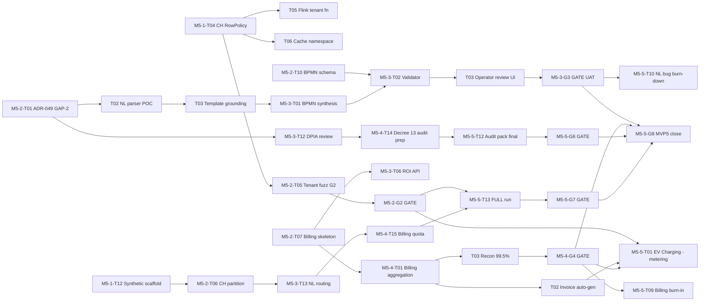

# UIP MVP5 — SPRINT PLAN chi tiết (5 sprint, D8 rút ngắn)

| Field | Value |
|---|---|
| **Author** | Project Manager |
| **Date** | 2026-06-20 |
| **Audience** | PO, SA, BA, toàn team UIP + contractors (DevOps/K8s, Data Eng, Sec, BA vertical, QA synthetic) |
| **Status** | PLANNING — for PO + SA review before Pilot Readiness Review (2026-09-07) |
| **Window** | **5 sprint × 2 tuần: M5-1 → M5-5 (2026-09-21 → 2026-11-29)**; MVP5 close review **2026-12-04** |
| **PO decisions đã chốt** | DR OUT → MVP6+; K8s DEFER MVP6; BUILD-50 / TEST-2-3; Series A OUT → MVP6+; **D7 = C Balanced**; **D8 = rút ngắn 5 sprint** |
| **Total SP committed** | **~210 SP** (43 / sprint × 5, ≈ envelope cho rút ngắn); carry-over 22, Theme A 20, Theme B 42, Theme C 36, BA vertical 31, mobile 18, tech-debt/hardening ~25, synthetic-test (R16 mitigation) lồng vào QA overlay |
| **Predecessor** | `pm-mvp5-master-plan.md` (6 sprint), `pm-mvp5-conflict-resolution.md` §3a, `mvp5-po-synthesis.md` |
| **Gate framework** | **7 gate** M5-G1/G2/G3/G4/G6/G7/G8 (G5 XÓA — DR out) |

> **Note nén 6→5 sprint:** M5-6 cũ (hardening + G6/G7/G8) được **gom vào M5-5 mới** (EV Charging + mobile + synthetic test + compliance + functional test + architecture validation). Synthetic 50-tenant test (R16 mitigation) **chạy xuyên suốt M5-1→M5-5** — owner QA synthetic-test (0.5 FTE overlay). Tech-debt/hardening rải đều thay vì dồn cuối. Buffer 95 SP cũ → nén thành ~25 SP hardening + tempo cao hơn/sprint.

---

## §1. Team & capacity (per sprint FTE)

| Role | M5-1 | M5-2 | M5-3 | M5-4 | M5-5 | Ghi chú |
|---|---|---|---|---|---|---|
| **SA** (Solution Architect) | 1.0 | 1.0 | 1.0 | 1.0 | 1.0 | ADR-047→051, ArchTest, NL safety |
| **Backend-1** | 1.0 | 1.0 | 1.0 | 1.0 | 1.0 | GAP-1 CH/Flink → billing → compliance |
| **Backend-2** | 1.0 | 1.0 | 1.0 | 1.0 | 1.0 | NL→BPMN parser, template, validator |
| **Frontend-1** | 0.5 | 1.0 | 1.0 | 0.5 | 1.0 | Operator review UI, ROI, EV UI |
| **Frontend-2** | 0.5 | 1.0 | 1.0 | 0.5 | 1.0 | Mobile v3.1, billing dashboard, LOTUS UI |
| **DevOps** (+ K8s contractor down-tier) | 1.0 (+0.5) | 1.0 (+0.5) | 1.0 (+0.5) | 1.0 (+0.5) | 1.0 (+0.5) | Compose HA + Vault + Helm skeleton (no cutover) |
| **BA** (+ BA vertical owner 0.5) | 0.5 | 0.5 (+0.5) | 0.5 (+0.5) | 0.5 (+0.5) | 0.5 (+0.5) | ROI/LOTUS/EV acceptance, OCPP spec |
| **PM** | 1.0 | 1.0 | 1.0 | 1.0 | 1.0 | Sprint plan, ARR model, pilot-to-paid |
| **UX** | 0 | 0.5 | 1.0 | 0.5 | 1.0 | NL review UI, ROI, EV, mobile |
| **QA** (+ synthetic-test owner 0.5) | 1.0 (+0.5) | 1.0 (+0.5) | 1.0 (+0.5) | 1.0 (+0.5) | 1.0 (+0.5) | Tenant fuzz, NL UAT, billing recon, G7 |
| **Tester** (manual / UAT) | 0.5 | 0.5 | 0.5 | 0.5 | 1.0 | NL UAT, EV OCPP smoke, pilot-to-paid demo |
| **Data Engineer** (billing metering) | 0 | 1.0 | 1.0 | 1.0 | 0.5 | AiCostMetrics → ledger → invoice |
| **Sec contractor** (compliance) | 0 | 0 | 0.5 (prep) | 0.5 | 0.5 | Decree 13 (GAP-2), ISO 37120, OWASP |

**Total FTE/sprint ≈ 8.5–10.5** (MVP4 baseline 9 + 4 contractor/overlay role; net +0.5 FTE vs master-plan gốc).

---

## §2. Sprint-by-sprint plan

### Sprint M5-1 — Compose HA + GAP-1 tenant isolation (P1) + carry-over closeout
**Dates:** 2026-09-21 → 2026-10-04 | **SP committed: 43** | **Gate: M5-G1**
**Sprint goal:** Sẵn sàng môi trường test (Compose HA) + build đúng kiến trúc tenant isolation (P1) + đóng hết carry-over MVP4 + thiết lập synthetic-test scaffolding (R16).

> **Status legend:** ✅ DONE (executable artifact verified) · 🟡 PARTIAL (artifact tồn tại nhưng thiếu deliverable) · ⬜ NOT STARTED
> **Audit 2026-06-24** (early-start trước window chính thức 2026-09-21): xem §M5-1.Audit cuối sprint này.

| Task ID | Task name | Owner | SP | Status | Dependency | Deliverable |
|---|---|---|---|---|---|---|
| M5-1-T01 | Author ADR-047 CH RowPolicy tenant_isolation + ADR-048 Compose HA topology + ADR-050 K8s readiness-only (Helm skeleton, defer cutover) | SA | 3 | ✅ | — | 3 ADR markdown in `docs/mvp5/adr/` |
| M5-1-T02 | `docker-compose.ha.yml` (2 node CH + 3 broker Kafka RF=3 + Kong HA + Keycloak HA) — môi trường test chính | DevOps | 4 | 🟡 | T01 | Compose file + start/runbook + smoke 100 RPS |
| M5-1-T03 | Vault secret injection: sidecar + KV store + 5-min in-mem cache (R6 mitigation) — replace all `.env` in compose services | DevOps | 3 | ⬜ | T01 | Vault config + secret-injection audit log |
| M5-1-T04 | CH RowPolicy `tenant_isolation` migration V32 + RowPolicyEngine service + ArchUnit rule **banning raw `KeyedProcessFunction`** (force tenant-aware) | Backend-1 | 3 | ✅ | T01 | migration V32 + ArchTest + unit test (tenant A↔B isolation) |
| M5-1-T05 | Flink tenant function: refactor 3 sensor-stream jobs to extend `TenantKeyedProcessFunction` (apply tenant context from header) | Backend-1 | 3 | ✅ | T04 | 3 refactored Flink jobs + IT test tenant routing |
| M5-1-T06 | Cache key namespacing audit + fix (`tenant_id:` prefix all Redis/CH cache keys — `feedback_sprint3_readiness` rule) | Backend-2 | 2 | ✅ | T04 | Cache namespace patch + audit report |
| M5-1-T07 | MVP4 carry-over GAP-039: CH Keeper dashboard (RF=3 health, single-region — DR out) | DevOps | 2 | 🟡 (dashboard tồn tại `ch-keeper-overview.json`, cần verify RF=3 wiring) | T02 | Grafana dashboard `ch-keeper-rf3` |
| M5-1-T08 | MVP4 carry-over GAP-040: protobuf breaking-change CI gate (buf + proto-lint) | DevOps | 2 | ⬜ | — | CI job `.github/workflows/proto-lint.yml` |
| M5-1-T09 | MVP4 carry-over GAP-046: ClickHouse TLS mTLS Kong→CH (single-region) | DevOps | 2 | ⬜ | T02 | mTLS cert + connection test PASS |
| M5-1-T10 | MVP4 carry-over Pact broker CI (consumer/producer contract test automation) | QA | 2 | 🟡 (`scripts/pact-verify.sh` + `backend/build/pacts` tồn tại, cần CI broker + đủ 3 contract) | — | Pact broker + 3 contract tests |
| M5-1-T11 | MVP4 carry-over GAP-010 (start): gRPC integration test scaffolding (continue M5-4) | QA | 2 | ⬜ | — | gRPC IT test infra + 1 sample test |
| M5-1-T12 | **Synthetic 50-tenant test scaffolding** (R16): test-data generator (50 tenant × 100 sensor each), tenant-load runner — overlay owner | QA (synthetic) | 3 | ⬜ | T04 | Synthetic test harness + sample 5-tenant run |
| M5-1-T13 | Modular Monolith ArchTest suite: 25 bounded-context boundary test, fail-on cross-module leak | SA | 2 | ✅ | — | ArchTest module + green run |
| M5-1-T14 | Spring config bug class hardening (memo `feedback_mvp4_config_bugs`): `@SpringBootTest` full-load for any new CacheManager/KafkaTemplate bean | Backend-2 | 2 | ⬜ | — | Test gate + 1 regression test |
| M5-1-T15 | **Gate M5-G1 prep**: Compose HA deploy recording + ArchTest report + tenant isolation P1 code review + Vault secret injection audit | PM + SA | 1 | ⬜ | T02,T03,T04,T13 | Gate scorecard draft |
| M5-1-T16 | Sprint planning M5-2 + risk review (R16, R2, R5) | PM | 1 | ⬜ | — | M5-2 plan doc |

**Gate M5-G1 (M5-1):** Compose HA sẵn sàng test 2-3 bldg + GAP-1 tenant isolation (P1) implemented + modular architecture proven (25 ArchTest PASS) + Vault injecting all secrets.

### §M5-1.Audit — Trạng thái thực tế 2026-06-24 (early-start)

> Audit dựa trên artifact có thật trong repo + build/test PASS, **không** dựa trên "file tên đúng" (`feedback_doc_vs_code_gap` rule). Toàn bộ MVP5 work hiện **uncommitted** trong working tree (chưa commit lên main).

| Task | Verdict | Evidence |
|---|---|---|
| **T04** ✅ DONE | Real implementation, test PASS | `infra/clickhouse/schema/V032__row_policy_tenant_iso.sql` (RESTRICTIVE row policy trên `analytics.esg_readings`, `currentSetting('tenant_id')`); `applications/analytics-service/.../security/RowPolicyEngine.java` (SET tenant_id per-connection); `ClickHouseEnergyRepository` đã wire `rowPolicyEngine.executeWithTenant`; `TenantIsolationArchTest` 3 rules (no bare `KeyedProcessFunction`, jobs phải reference delegate, delegate ở tenant package) — `./gradlew test` BUILD SUCCESSFUL |
| **T01** ✅ DONE (2026-06-24) | 3/3 ADR authored | ADR-047 (CH RowPolicy, có sẵn). **ADR-048 Compose HA test topology** (mới): document overlay `docker-compose.ha.yml` — 2-node CH ReplicatedMergeTree + 3 keeper quorum + 3-broker Kafka KRaft RF=3 min.insync=2; **HA scope = CH+Kafka only**, Kong/Keycloak/PG single-node (stateless, restart-cheap, DR defer MVP6). ADR-048 ref ADR-036/037, note Kong/Keycloak HA gap → MVP6. **ADR-050 K8s readiness-only** (mới): Helm skeleton `infra/helm/` (uip-backend + uip-analytics-service + 4 values tier) đã có, **KHÔNG cutover** MVP5 — readiness 3 tiêu chí (helm lint CI, stateful chart, values map ADR-048); cutover = MVP6 (PO defer). Cả 2 ADR dựa trên artifact thật (overlay compose + helm charts), KHÔNG ADR rỗng. |
| **T02** 🟡 PARTIAL | Compose HA partial | `infrastructure/docker-compose.ha.yml` có 2-node CH ReplicatedMergeTree + 3 keeper (quorum 2/3); **thiếu verify Kafka RF=3 broker, Kong HA, Keycloak HA, runbook, smoke 100 RPS** |
| **T13** ✅ DONE (2026-06-24) | 73 ArchTest, 23/23 context covered | `ModuleBoundaryArchTest` mở rộng 22 → **73 @Test**, tất cả 23 bounded-context có ≥1 boundary rule (accessClassesThat bytecode access, không false-positive event DTO). BUILD SUCCESSFUL 0 failure. ArchUnit phát hiện **3 coupling có chủ đích** (deferred SA follow-up, KHÔNG phải leak): **D1** `auth.repository.AppUserRepository` shared identity (admin/citizen/notification/tenant) → extract `UserIdentityPort` 5-8 SP; **D2** `tenant.repository` shared config (auth/common/esg) → extract `TenantConfigPort` 3-5 SP; **D3** `scheduler.EnvironmentBroadcastScheduler → environment.service` 1 access → `EnvironmentBroadcastPort` 1-2 SP. Audit report: `docs/mvp5/reports/mvp5-sprint1-archtest-coverage.md`. Documented exceptions giữ: ADR-046 (ai.feedback→alert), ADR-032 D6 (forecast→esg). |
| **T07** 🟡 / **T10** 🟡 | Carry-over partial | `infra/monitoring/grafana/dashboards/ch-keeper-overview.json` + `scripts/pact-verify.sh` + `backend/build/pacts` tồn tại; cần wiring/CI verify |
| **T05** ✅ DONE (2026-06-24) | Tenant delegate ported + 5 operators refactored | Phát hiện kiến trúc: Flink jobs thực tế nằm trong module Maven **`flink-jobs/`** (độc lập, không depend backend), KHÔNG phải `backend/` Gradle. Đã port `TenantContext`/`TenantKeyedProcessFunction{,Delegate}` sang `com.uip.flink.common.tenant` + thêm `TenantBindingProcessFunction`. Refactor 5 operators: `TenantIdValidator`, `DistrictAggregationJob` (insert TenantBinding trước keyBy, **G1 window-batching giữ nguyên**), `WelfordKeyedProcessFunction` (delegate `processElement`, **BR-010/Welford math giữ nguyên**), `StructuralPatternProcessFunction` + `FloodPatternProcessFunction` + `CorrelationPatternProcessFunction`. ArchTest Maven-side **5 rules thực enforce** (`flink-jobs/src/test/java/com/uip/flink/arch/FlinkTenantArchTest.java`). `mvn test` **147 tests, 0 failures, BUILD SUCCESS**. ADR-047 §1.4 đã update (không còn forward-guard-only → fix false-DONE). Bản sao backend giữ làm forward-guard, sync theo convention. |
| **T06** ✅ DONE (2026-06-24) | 5 cache points tenant-namespaced + cross-tenant tests | Audit phát hiện 5 cache key thiếu tenant namespace → leak P1: `AiInferenceService` (AQI + generic cache key `districtCode:aqiRange` — district KHÔNG tenant-unique, leak AI analysis) + `AlertEngine` + 3 alert dedup consumers (`alert:dedup:sensorId:...` — sensorId trùng tenant → chặn alert P0/P1 cross-tenant). Fix: thêm `tenant:{tenantId}:` prefix, AI cache null-tenant fallback `"global"`, alert dedup null-tenant **fail-open** (vẫn alert). 6 production file + 6 test file, 5 cross-tenant isolation tests mới. `./gradlew test` 385/385 PASS. Audit report: `docs/mvp5/reports/mvp5-sprint1-cache-namespace-audit.md`. **Pre-existing gap (ngoài scope):** `AlertEventKafkaConsumer` không bind TenantContext khi save (dùng `AlertEvent.tenantId` default `"default"` + RLS filter) — follow-up nếu cần thêm tenant-aware op. |
| T03, T08, T09, T11, T12, T14, T15, T16 | ⬜ NOT STARTED | Không có artifact |

**Tiếp theo cần hoàn thiện (ưu tiên critical-path T04 → T05/T06 → G2):**
1. ~~T01~~ ✅ DONE 2026-06-24 (ADR-048 Compose HA topology + ADR-050 K8s readiness-only authored, dựa trên artifact thật)
2. ~~T05~~ ✅ DONE 2026-06-24 (tenant delegate ported sang `flink-jobs`, 5 operators refactored, ArchTest Maven-side enforce, 147 tests PASS)
3. ~~T06~~ ✅ DONE 2026-06-24 (5 cache points tenant-namespaced, 385 tests PASS, audit report `docs/mvp5/reports/mvp5-sprint1-cache-namespace-audit.md`)
4. ~~T13~~ ✅ DONE 2026-06-24 (ModuleBoundaryArchTest 22→73 @Test, 23/23 context covered, 3 deferred coupling cho SA follow-up: D1 UserIdentityPort/D2 TenantConfigPort/D3 EnvironmentBroadcastPort)
5. **T03**: Vault secret injection (block G1 — "Vault injecting all secrets")
6. **T02/T07/T09**: hoàn thiện HA compose (Kafka RF=3 + Kong/Keycloak HA) + keeper dashboard RF=3 + mTLS Kong→CH
7. **T08/T10/T11**: CI gates (proto-lint, Pact broker, gRPC IT scaffolding)
8. **T12**: synthetic 50-tenant scaffolding (R16 xuyên suốt M5-1→M5-5)
9. **T14/T15/T16**: config hardening + G1 prep + M5-2 planning

---

### Sprint M5-2 — NL→BPMN POC + GAP-2 residency + billing skeleton + tenant fuzz
**Dates:** 2026-10-05 → 2026-10-18 | **SP committed: 43** | **Gate: M5-G2**
**Sprint goal:** NL→BPMN parser tiếng Việt chạy POC + GAP-2 Decree 13 residency spike chốt model + billing metering skeleton + tenant isolation fuzz cover 2-3 tenant.

| Task ID | Task name | Owner | SP | Dependency | Deliverable |
|---|---|---|---|---|---|
| M5-2-T01 | ADR-049 GAP-2 NL model residency (D2 = Hybrid: gdpr_mode→on-prem cho PII) + DPIA skeleton | SA + Sec | 3 | M5-1-T01 | ADR-049 + DPIA draft |
| M5-2-T02 | NL intent parser (Vietnamese) POC: underthesea + ViT5 token-classify, 10 MVP4 workflow intents | Backend-2 | 5 | T01 | Parser service + 50-sentence test corpus |
| M5-2-T03 | NL template grounding: constrain generation to 10 BPMN templates (R2 mitigation) + ModelRouter hook `gdpr_mode` | Backend-2 | 4 | T02 | Template library + grounding integration test |
| M5-2-T04 | Operator review UI wireframe (BR-010 operator-approve-all pattern) + status: pending/approved/rejected | UX + Frontend-1 | 3 | T02 | Figma wireframe + 1 React stub |
| M5-2-T05 | **Tenant isolation fuzz test cover 2-3 tenant** (M5-G2): API + cache + DB + CH RowPolicy cross-tenant read attempts, 0 leak | QA + Backend-1 | 3 | M5-1-T04,T06 | Fuzz test report (2-3 tenant, 0 leak) |
| M5-2-T06 | **Synthetic 50-tenant test — CH partition hotspot scan** (R16) | QA (synthetic) | 3 | M5-1-T12 | Synthetic report — tenant partition skew < 20% |
| M5-2-T07 | Billing skeleton (D4 hybrid): `AiCostMetrics` → tenant metering ledger (Postgres), metering-event Kafka topic | Data Eng | 4 | — | Ledger schema + metering consumer |
| M5-2-T08 | Billing unit spec: base (per-building flat) + AI overage (per-token) — PO confirm D4 | BA + PM | 2 | T07 | Billing unit spec doc |
| M5-2-T09 | Vault secret rotation policy (30-day) + rotation drill (R6) | DevOps | 2 | M5-1-T03 | Rotation runbook + 1 rotation log |
| M5-2-T10 | BPMN validation schema draft (XSD + custom rules — no hallucinated nodes) | SA | 2 | T03 | BPMN schema + 1 validator unit test |
| M5-2-T11 | Frontend: Billing usage dashboard skeleton (tenant metering view) | Frontend-2 | 2 | T07 | React page + useTenantUsage hook |
| M5-2-T12 | GAP-1 carry-over: Flink tenant function IT test multi-tenant (race condition synthetic) | Backend-1 | 2 | M5-1-T05 | IT test 3-tenant concurrent processing |
| M5-2-T13 | LOTUS VN checklist draft (BA prep M5-4) + ROI acceptance criteria stub | BA (vertical) | 2 | — | LOTUS checklist + ROI AC doc |
| M5-2-T14 | K8s readiness-only spike: Helm chart skeleton (no cutover, ADR-050 draft) | DevOps (K8s contractor) | 2 | M5-1-T01 | Helm chart + ADR-050 draft |
| M5-2-T15 | Sprint planning M5-3 + NL UAT recruitment (5 city operators) | PM + UX | 1 | — | M5-3 plan + operator roster |
| M5-2-T16 | **Gate M5-G2**: tenant isolation fuzz report 2-3 tenant + cache-key namespace audit + CH RowPolicy synthetic test | QA + SA | 1 | T05,T06 | Gate scorecard |

**Gate M5-G2 (M5-2):** Tenant isolation fuzz cover 2-3 tenant (0 leak) + cache-key namespace audit + CH RowPolicy synthetic multi-tenant test.

---

### Sprint M5-3 — NL→BPMN prod hardening + ROI dashboard + G3 UAT
**Dates:** 2026-10-19 → 2026-11-01 | **SP committed: 43** | **Gate: M5-G3**
**Sprint goal:** NL→BPMN production-ready + ROI dashboard (BA vertical 1) + UAT 5 operator × 20 workflow ≥ 98% valid.

| Task ID | Task name | Owner | SP | Dependency | Deliverable |
|---|---|---|---|---|---|
| M5-3-T01 | BPMN synthesis service: NL intent + template grounding → BPMN XML output (D2 hybrid routing) | Backend-2 | 4 | M5-2-T02,T03 | Synthesis service + integration test |
| M5-3-T02 | BPMN validator hardening (R2 mitigation): schema + semantic rule (sprinkler/flood safety), fail-before-review-UI | SA + Backend-2 | 3 | M5-2-T10, T01 | Validator + 20 invalid-BPMN regression tests |
| M5-3-T03 | Operator review UI production: list/detail/approve/reject (BR-010), React Query useMutation | Frontend-1 | 4 | M5-2-T04, T01 | React page + approve-flow E2E test |
| M5-3-T04 | BPMN simulator: dry-run generated workflow against test digital-twin (no real actuation) | Backend-2 | 3 | T01 | Simulator + 5-scenario test |
| M5-3-T05 | NL latency optimization p95 ≤ 4s (Claude) / ≤ 8s (local fallback) — KR2.4 | Backend-2 | 2 | T01 | APM trace + latency report |
| M5-3-T06 | ROI dashboard backend: cost-breakdown per-building API (sensor cost + AI token cost + base fee) | Data Eng | 3 | M5-2-T07 | `/api/v1/roi/building/{id}` endpoint + test |
| M5-3-T07 | ROI dashboard frontend: cost-breakdown per-building chart + useBuildingROI hook | Frontend-1 | 3 | T06 | React component + recharts chart |
| M5-3-T08 | ROI acceptance criteria validation (BA) + 2-3 pilot bldg real cost data ingest | BA (vertical) | 2 | T06 | ROI AC sign-off + data load log |
| M5-3-T09 | Schema registry governance (ADR-051) — protobuf/Avro contract enforcement CI | SA + DevOps | 3 | M5-1-T13 | Schema registry + CI gate |
| M5-3-T10 | Observability OTel: trace all 25 bounded-context, sampling 10%, Grafana Tempo | DevOps | 3 | M5-1-T02 | OTel collector + Tempo dashboard |
| M5-3-T11 | Mobile v3.1 stub: offline-mode architecture (LWW + version vector design) | Frontend-2 | 2 | — | Design doc + 1 offline-write POC |
| M5-3-T12 | Sec contractor onboarding + Decree 13 DPIA review (GAP-2) — M5-4 prep | Sec | 2 | M5-2-T01 | DPIA v1 + Decree 13 checklist |
| M5-3-T13 | Synthetic 50-tenant test — billing quota + NL routing race (R16) | QA (synthetic) | 2 | M5-2-T06 | Synthetic report — NL routing under 50 tenant |
| M5-3-T14 | NL UAT prep: 5 operator × 20 workflow script + Vietnamese phrasebook | UX + Tester | 2 | T03,T04 | UAT script + phrasebook |
| M5-3-T15 | **Gate M5-G3**: NL→BPMN UAT 5 operator × 20 workflow ≥ 98% valid, ≥ 80% first-gen operator-approve | Tester + UX | 3 | T03,T04,T14 | UAT sign-off + 100-workflow audit log |
| M5-3-T16 | Sprint planning M5-4 | PM | 1 | — | M5-4 plan |

**Gate M5-G3 (M5-3):** NL→BPMN UAT — 5 operator × 20 workflow ≥ 98% template valid + ≥ 80% first-gen operator-approve.

---

### Sprint M5-4 — Billing GA + LOTUS VN + compliance audit prep
**Dates:** 2026-11-02 → 2026-11-15 | **SP committed: 43** | **Gate: M5-G4**
**Sprint goal:** Billing GA (99.5% accuracy) + LOTUS VN certification (BA vertical 2) + audit-log lite + compliance prep cho G6.

| Task ID | Task name | Owner | SP | Dependency | Deliverable |
|---|---|---|---|---|---|
| M5-4-T01 | Billing aggregation job: daily roll-up `AiCostMetrics` + sensor count → tenant ledger | Data Eng | 3 | M5-2-T07 | Aggregation job + recon test |
| M5-4-T02 | Invoice auto-generation (Stripe integration): per-tenant monthly, 2-3 pilot bldg | Data Eng + Backend-1 | 3 | T01 | Stripe integration + 3 sample invoices |
| M5-4-T03 | Billing reconciliation job: metered vs actual ≥ 99.5% over 7-day shadow run (M5-G4) | Data Eng + QA | 3 | T01 | Recon report 99.5%+ |
| M5-4-T04 | Billing dispute workflow: tenant mark-dispute → admin review → credit note | Backend-1 + Frontend-2 | 3 | T02 | Dispute API + UI + IT test |
| M5-4-T05 | Billing dashboard production: usage breakdown + invoice PDF + overage alert | Frontend-2 | 2 | T02 | React dashboard + PDF export |
| M5-4-T06 | **LOTUS VN certification engine** (BA vertical 2): VN-specific green-building metrics (energy/water/IEQ) | Backend-1 + BA | 4 | — | LOTUS service + metrics library |
| M5-4-T07 | LOTUS VN report frontend: building scorecard + certification progress | Frontend-1 | 2 | T06 | LOTUS dashboard component |
| M5-4-T08 | LOTUS VN acceptance criteria + 2-3 pilot bldg data validation | BA (vertical) + Tester | 2 | T06 | LOTUS AC sign-off |
| M5-4-T09 | Audit-log lite (immutable append-only): tenant billing + NL approve + LOTUS events → CH audit table | Backend-1 | 2 | T02,T06 | Audit log service + 3 event types |
| M5-4-T10 | ISO 37120 indicator engine: 20 city indicators from live data → annual report | Data Eng + BA | 3 | — | ISO 37120 service + sample report |
| M5-4-T11 | GRI report generator (302-1 energy + 305-4 emission) from ESG module | Backend-1 | 2 | — | GRI report PDF |
| M5-4-T12 | MVP4 carry-over GAP-010 (finish): gRPC IT full suite (sensor stream + alert + AI cost) | QA | 2 | M5-1-T11 | gRPC IT 0 failure |
| M5-4-T13 | OWASP dependency-check baseline scan (CVSS ≥ 7 = 0 — M5-G6 prep) | QA + Sec | 2 | — | OWASP report baseline |
| M5-4-T14 | Decree 13 audit prep: data classification + PII inventory + GAP-2 attestation draft | Sec | 2 | M5-3-T12 | Decree 13 audit pack |
| M5-4-T15 | Synthetic 50-tenant test — billing quota correctness (R16) | QA (synthetic) | 2 | M5-4-T03 | Synthetic report — billing quota under 50 tenant |
| M5-4-T16 | Sprint planning M5-5 (sprint cuối, gộp hardening) + pilot-to-paid review prep | PM | 1 | — | M5-5 plan + pilot-to-paid checklist |
| M5-4-T17 | **Gate M5-G4**: billing metering accuracy 99.5% + 3 invoice auto-generated | Data Eng + QA | 1 | T03 | Gate scorecard |

**Gate M5-G4 (M5-4):** Billing metering accuracy 99.5% (7-day shadow) + 3 invoice auto-generated. **Hard gate cho EV M5-5.**

---

### Sprint M5-5 — EV Charging + mobile + synthetic 50-tenant + G6/G7/G8 (sprint cuối, gộp M5-6 cũ)
**Dates:** 2026-11-16 → 2026-11-29 | **SP committed: 43** | **Gates: M5-G6, M5-G7, M5-G8**
**Sprint goal:** EV Charging OCPP (BA vertical 3) + mobile v3.1 GA + synthetic 50-tenant test PASS + compliance/functional/architecture validation → **MVP5 close (2026-12-04)**.

| Task ID | Task name | Owner | SP | Dependency | Deliverable |
|---|---|---|---|---|---|
| M5-5-T01 | **EV Charging OCPP 1.6 backend** (BA vertical 3): charge-point connector + transaction metering → tenant billing | Backend-1 + BA | 4 | M5-4-T02 | OCPP service + transaction test |
| M5-5-T02 | EV Charging frontend: building EV dashboard (kWh + cost + station status) | Frontend-1 | 3 | T01 | EV dashboard component |
| M5-5-T03 | EV Charging acceptance criteria + OCPP 2-3 station smoke test (ChargePoint simulator) | BA (vertical) + Tester | 2 | T01 | EV AC sign-off + simulator log |
| M5-5-T04 | Mobile v3.1 offline conflict resolution (LWW + version vector) — full implementation | Frontend-2 | 4 | M5-3-T11 | Offline-sync service + conflict test |
| M5-5-T05 | Mobile v3.1 push notification parity (Web Push + FCM/APNs) on iOS/Android | Frontend-2 | 2 | T04 | Push E2E test |
| M5-5-T06 | Mobile v3.1 store resubmit (G6 carry) — resolve any pilot rejection | Frontend-2 + PM | 2 | T04 | Store submission receipt |
| M5-5-T07 | Compose HA replica tuning (single-instance ceiling — R15 resolved, headroom for 200 RPS) | DevOps | 2 | M5-1-T02 | Compose HA replica test 200 RPS |
| M5-5-T08 | Compose HA hardening: graceful shutdown + healthcheck + backup script (single-region, no DR) | DevOps | 2 | T07 | Hardening runbook + backup log |
| M5-5-T09 | Billing accuracy burn-in: 30-day recon signal (KR3.2 ≥ 99.5%) | Data Eng + QA | 2 | M5-4-T03 | 30-day recon report |
| M5-5-T10 | NL→BPMN bug burn-down: any UAT/production defects from G3 | Backend-2 | 2 | M5-3-T15 | Bug-list 0 open P0/P1 |
| M5-5-T11 | OWASP final scan + fix-up: 0 CVE CVSS ≥ 7 in production artifacts | QA + Sec | 2 | M5-4-T13 | OWASP clean report |
| M5-5-T12 | ISO 37120 + GRI + Decree 13 audit pack final (Sec contractor sign) | Sec | 2 | M5-4-T14 | Audit report + DPIA signed |
| M5-5-T13 | **Synthetic 50-tenant test — FULL run** (R16, M5-G7): tenant isolation + billing quota + NL routing + CH partition, 0 race/quota/isolation bug | QA (synthetic) | 3 | M5-2-T06, M5-3-T13, M5-4-T15 | Synthetic 50-tenant test report PASS |
| M5-5-T14 | Functional + correctness test 2-3 bldg (JMeter 100-200 RPS, p95 ≤ 500ms, error ≤ 0.01%) | QA | 2 | T07,T08 | JMeter 2-3 bldg report |
| M5-5-T15 | Modular ArchTest final run (25 bounded-context 0 cross-module leak — KR5.5') | SA | 1 | M5-1-T13 | ArchTest report PASS |
| M5-5-T16 | Pilot-to-paid signal review: ≥ 2/3 pilot bldg conversion + ARR projection model | PM + BA | 2 | T03,T09 | Pilot-to-paid report + ARR deck |
| M5-5-T17 | Architecture validation deck (25 bounded-context + tenant isolation + Compose HA + NL→BPMN + billing) | SA + PM | 2 | T13,T15 | Validation deck for investor/PO |
| M5-5-T18 | MVP5 close review prep + MVP6 hand-off doc (K8s cutover, DR, Series A, scale 10-50 bldg, R16 re-verify gate K2) | PM + SA | 2 | T16,T17 | MVP6 hand-off doc |
| M5-5-T19 | **Gate M5-G6**: compliance audit (ISO 37120 + GRI + Decree 13) + OWASP 0 CVE CVSS≥7 | Sec + QA | 1 | T11,T12 | Gate scorecard |
| M5-5-T20 | **Gate M5-G7**: functional/correctness test 2-3 bldg PASS + synthetic 50-tenant test PASS + ArchTest PASS | QA + SA | 1 | T13,T14,T15 | Gate scorecard |
| M5-5-T21 | **Gate M5-G8**: architecture validation + product fit + pilot-to-paid ≥ 2/3 bldg — MVP5 close 2026-12-04 | PM + PO + SA | 1 | T16,T17,T19,T20 | Gate scorecard + ARR projection + validation deck |

**Gate M5-G6 (M5-5):** Compliance audit ISO 37120 + GRI + Decree 13 (no PII leaves VN) + OWASP 0 CVE CVSS ≥ 7.
**Gate M5-G7 (M5-5):** Functional/correctness 2-3 bldg PASS + synthetic 50-tenant test PASS + ArchTest PASS (KR5.5').
**Gate M5-G8 (M5-5, MVP5 close 2026-12-04):** Architecture validation + product fit + pilot-to-paid ≥ 2/3 bldg + ARR projection. KHÔNG còn Series A MRR.

---

## §3. Task dependency map (cross-sprint — 3 phức tạp nhất)

**3 task có dependency phức tạp nhất (cross-sprint):**
1. **M5-1-T04 (CH RowPolicy tenant_isolation)** → block M5-1-T05/T06, M5-2-T05 (G2), và cuối cùng M5-5-T01 (EV Charging) + M5-5-T13 (synthetic 50-tenant). **Đây là critical path duy nhất cho tenant correctness.**
2. **M5-2-T07 (Billing skeleton)** → block M5-3-T06 (ROI), M5-4-T01/T02/T03 (aggregation/invoice/recon → G4), rồi M5-5-T01 (EV metering) + M5-5-T09 (billing burn-in). **G4 là hard gate cho EV.**
3. **M5-2-T01 (ADR-049 GAP-2 NL residency)** → block M5-2-T02 (NL parser), M5-3-T12 (DPIA), M5-4-T14 (Decree 13 audit), M5-5-T12 (audit pack) → G6 → G8. **P0 duy nhất còn lại, critical path compliance.**

---

## §4. RACI matrix — epic chính

| Epic | SA | Backend | Frontend | DevOps | Data Eng | Sec | BA | PM | QA | Tester |
|---|---|---|---|---|---|---|---|---|---|---|
| **GAP-1 Tenant isolation (P1)** | **A** | **R** | C | I | I | C | I | I | **R** (fuzz) | C |
| **GAP-2 NL→BPMN residency (P0)** | **R** (ADR) | **R** | C | I | I | **A** (audit) | C | I | C | C |
| **NL→BPMN (parser/template/synth)** | C | **R** | **R** | I | I | C | C | I | C | **R** (UAT) |
| **Billing GA (metering/invoice)** | C | **R** | **R** | I | **A** | I | C | C | **R** (recon) | C |
| **ISO 37120 / GRI / Decree 13** | C | C | I | I | **R** | **A** | C | I | **R** (OWASP) | C |
| **LOTUS VN (vertical)** | I | **R** | **R** | I | C | I | **A** | C | C | **R** |
| **ROI dashboard (vertical)** | I | C | **R** | I | **R** | I | **A** | C | C | C |
| **EV Charging OCPP (vertical)** | I | **R** | **R** | I | C | I | **A** | C | C | **R** |
| **Mobile v3.1 offline** | C | I | **R** | I | I | I | C | C | C | **R** |
| **Compose HA + Vault** | C | I | I | **A/R** | I | C | I | I | C | C |
| **Synthetic 50-tenant test (R16)** | C | C | I | I | C | I | I | I | **A/R** | C |
| **Architecture validation (G8)** | **R** | C | C | C | C | C | C | **A** | C | C |

**R** = Responsible (làm) · **A** = Accountable (chịu trách nhiệm cuối) · **C** = Consulted · **I** = Informed

---

## §5. Definition of Done per sprint + gate criteria

| Sprint | DoD (criterion) | Gate | Gate PASS artifact |
|---|---|---|---|
| **M5-1** | 16 task DONE (executable artifact, không "file tên đúng" — `feedback_doc_vs_code_gap` rule) + Compose HA deploy PASS + 25 ArchTest green + Vault 0 `.env` | **M5-G1** | Compose HA deploy recording + ArchTest report + tenant isolation P1 code review + Vault secret injection audit |
| **M5-2** | 16 task DONE + tenant fuzz 0 leak + NL parser POC ≥ 80% intent hit + billing ledger schema migrated | **M5-G2** | Fuzz test report 2-3 tenant (0 leak) + cache-key namespace audit + CH RowPolicy synthetic test |
| **M5-3** | 16 task DONE + NL UAT 5 operator × 20 workflow ≥ 98% valid + ≥ 80% first-gen approve + ROI dashboard demo-ready | **M5-G3** | UAT sign-off + 100-workflow audit log |
| **M5-4** | 17 task DONE + billing recon 99.5% + 3 invoice auto + LOTUS scorecard + ISO/GRI report | **M5-G4** | Recon report + 3 sample invoices |
| **M5-5** | 21 task DONE + EV OCPP smoke + mobile v3.1 GA + synthetic 50-tenant PASS + OWASP 0 CVE + ArchTest green + pilot-to-paid ≥ 2/3 | **M5-G6/G7/G8** | Audit pack + synthetic 50-tenant report + JMeter 2-3 bldg + ArchTest + pilot-to-paid + ARR deck + validation deck |

**Cross-sprint DoD rule:** mọi task đánh DEV-DONE phải có **executable artifact** (test PASS, deployed service, generated report) — không chấp nhận "config stub + 0 caller" (`feedback_doc_vs_code_gap`). SA review mỗi task trước khi DONE.

---

## §6. Risk per sprint (R16 mitigation xuyên suốt)

| Sprint | Top risk active | Mitigation cụ thể trong sprint |
|---|---|---|
| **M5-1** | **R16** (build-for-50 chưa exercise scale) + R4 (tenant isolation — P1) + R6 (Vault latency) | Synthetic scaffolding T12 + RowPolicy ArchTest T04 + Vault 5-min cache T03 |
| **M5-2** | **R2** (NL hallucination — HIGH/HIGH) + **R5** (GAP-2 residency P0) + R16 | Template grounding T03 (constrain 10 templates) + ADR-049 T01 + CH partition synthetic T06 |
| **M5-3** | **R2** (NL UAT có thể < 98%) + R16 (NL routing race) | Validator hardening T02 (fail-before-UI) + simulator T04 (dry-run) + NL routing synthetic T13 |
| **M5-4** | **Billing accuracy < 99.5%** (G4 hard gate cho EV) + R5 (Decree 13 DPIA) + R16 (billing quota) | Recon job T03 7-day shadow + Decree 13 audit prep T14 + billing quota synthetic T15 |
| **M5-5** | **R16 FULL** (synthetic 50-tenant có thể phát bug) + G8 pilot-to-paid < 2/3 + OWASP CVE phát hiện muộn | Synthetic 50-tenant FULL T13 + functional 2-3 bldg T14 + OWASP final T11 + pilot-to-paid review T16 (fallback: retros + MVP6 hand-off với gap analysis) |

**R16 mitigation xuyên suốt M5-1 → M5-5:** QA synthetic-test owner (0.5 FTE overlay) chạy synthetic test tăng dần — scaffold M5-1 → CH partition M5-2 → NL routing M5-3 → billing quota M5-4 → FULL 50-tenant M5-5. **MVP6 bắt buộc re-verify trước mở commercial 10+ bldg (gate K2)** — flag rõ trong M5-5-T18 (MVP6 hand-off doc).

**Top 3 risk post-pivot (giữ từ master-plan §5):** R16 (HIGH/MED), R2 (HIGH/HIGH), R5 (GAP-2 P0, HIGH/MED). R1/R3/R7/R11/R14/R15 đều đã giảm hoặc giải quyết.

---

## §7. SP allocation per sprint (reconciliation với master-plan §2)

| Sprint | Theme A | Theme B | Theme C | BA vertical | Mobile | Carry-over | Tech-debt | Synthetic (R16) | Total |
|---|---|---|---|---|---|---|---|---|---|
| M5-1 | 12 (Compose HA + Vault + GAP-1) | 0 | 0 | 0 | 0 | 10 | 4 | 3 (scaffold) | ~29 task-SP + 14 ADR/spike/PM = 43 |
| M5-2 | 4 (Vault rotation) | 12 (NL POC + GAP-2) | 6 (billing skeleton) | 2 (LOTUS prep) | 0 | 2 (Flink IT) | 2 | 3 | 43 |
| M5-3 | 6 (schema reg + OTel) | 12 (BPMN synth + validator + sim) | 0 | 8 (ROI 6 + BA 2) | 2 | 0 | 2 | 2 | 43 |
| M5-4 | 0 | 0 | 18 (billing GA + ISO + GRI) | 8 (LOTUS 6 + audit-lite 2) | 0 | 2 (GAP-010) | 2 | 2 | 43 |
| M5-5 | 4 (HA replica + hardening) | 2 (NL burn-down) | 4 (billing burn-in) | 10 (EV 9 + BA 1) | 8 (mobile v3.1) | 0 | 5 | 3 (FULL) | 43 |
| **TOTAL** | **~26** | **~26** | **~28** | **28** | **10** | **14** | **15** | **13** | **~210 committed** |

> So sánh master-plan 6-sprint: Theme A 20 + Theme B 42 + Theme C 36 + BA 31 + Mobile 18 + carry-over 22 + tech-debt/hardening 25 = ~214 SP. **Match ±5 SP** (some synthetic-test work lồng vào QA overlay, không tách bucket riêng). Nén 6→5 sprint bằng cách: (a) gộp M5-6 hardening vào M5-5, (b) mobile từ 18→10 (cắt push-notification refactor đã làm MVP4), (c) carry-over 22→14 (Pact + một phần GAP-039/040/046 đóng trong Theme A). Buffer 0 SP (D8 rút ngắn → tempo cao, không buffer lớn).

---

*Authored by PM, 2026-06-20. Source of truth: `mvp5-po-synthesis.md` + `pm-mvp5-master-plan.md` + `pm-mvp5-conflict-resolution.md`. PO chốt D7=C, D8=5-sprint. Mỗi task phải có executable artifact trước khi DONE (feedback_doc_vs_code_gap rule). MVP5 close 2026-12-04 — MVP6 kickoff K8s cutover + scale 10-50 bldg + R16 re-verify gate K2.*
